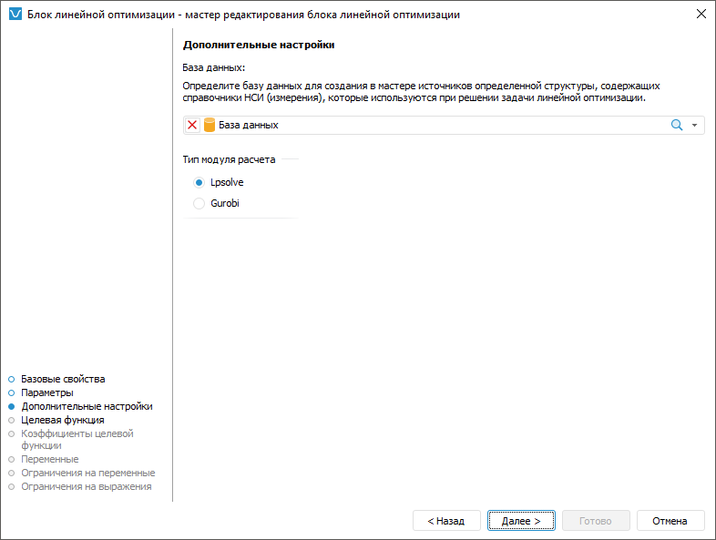

# Выбор базы данных, модуля расчёта: Блок линейной оптимизации, настольное приложение

Выбор базы данных, модуля расчёта: Блок линейной оптимизации, настольное приложение
-

# Выбор базы данных, модуля расчёта

Дополнительные параметры позволяют определить базу данных для создания
 источников, которые используются при решении задачи линейной оптимизации,
 и выбора модуля расчёта.

В раскрывающемся списке «База данных»
 выберите базу данных, которая будет использоваться блоком линейной оптимизации.
 Если в репозитории задана база данных, [используемая по умолчанию](UiNav.chm::/02_Navigator/Repo_Default.htm),
 то она будет выбрана автоматически.

В списке «Тип модуля расчёта»
 выберите модуль, который будет использоваться при расчёте блока линейной
 оптимизации. Доступны следующие варианты:

	- Lpsolve. При расчёте
	 будет использоваться модуль для решения линейных задач LPSolve. Предварительно
	 должна быть проведена [интеграция
	 с LPSolve](UiNav.chm::/02_Navigator/CommonSettings/Integration.htm#lpsolve);

	- Gurobi. При расчёте
	 будет использоваться внешний модуль расчёта Gurobi. Для использования
	 данного модуля расчёта на компьютере должно быть установлено соответствующее
	 программное обеспечение, получена лицензия и [произведены
	 настройки](../../FAQ/Connect_Gurobi.htm).

См. также:

[Начало
 работы с расширением «Алгоритмы расчёта» в веб-приложении](../../Web/Work/Beginning_of_work.htm) | [Вставка и настройка блоков линейной
 оптимизации](Linear_optimization_block.htm)

		Справочная
		 система на версию 10.9
		 от 18/08/2025,
		 © ООО «ФОРСАЙТ»,
