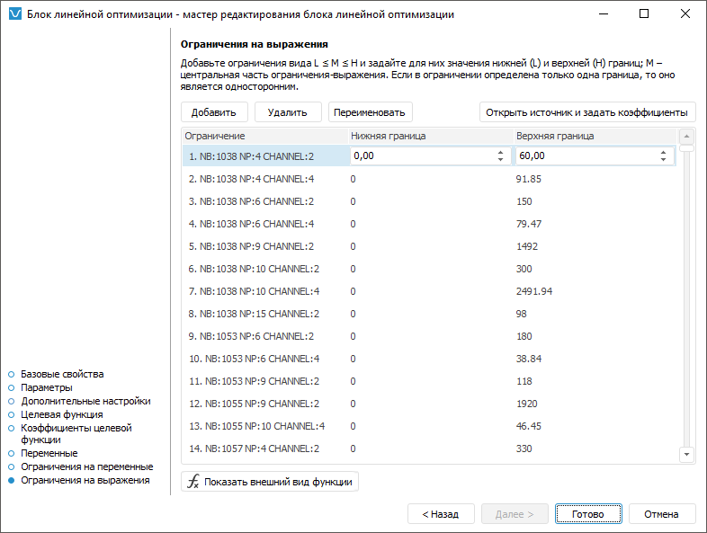

# Настройка сложных ограничений управляющих переменных: Блок линейной оптимизации, настольное приложение

Настройка сложных ограничений управляющих переменных: Блок линейной оптимизации, настольное приложение
-

# Настройка сложных ограничений управляющих переменных

Ограничения на выражения позволяют задать сложные условия, накладываемые
 на значения управляющих переменных. Условие является сложным, если оно
 соответствует одному или нескольким критериям:

	- в нём участвует несколько управляющих переменных;

	- для управляющей переменной задан любой коэффициент.

Например, x1 - x2 ≥ 25
 или 100 ≤ 4x3 ≤ 254, где x1 - это управляющая
 переменная с коэффициентом 1, x2 - это
 управляющая переменная с коэффициентом -1, а 4x3 - это управляющая
 переменная с коэффициентом 4. Для задания простых условий предназначена
 страница «[Ограничения
 на переменные](VariablesRestriction_LinOpt.htm)» в мастере редактирования блока линейной оптимизации.

Для настройки сложных ограничений управляющих переменных используйте
 страницу «Ограничения на выражения»
 в мастере редактирования блока линейной оптимизации:

Отдельно задаются верхняя, нижняя границы ограничений и коэффициенты
 управляющих переменных. Нижняя граница - это минимально допустимое значение
 управляющей переменной, верхняя граница - максимально допустимое значение.
 Коэффициент - это элемент, предназначенный для учёта воздействия изменений
 условий на расчёт целевой функции. Для каждой управляющей переменной можно
 задать коэффициент, только нижнюю границу, только верхнюю границу, обе
 границы или вообще не накладывать ограничений.

Например, ограничение x1 1 - x2 ≥ 25 задаётся с помощью верхней
 границы и коэффициента 1 для управляющей переменной x1 и -1 для
 управляющей переменной x2. А ограничение
 100 ≤ 4x3 ≤
 254 требует задания обеих границ и коэффициента 4 для управляющей переменной.

Для ввода сложных ограничений управляющих переменных:

	- Добавьте ограничение. Для этого нажмите кнопку «Добавить».
	 Ограничение будет добавлено в таблицу.

	- Измените название ограничения. Для этого нажмите кнопку «Переименовать» и введите новое название
	 ограничения. Осмысленное название поможет в дальнейшем идентифицировать
	 ограничение среди других в измерении ограничений. Измерение ограничений
	 формируется автоматически из всех ограничений, созданных на данной
	 странице мастера редактирования блока линейной оптимизации.

	- В таблице введите значения границ ограничения.

	- Задайте коэффициенты переменных, участвующих в ограничении.
	 Для этого:

		- Нажмите кнопку «Открыть
		 источник и задать коэффициенты». Источник данных будет
		 создан автоматически и открыт в инструменте «[Аналитические
		 запросы (OLAP)](UIExpress.chm::/purpose/UiExpress_Purpose.htm)». Таблица данных формируется
		 следующим образом: по строкам расположены все измерения управляющих
		 переменных с отметкой, заданной при [настройке
		 целевой функции](TargetFunction_LinOpt.htm), и измерение ограничений; измерения по столбцам
		 отсутствуют.

		- Введите в таблицу значения коэффициентов для управляющих
		 переменных, участвующих в ограничении.

		- Перейдите на вкладку «Данные»
		 на ленте инструментов и нажмите кнопку  «Сохранить изменения». Будет
		 отображён запрос подтверждения выполняемого действия.

		- Закройте инструмент «Аналитические
		 запросы (OLAP)». При закрытии будет предложено сохранить
		 отчёт. Откажитесь.

В результате будет задано ограничение управляющих переменных.

Для просмотра целевой функции нажмите кнопку «[Показать
 внешний вид функции](ViewTagretFunction_LinOpt.htm)».

См. также:

[Начало
 работы с расширением «Алгоритмы расчёта» в веб-приложении](../../Web/Work/Beginning_of_work.htm) | [Вставка и настройка блоков линейной
 оптимизации](Linear_optimization_block.htm)

		Справочная
		 система на версию 10.9
		 от 18/08/2025,
		 © ООО «ФОРСАЙТ»,
