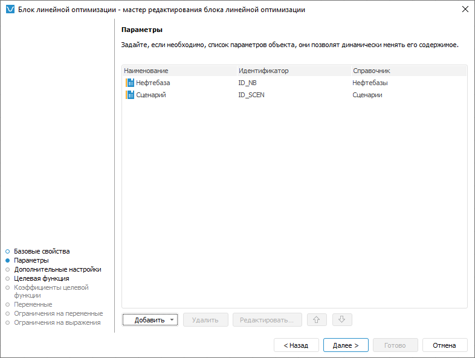
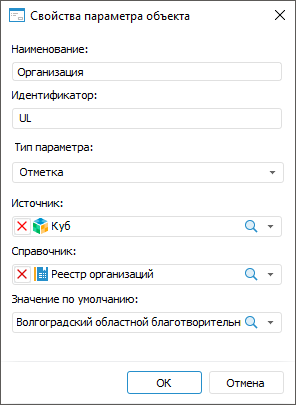

# Добавление параметров: Блок линейной оптимизации, настольное приложение

Добавление параметров: Блок линейной оптимизации, настольное приложение
-

# Добавление параметров

Параметры позволяют динамически управлять расчётом блока. Их можно использовать
 для ограничения количества рассчитываемых элементов при [настройке
 целевой функции](TargetFunction_LinOpt.htm).

Добавление параметров блока линейной оптимизации расчёта выполняется
 на странице «Параметры» в мастере
 редактирования блока линейной оптимизации:

[Добавление параметра](javascript:TextPopup(this))

	Добавьте новый или уже существующий параметр.

	Для добавления нового параметра:

		- нажмите кнопку «Добавить»;

		- дважды щёлкните по свободному пространству в списке параметров.

	Будет открыт диалог «Свойства параметра
	 объекта», в котором задайте настройки параметра.

	Для добавления существующего параметра из другого блока или
	 параметра из алгоритма расчёта:

		- Вызовите раскрывающееся меню кнопки «Добавить».
		 Будет отображён список, содержащий объекты с параметрами.

		- Выберите объект, параметр которого должен быть добавлен
		 в текущий блок. Будет отображён список параметров объекта.

		- Выберите один из параметров.

	В результате в блок будет добавлен параметр, настройки которого
	 полностью совпадают с настройками выбранного параметра. Если был выбран
	 параметр алгоритма расчёта, то добавленный параметр блока и выбранный
	 параметр алгоритма будут [автоматически
	 связаны](../Work/Manage_settings.htm).

[Редактирование
 параметра](javascript:TextPopup(this))

	Для редактирования настроек выбранного параметра:

		- нажмите кнопку «Редактировать»;

		- дважды щёлкните по параметру.

	Будет открыт диалог «Свойства параметра
	 объекта», в котором измените настройки параметра.

[Изменение порядка
 следования параметров](javascript:TextPopup(this))

	Порядок следования параметров влияет на порядок их отображения на
	 вкладке «[Управление
	 параметрами](../Work/Manage_settings.htm)» в диалоге «[Параметры
	 алгоритма расчёта](../Work/Set_up_calculation_parameters.htm)».

	Для изменения порядка следования выделенного параметра используйте
	 кнопки  и .

[Удаление параметра](javascript:TextPopup(this))

	Для удаления выбранного параметра нажмите кнопку «Удалить».
	 Будет запрошено подтверждение удаления параметра. В случае положительного
	 ответа параметр будет удалён, также параметр будет удален во всех
	 настройках алгоритма расчёта.

## Настройка параметра

Настройка параметра выполняется в диалоге «Свойства
 параметра объекта»:

Укажите:

	- Наименование. Наименование
	 параметра должно нести смысловую нагрузку, раскрывать его функциональность.
	 Свойство является обязательным;

	- Идентификатор. Идентификатор
	 параметра должен быть уникальным. Идентификатор должен состоять из
	 букв латинского алфавита. Может включать цифры и знаки подчёркивания
	 и обязательно должен начинаться с буквы. Свойство является обязательным;

	- Тип параметра. Выберите
	 тип параметра:

		- Отметка. Используется
		 по умолчанию. В качестве значения параметра используется отметка
		 справочника;

		- Иерархия. В качестве
		 значения параметра используется альтернативная иерархия справочника;

		- Строковый. В качестве
		 значения параметра используется символьная строка;

		- Целый. В качестве
		 значения параметра используется целое число;

		- Вещественный. В
		 качестве значения параметра используется вещественное число;

		- Дата. В качестве
		 значения параметра используется дата;

Примечание.
 Тип параметра можно изменить только на этапе создания параметра.

	- Источник.
	 При необходимости выберите куб, содержащий [управляющие
	 измерения](uinavobj.chm::/cube/createcube/master_calculation/uimd_cube_createcube_master_calculation_managed_dim.htm), которые управляют элементами других
	 измерений в данном кубе.

Примечание.
 После выбора куба в раскрывающемся списке «Справочник»
 будут доступны только те справочники, которые состоят в выбранном кубе.

Если справочник не содержится в списке управляющих
 измерений, но состоит в кубе, то отметка или альтернативная иерархия справочника
 будет использоваться в качестве значений параметра. Данный справочник
 можно выбрать в раскрывающемся списке «Справочник»
 без указания куба в раскрывающемся списке «Источник».

Если справочник содержится в списке управляющих
 измерений и является управляемым/управляющим или одновременно управляемым
 и управляющим, то для отображения отметки элементов справочника в параметре
 добавьте все управляющие измерения куба в качестве параметров алгоритма
 расчёта и задайте отметку по управляющему измерению;

	- Справочник. Выберите
	 справочник, к которому будет привязан параметр. Отметка или альтернативная
	 иерархия справочника будет использоваться в качестве значений параметра.
	 Свойство является обязательным;

Примечание.
 Если в раскрывающемся списке «Источник»
 выбран куб, то в раскрывающемся списке «Справочник»
 будут доступны только те справочники, которые состоят в выбранном кубе.

	- Значение по умолчанию.
	 Выберите в раскрывающемся списке или введите с клавиатуры значение
	 параметра по умолчанию.

Если алгоритм расчёта расположен в [контейнере](UiNavObj.chm::/Container/Container.htm)
 или [бизнес-приложении](Constructor.chm::/Intro/Designer_business_applications.htm),
 то объекты репозитория, доступные для выбора в раскрывающихся списках
 «Источник» и «Справочник»,
 будут зависеть от состояния флажка «Использовать
 объекты репозитория». По умолчанию флажок снят и в раскрывающихся
 списках доступны только те объекты репозитория, которые содержатся в соответствующем
 контейнере или бизнес-приложении. Для использования любых объектов репозитория
 установите флажок «Использовать объекты
 репозитория» на странице «Базовые
 свойства».

См. также:

[Начало
 работы с расширением «Алгоритмы расчёта» в веб-приложении](../../Web/Work/Beginning_of_work.htm) | [Вставка и настройка блоков линейной
 оптимизации](Linear_optimization_block.htm)

		Справочная
		 система на версию 10.9
		 от 18/08/2025,
		 © ООО «ФОРСАЙТ»,
