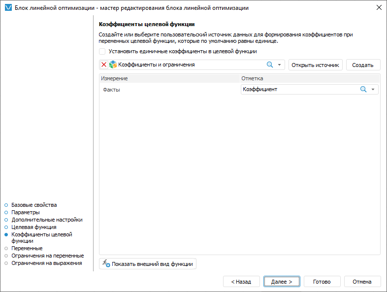

# Формирование коэффициентов целевой функции: Блок линейной оптимизации, настольное приложение

Формирование коэффициентов целевой функции: Блок линейной оптимизации, настольное приложение
-

# Формирование коэффициентов целевой функции

Коэффициенты целевой функции предназначены для учёта воздействия изменений
 условий на расчёт целевой функции.

По умолчанию все коэффициенты целевой функции равны единице. Для задания
 иных значений коэффициентов используйте страницу «Коэффициенты
 целевой функции» в мастере редактирования блока линейной оптимизации:

Для формирования коэффициентов целевой функции, отличных от единицы:

	- Снимите флажок «Установить
	 единичные коэффициенты целевой функции».

	- Выберите источник данных для формирования коэффициентов целевой
	 функции. Данный источник должен содержать все измерения управляющих
	 переменных, выбранные при [настройке
	 целевой функции](TargetFunction_LinOpt.htm). Для создания источника данных требуемой структуры
	 нажмите кнопку «Создать».

	- Задайте отметку по фиксированным измерениям источника данных.
	 Если выбран пользовательский источник данных, то в фиксированные измерения
	 попадают все измерения источника, кроме тех, которые используются
	 в качестве измерений управляющих переменных. Если используется источник
	 данных, созданный мастером редактирования блока линейной оптимизации,
	 то зафиксировано только измерение «Факты»
	 с единственным элементом «Значение»,
	 выбранным по умолчанию.

	- Задайте значение коэффициентов. Для этого:

		- Нажмите кнопку «Открыть
		 источник». Источник данных будет открыт в инструменте «[Аналитические
		 запросы (OLAP)](UIExpress.chm::/purpose/UiExpress_Purpose.htm)». Таблица данных формируется
		 следующим образом: по строкам расположены все измерения управляющих
		 переменных с отметкой, заданной при [настройке
		 целевой функции](TargetFunction_LinOpt.htm); измерения по столбцам отсутствуют; фиксированные
		 измерения и их отметка те же, что заданы в шаге 3.

		- Введите в таблицу данных значения коэффициентов.

		- Перейдите на вкладку «Данные»
		 на ленте инструментов и нажмите кнопку  «Сохранить изменения». Будет
		 отображён запрос подтверждения выполняемого действия.

		- Закройте инструмент «Аналитические
		 запросы (OLAP)». При закрытии будет предложено сохранить
		 отчёт. Откажитесь.

Если требуется задать значение коэффициентов
 для других значений фиксированных измерений, то смените в них отметку
 и повторите данный шаг.

В результате будут сформированы коэффициенты управляющих переменных.

Для возврата к единичным коэффициентам целевой функции установите флажок
 «Установить единичные коэффициенты целевой
 функции».

Для просмотра целевой функции нажмите кнопку «[Показать
 внешний вид функции](ViewTagretFunction_LinOpt.htm)».

См. также:

[Начало
 работы с расширением «Алгоритмы расчёта» в веб-приложении](../../Web/Work/Beginning_of_work.htm) | [Вставка и настройка блоков линейной
 оптимизации](Linear_optimization_block.htm)

		Справочная
		 система на версию 10.9
		 от 18/08/2025,
		 © ООО «ФОРСАЙТ»,
