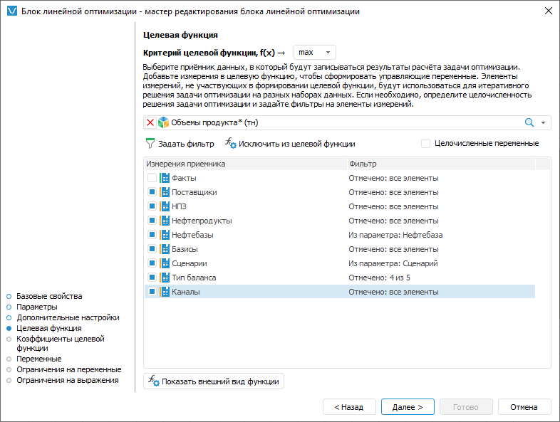
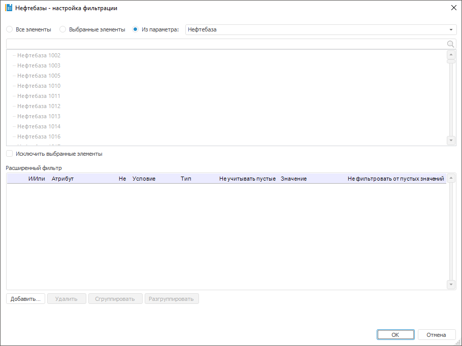

# Настройка целевой функции: Блок линейной оптимизации, настольное приложение

Настройка целевой функции: Блок линейной оптимизации, настольное приложение
-

# Настройка целевой функции

Целевая функция - это функция для которой управляющие переменные должны
 быть подобраны таким образом, чтобы целевая функция приняла минимальное
 или максимальное значение.

Выбор цели оптимизации целевой функции, управляющих переменных и приёмника
 данных, в который будут выгружены результаты оптимизации выполняется на
 странице «Целевая функция» в мастере
 редактирования блока линейной оптимизации:

Для формирования целевой функции:

	- Выберите цель оптимизации целевой функции в поле «Критерий
	 целевой функции, f(x)» :

		- min. Используется
		 по умолчанию. Значения управляющих переменных будут подобраны
		 таким образом, чтобы целевая функция имела минимальное значение;

		- max. Значения управляющих
		 переменных будут подобраны таким образом, чтобы целевая функция
		 имела максимальное значение.

	- Выберите приёмник данных, в который будут выгружены результаты
	 расчёта блока. В блоке линейной оптимизации предполагается, что все
	 управляющие переменные будут сформированы на основе измерений приёмника
	 данных. Таким образом выбранный приёмник должен содержать измерения,
	 позволяющие сформировать полный набор управляющих переменных. Если
	 измерение используется в качестве управляющей переменной, то оно называется
	 измерением управляющей переменной. Для выбора источника данных используйте
	 раскрывающийся список, расположенный ниже поля для выбора цели оптимизации
	 целевой функции.

	- Выберите измерения управляющих переменных. Для выбора измерения
	 отметьте его флажком или выделите его в списке и нажмите кнопку «Добавить в целевую функцию». Все
	 оставшиеся измерения будут использованы для итеративного решения задачи
	 оптимизации. Для преобразования измерения управляющей переменной в
	 обычное измерение снимите флажок или выделите его в списке и нажмите
	 кнопку «Исключить из целевой функции».

	- Для выполнения расчётов только по части элементов настройте
	 фильтрацию по элементам. Для этого выделите измерение в списке и:

		- нажмите кнопку  «Задать
		 фильтр»;

		- дважды щёлкните по измерению.

Будет открыт диалог «[Настройка фильтрации](#filter)», в котором задайте
 настройки фильтрации измерения приёмника данных.

	- Если все управляющие переменные целочисленные, то установите
	 флажок «Целочисленные переменные».
	 В результате будет решаться целочисленная задача линейной оптимизации.
	 Данная задача применяется, если управляющие переменные обладают свойством
	 неделимости. Например, целочисленная управляющая переменная - это
	 количество автомобилей в транспортной компании. Не может быть половины
	 автомобиля, следовательно, он обладает свойством неделимости.

В результате будет настроена целевая функция.

Для просмотра целевой функции нажмите кнопку «[Показать внешний вид функции](ViewTagretFunction_LinOpt.htm)».

## Настройка фильтрации измерения приёмника данных

Фильтрация позволяет выполнять расчёт только по части элементов измерения.

Для выбора элементов измерения, по которым будет рассчитываться блок,
 используйте диалог «Настройка фильтрации»:

Порядок настройки:

	- Выберите элементы, по которым будет рассчитываться блок. Установите
	 один из переключателей:

		- Все элементы. Расчёт
		 блока будет идти по всем элементам измерения;

		- Выбранные элементы.
		 Расчёт блока будет идти только по выбранным элементам измерения.
		 Список элементов формируется в области «Выбранные
		 элементы» с помощью кнопок:

			-  «Выбрать элементы». Добавляет
			 элементы, выделенные в области «Все
			 элементы», в область «Выбранные
			 элементы»;

			-  «Исключить элементы». Удаляет
			 выделенные элементы из области «Выбранные
			 элементы».

Фильтрация будет производиться по всем элементам,
 содержащимся в области «Выбранные элементы».
 При необходимости выполнения расчёта по всем элементам, кроме тех, которые
 содержатся в области «Выбранные элементы»,
 установите флажок «Исключить выбранные
 элементы (N)», где N -
 количество выбранных элементов.

Для работы с [отметкой
 элементов измерения](UiSelection.chm::/Selection/Selection_of_the_dimension_elements.htm#selection) используйте команды контекстного
 меню. Если к элементам, расположенным в области «Все
 элементы», применена [схема
 отметки](UiSelection.chm::/Selection/Selection_of_the_dimension_elements.htm#selection_schemas), то она учитывается при переносе элементов
 в область «Выбранные элементы».

Для поиска элемента в каждой из областей
 начните вводить наименование искомого элемента в строку  «Поиск».
 При вводе наименования частично или полностью в области будет отображаться
 список элементов, наименования которых содержат искомое сочетание символов;

Примечание.
 Если в качестве фильтра используется параметрический куб и для него
 [задана связь параметра
 с параметром алгоритма расчёта](../Work/Manage_cubes_settings.htm), то при изменении значения параметра
 переключатель будет автоматически переведён в положение «Все
 элементы».

		- Из параметра. Расчёт
		 блока будет идти по элементам, заданным параметром типа «Отметка». Способ доступен, если
		 блок содержит параметры типа «Отметка».

Если требуется, чтобы блок рассчитывался
 по всем элементам, кроме отмеченных, то установите флажок «Исключить
 выбранные элементы».

	- Для задания условий, которым должны соответствовать атрибуты
	 элементов, при выполнении расчёта блока, используйте группу параметров
	 «Расширенный фильтр». Работа
	 с данной группой параметров аналогична работе с диалогом «[Расширенный
	 фильтр](uinav.chm::/GUI/UFE/AttributeFiltering.htm)».

После выполнения действий блок будет рассчитываться только по элементам,
 соответствующих фильтру.

См. также:

[Начало
 работы с расширением «Алгоритмы расчёта» в веб-приложении](../../Web/Work/Beginning_of_work.htm) | [Вставка
 и настройка блоков линейной оптимизации](Linear_optimization_block.htm)

		Справочная
		 система на версию 10.9
		 от 18/08/2025,
		 © ООО «ФОРСАЙТ»,
