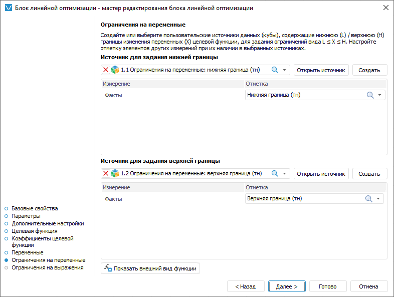

# Настройка простых ограничений управляющих переменных: Блок линейной оптимизации, настольное приложение

Настройка простых ограничений управляющих переменных: Блок линейной оптимизации, настольное приложение
-

# Настройка простых ограничений управляющих переменных

Ограничения на переменные позволяют задать простые условия, накладываемые
 на значения управляющих переменных. Условие является простым, если оно
 соответствует следующим критериям:

	- в нём участвует одна управляющая переменная;

	- для управляющей переменной задан единичный коэффициент.

Например, x1 ≥ 25
 или 100 ≤ x2 ≤ 254, где x1 и x2 -
 это управляющие переменные с единичным коэффициентом. Для задания более
 сложных условий предназначена страница «[Ограничения
 на выражения](ExpressionsRestriction_LinOpt.htm)» в мастере редактирования блока линейной оптимизации.

Для настройки простых ограничений управляющих переменных используйте
 страницу «Ограничения на переменные»
 в мастере редактирования блока линейной оптимизации:

Отдельно задаются верхняя и нижняя границы ограничений. Нижняя граница
 - это минимально допустимое значение управляющей переменной, верхняя граница
 - максимально допустимое значение. Для каждой управляющей переменной можно
 задать только нижнюю границу, только верхнюю границу, обе границы или
 вообще не накладывать ограничений.

Например, ограничение x1 ≥ 25
 задаётся только с помощью верхней границы. А ограничение 100 ≤ x2 ≤
 254 требует задания верхней и нижней границ.

Для ввода простых ограничений управляющих переменных:

	- Выберите источник данных для хранения значений верхних и нижних
	 границ. Данный источник должен содержать все измерения управляющих
	 переменных, выбранные при [настройке
	 целевой функции](TargetFunction_LinOpt.htm). Для создания источника данных требуемой структуры
	 нажмите кнопку «Создать».

	- Задайте отметку по фиксированным измерениям источника данных.
	 Если выбран пользовательский источник данных, то в фиксированные измерения
	 попадают все измерения источника, кроме тех, которые используются
	 в качестве измерений управляющих переменных. Если используется источник
	 данных, созданный мастером редактирования блока линейной оптимизации,
	 то зафиксировано только измерение «Факты»
	 с единственным элементом «Значение»,
	 выбранным по умолчанию.

	- Задайте значения границ. Для этого:

		- Нажмите кнопку «Открыть
		 источник». Источник данных будет открыт в инструменте «[Аналитические
		 запросы (OLAP)](UIExpress.chm::/purpose/UiExpress_Purpose.htm)». Таблица данных формируется
		 следующим образом: по строкам расположены все измерения управляющих
		 переменных с отметкой, заданной при [настройке
		 целевой функции](TargetFunction_LinOpt.htm); измерения по столбцам отсутствуют; фиксированные
		 измерения и их отметка те же, что заданы в шаге 2.

		- Введите в таблицу данных значение границ для управляющих
		 переменных.

		- Перейдите на вкладку «Данные»
		 на ленте инструментов и нажмите кнопку  «Сохранить изменения». Будет
		 отображён запрос подтверждения выполняемого действия.

		- Закройте инструмент «Аналитические
		 запросы (OLAP)». При закрытии будет предложено сохранить
		 отчёт. Откажитесь.

Если требуется задать значения границ управляющих
 переменных для других значений фиксированных измерений, то смените в них
 отметку и повторите данный шаг.

В результате будут заданы ограничения управляющих переменных.

Для просмотра целевой функции нажмите кнопку «[Показать
 внешний вид функции](ViewTagretFunction_LinOpt.htm)».

См. также:

[Начало
 работы с расширением «Алгоритмы расчёта» в веб-приложении](../../Web/Work/Beginning_of_work.htm) | [Вставка и настройка блоков линейной
 оптимизации](Linear_optimization_block.htm)

		Справочная
		 система на версию 10.9
		 от 18/08/2025,
		 © ООО «ФОРСАЙТ»,
