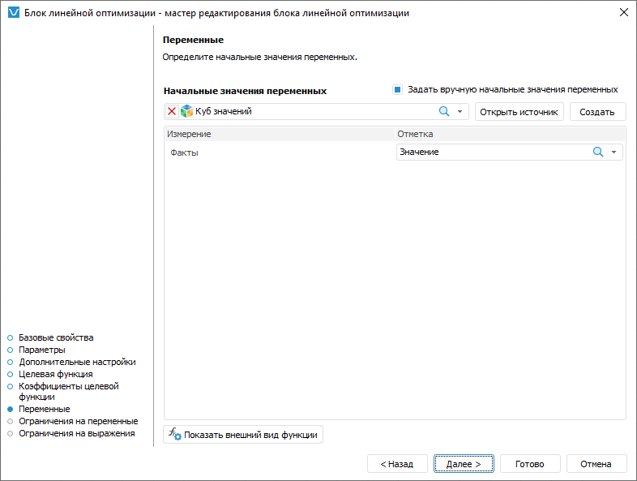

# Ввод начальных значений управляющих переменных: Блок линейной оптимизации, настольное приложение

Ввод начальных значений управляющих переменных: Блок линейной оптимизации, настольное приложение
-

# Ввод начальных значений управляющих переменных

Начальные значения управляющих переменных - это значения, с которых
 начинается расчёт блока линейной оптимизации. Начальные значения вводятся,
 если они известны из постановки задачи.

По умолчанию начальные значения управляющих переменных определяются
 автоматически. Для задания значений вручную используйте страницу «Переменные» в мастере редактирования
 блока линейной оптимизации:

Для ввода начальных значений управляющих переменных вручную:

	- Установите флажок «Задать вручную
	 начальные значения переменных».

	- Выберите источник данных для хранения начальных значений. Данный
	 источник должен содержать все измерения управляющих переменных, выбранные
	 при [настройке целевой функции](TargetFunction_LinOpt.htm).
	 Для создания источника данных требуемой структуры нажмите кнопку «Создать».

	- Задайте отметку по фиксированным измерениям источника данных.
	 Если выбран пользовательский источник данных, то в фиксированные измерения
	 попадают все измерения источника, кроме тех, которые используются
	 в качестве измерений управляющих переменных. Если используется источник
	 данных, созданный мастером редактирования блока линейной оптимизации,
	 то зафиксировано только измерение «Факты»
	 с единственным элементом «Значение»,
	 выбранным по умолчанию.

	- Задайте начальные значения управляющих переменных. Для этого:

		- Нажмите кнопку «Открыть
		 источник». Источник данных будет открыт в инструменте «[Аналитические
		 запросы (OLAP)](UIExpress.chm::/purpose/UiExpress_Purpose.htm)». Таблица данных формируется
		 следующим образом: по строкам расположены все измерения управляющих
		 переменных с отметкой, заданной при [настройке
		 целевой функции](TargetFunction_LinOpt.htm); измерения по столбцам отсутствуют; фиксированные
		 измерения и их отметка те же, что заданы в шаге 3.

		- Введите в таблицу данных начальные значения управляющих
		 переменных.

		- Перейдите на вкладку «Данные»
		 на ленте инструментов и нажмите кнопку  «Сохранить изменения». Будет
		 отображён запрос подтверждения выполняемого действия.

		- Закройте инструмент «Аналитические
		 запросы (OLAP)». При закрытии будет предложено сохранить
		 отчёт. Откажитесь.

Если требуется задать начальные значения
 управляющих переменных для других значений фиксированных измерений, то
 смените в них отметку и повторите данный шаг.

В результате будут заданы начальные значения управляющих переменных.

Для возврата к автоматическому определению начальных значений снимите
 флажок «Задать вручную начальные значения
 переменных».

Для просмотра целевой функции нажмите кнопку «[Показать
 внешний вид функции](ViewTagretFunction_LinOpt.htm)».

См. также:

[Начало
 работы с расширением «Алгоритмы расчёта» в веб-приложении](../../Web/Work/Beginning_of_work.htm) | [Вставка и настройка блоков линейной
 оптимизации](Linear_optimization_block.htm)

		Справочная
		 система на версию 10.9
		 от 18/08/2025,
		 © ООО «ФОРСАЙТ»,
