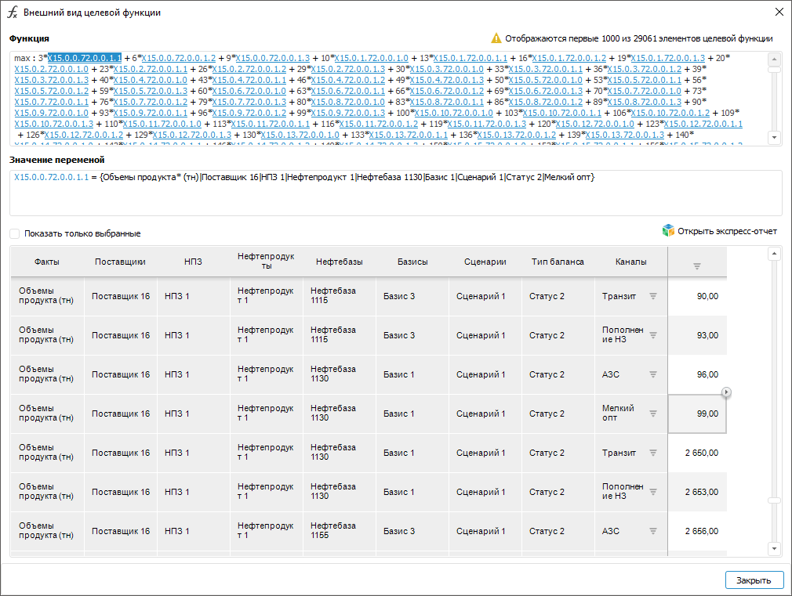

# Просмотр целевой функции: Блок линейной оптимизации, настольное приложение

Просмотр целевой функции: Блок линейной оптимизации, настольное приложение
-

# Просмотр целевой функции

Просмотр позволяет увидеть целевую функцию в математической форме и
 посмотреть заданные значения коэффициентов, рассчитанные значения управляющих
 переменных и целевой функции.

Для просмотра целевой функции:

	- нажмите кнопку «Показать внешний
	 вид функции» в мастере редактирования блока линейной оптимизации.
	 Кнопка доступна начиная со страницы «[Целевая
	 функция](TargetFunction_LinOpt.htm)»;

	- выполните команду «Целевая
	 функция» в контекстном меню блока линейной оптимизации.

Будет открыт диалог «Внешний вид целевой
 функции». Например:

В поле «Функция» отображается
 целевая функция в математическом виде.

Элементами целевой функции являются:

	- критерий целевой функции.
	 Отображается в начале функции перед знаком «:». Информация по критерию
	 целевой функции доступна только после [расчёта
	 блока](../Work/Perform_calculations.htm);

	- управляющие переменные.
	 Отображаются в виде гиперссылок. Название переменной состоит из буквы
	 X с порядковым номером управляющей переменной. Далее через точку идут
	 порядковые номера элементов управляющих измерений, формирующих переменную. Значения
	 управляющих переменных доступны только после [расчёта
	 блока](../Work/Perform_calculations.htm);

	- коэффициенты управляющих переменных.
	 Отображаются перед управляющими переменными перед знаком «*».

Если функция содержит более 1000 элементов, то отображаются только первые
 1000 элементов, а в правом верхнем углу отображается информация об общем
 количестве элементов целевой функции.

Для просмотра информации об элементе щёлкните по нему. Информация будет отражена в поле «Значение
 переменной» в виде:

Название элемента = {Название источника данных|Название
 элемента управляющего измерения}

Если элемент сформирован по нескольким элементам управляющих измерений,
 то все они будут перечислены через вертикальную черту.

Для просмотра значения элемента, а также полной его отметки, включающей
 элементы управляющих измерений и элементы измерений для итеративного решения
 задачи, используйте таблицу, расположенную ниже поля «Значение
 переменной». После щелчка по элементу таблица будет прокручена
 к выбранному элементу. Для отображения в таблице только выделенного элемента
 установите флажок «Показать только выбранные».

Для просмотра информации, представленной в таблице, в инструменте «[Аналитические
 запросы (OLAP)](UIExpress.chm::/purpose/UiExpress_Purpose.htm)» нажмите кнопку «Открыть
 экспресс-отчёт». Будет открыт экспресс-отчёт, содержащий данную
 информацию.

См. также:

[Начало
 работы с расширением «Алгоритмы расчёта» в веб-приложении](../../Web/Work/Beginning_of_work.htm) | [Вставка и настройка блоков линейной
 оптимизации](Linear_optimization_block.htm)

		Справочная
		 система на версию 10.9
		 от 18/08/2025,
		 © ООО «ФОРСАЙТ»,
