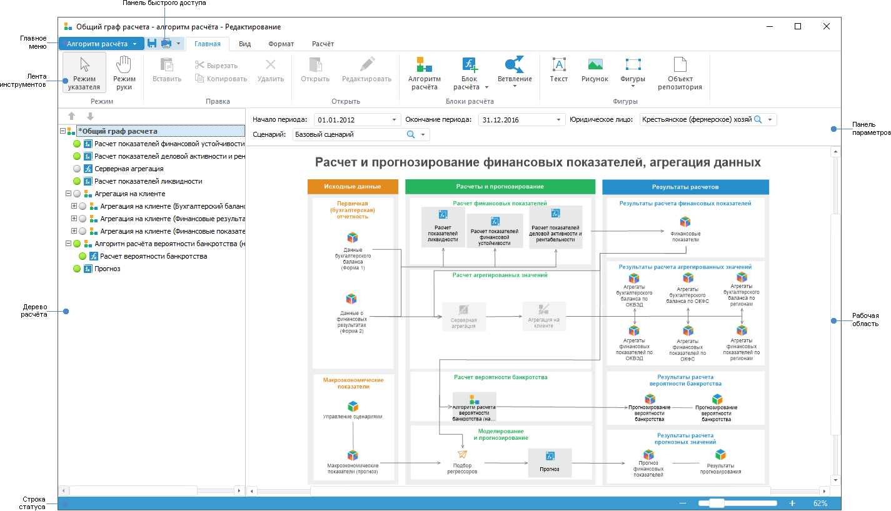

# Начало работы с расширением «Алгоритмы расчёта» в настольном приложении

Начало работы с расширением «Алгоритмы расчёта» в настольном приложении
-

# Начало работы с расширением «Алгоритмы
 расчёта» в настольном приложении

Для начала работы с расширением создайте новый или откройте готовый
 алгоритм расчёта.

[Создание нового
 алгоритма расчёта](javascript:TextPopup(this))

	Для создания нового алгоритма расчёта в [навигаторе
	 объектов](GetStarted.chm::/Interface/Interface_Navigator.htm):

		- нажмите кнопку «Новый объект
		 > Пользовательские объекты > Алгоритм расчёта показателей»
		 в группе «Создать» на
		 вкладке «Главная» ленты
		 инструментов;

		- выполните команду «Создать >
		 Пользовательские объекты > Алгоритм расчёта показателей»
		 в контекстном меню навигатора объектов.

	После выполнения одного из действий будет открыто окно «Вставка
	 объекта - параметры - Алгоритм расчёта показателей». Введите
	 наименование создаваемого алгоритма расчёта и измените автоматически
	 сформированный идентификатор при необходимости.

[Открытие
 готового алгоритма расчёта](javascript:TextPopup(this))

	Для открытия готового алгоритма расчёта на редактирование в [навигаторе
	 объектов](GetStarted.chm::/Interface/Interface_Navigator.htm) выделите алгоритм расчёта и выполните
	 одно из действий:

		- нажмите кнопку 
		 «Редактировать» в группе
		 «Открыть» на вкладке «Главная» ленты инструментов;

		- выполните команду «Редактировать»
		 в контекстном меню алгоритма расчёта;

		- нажмите клавишу F4.

	Для открытия готового алгоритма расчёта на просмотр в [навигаторе
	 объектов](GetStarted.chm::/Interface/Interface_Navigator.htm) выделите алгоритм расчёта и выполните
	 одно из действий:

		- нажмите кнопку  «Открыть»
		 в группе «Открыть» на
		 вкладке «Главная» ленты
		 инструментов;

		- выполните команду «Открыть»
		 в контекстном меню алгоритма расчёта.

Для построения алгоритмов расчёта
 смотрите статью «[Построение
 алгоритма расчёта](Construction_of_the_calculation_algorithm.htm)».

Для работы с готовыми алгоритмами
 расчёта смотрите статью «[Работа
 с готовым алгоритмом расчёта](Work.htm)».

Основное окно расширения «Алгоритмы
 расчёта»:

[Элементы окна
 алгоритма расчёта](javascript:TextPopup(this))

		- [Главное меню](GetStarted.chm::/interface/interface_description.htm#main_menu).
		 Содержит список команд, предназначенных для выполнения различных
		 операций над алгоритмом расчёта.

		- [Лента инструментов](GetStarted.chm::/interface/interface_description.htm#customize_ribbon).
		 Содержит кнопки для построения и настройки алгоритма расчёта.

		- [Панель быстрого доступа](GetStarted.chm::/Interface/Interface_Description.htm#quick_access_toolbar).
		 Содержит набор часто используемых команд.

		- Дерево расчёта.
		 Предназначено для настройки структуры алгоритма расчёта.

		- Панель параметров.
		 Предназначена для задания значения параметров алгоритма расчёта.

		- Рабочая область.
		 Предназначена для построения алгоритма расчёта.

		- Строка статуса.
		 Предназначена для отображения состояния алгоритма расчёта и масштаба.

См. также:

[Начало
 работы с расширением «Алгоритмы расчёта» в веб-приложении](../../Web/Work/Beginning_of_work.htm) | [Работа с готовым алгоритмом расчёта](Work.htm)

		Справочная
		 система на версию 10.9
		 от 18/08/2025,
		 © ООО «ФОРСАЙТ»,
