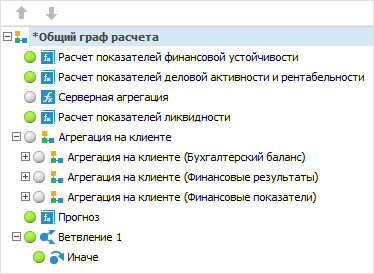
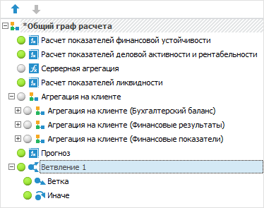
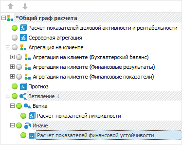
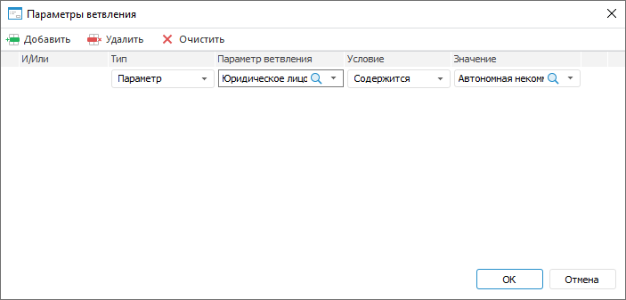
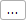
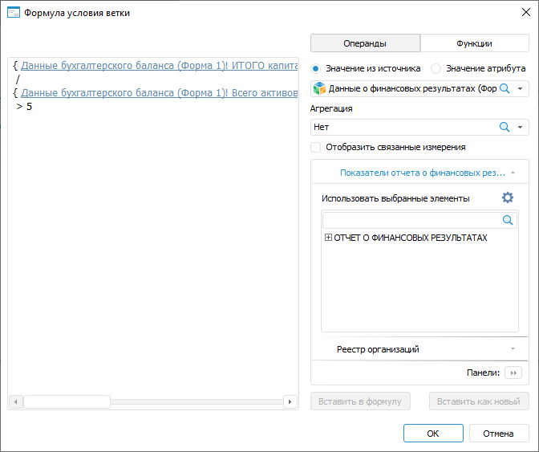

# Настройка условий выполнения расчёта алгоритма: Настольное приложение

Настройка условий выполнения расчёта алгоритма: Настольное приложение
-

# Настройка условий выполнения расчёта алгоритма

После [добавления и настройки
 параметров](Set_up_calculation_parameters.htm) алгоритма расчёта можно настроить условия выполнения алгоритма
 расчёта с помощью ветвлений. Ветвления используются для создания условий
 выполнения отдельных элементов алгоритма расчёта.

Для настройки условий выполнения расчёта алгоритма:

	- Нажмите кнопку  «Ветвление»
	 на вкладке «Главная» ленты
	 инструментов. В результате будет создано ветвление в [дереве
	 расчёта](Beginning_of_work.htm) и условие  «Иначе»:

	- Выделите созданное ветвление и выполните команду  «Ветка»
	 в раскрывающемся меню кнопки  «Ветвление».
	 В результате будет создана ветка в ветвлении:

Примечание.
 Количество веток и ветвлений не ограничено. При наличии нескольких веток
 по умолчанию выполняется расчёт только в первой ветке, условие которой
 выполняется. Для проверки условия и выполнения остальных веток, выполните
 команду контекстного меню ветвления «Выполнять
 все подходящие ветки». При расчёте алгоритма будут выполнены все
 ветки, условия которых выполняются.

	- Перетащите элементы алгоритма расчёта в условия  «Ветка»
	 и  «Иначе» с помощью механизма Drag&Drop:

	- Откройте окно «Параметры ветвления»
	 для задания условий выполнения блока расчёта:

		- дважды щелкните по объекту  «Ветка»
		 в [дереве расчёта](Beginning_of_work.htm);

		- выполните команду «Редактировать»
		 контекстного меню объекта  «Ветка»
		 в [дереве расчёта](Beginning_of_work.htm).

В результате будет открыто окно «Параметры
 ветвления»:

	- Нажмите кнопку  «Добавить»
	 на панели инструментов для добавления условия:

	- Задайте параметры:

		- Тип. Выберите тип
		 условия в раскрывающемся списке:

			- Параметр;

			- Формула;

		- Параметр ветвления.
		 В раскрывающемся списке выберите [параметр](Parameters_of_the_calculation_algorithm.htm)
		 алгоритма расчёта или его [атрибут](UiNavObj.chm::/reference_book/Master_RDS_reference_book/Attributes.htm),
		 который будет участвовать в условии. Для выбора доступны только
		 параметры типа «Отметка»;

Примечание.
 Доступно только для типа условия «Параметр».

		- Условие.
		 В раскрывающемся списке выберите один из типов условия:

			- Содержится;

			- Не содержится;

			- Равно;

			- Не равно;

			- Больше;

			- Меньше.

Примечание.
 Доступно только для типа условия «Параметр».
 Набор отображаемых типов условия зависит от параметра или [типа
 данных](UiNavObj.chm::/reference_book/Master_RDS_reference_book/Attributes/Attribute.htm) его атрибута, выбранного в столбце «Параметр
 ветвления».

		- Значение. Задайте
		 значение для выбранного типа условия:

			- Параметр. Задайте
			 значение, которое будет сравниваться со значением параметра
			 ветвления. Если в качестве параметра ветвления выбран параметр
			 алгоритма расчёта, то в раскрывающемся списке отметьте сравниваемые
			 элементы параметра. Если в качестве параметра ветвления выбран
			 атрибут параметра, то укажите сравниваемое значение, тип данных
			 которого задаётся в соответствии с типом данных атрибута;

			- Формула. Для
			 задания формулы условия ветки нажмите кнопку  «Добавить
			 формулу» и сформируйте формулу условия аналогично [формированию
			 формулы расчёта](../Calculation_block/Calculation_Formula_Generation.htm) в открывшемся окне «Формула
			 условия ветки»:

Сформированная формула будет отображаться
 в виде строки, недоступной для редактирования, в столбце «Значение».

Примечание.
 Задание и редактирование формулы осуществляется только в окне «Формула
 условия ветки».

		- И/Или. Выберите
		 один из логических операторов в раскрывающемся списке, если добавлено
		 несколько условий:

			- И. Используется
			 по умолчанию. Если все условия выполняются, то выполняется
			 расчёт алгоритма;

			- Или. Если выполняется
			 хотя бы одно условие, то выполняется алгоритм.

Для удаления одного из условий выделите условие
 и нажмите кнопку  «Удалить»
 на панели инструментов.

Для удаления всех условий нажмите кнопку
  «Очистить».

## Пример настройки условий выполнения расчёта алгоритма

В примере создается ветвление с двумя ветками, для каждой из которых
 задаются условия выполнения расчёта алгоритма.

См. также:

[Начало
 работы с расширением «Алгоритмы расчёта» в веб-приложении](../../Web/Work/Beginning_of_work.htm) | [Построение алгоритма
 расчёта](Construction_of_the_calculation_algorithm.htm)

		Справочная
		 система на версию 10.9
		 от 18/08/2025,
		 © ООО «ФОРСАЙТ»,
