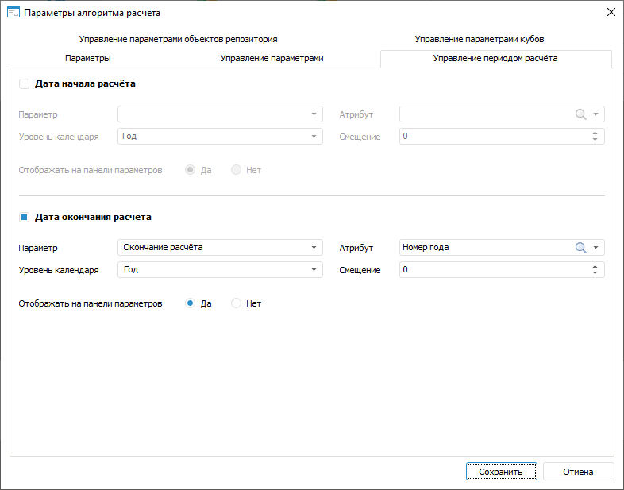

# Управление периодом расчёта: Алгоритм расчёта показателей, настольное приложение

Управление периодом расчёта: Алгоритм расчёта показателей, настольное приложение
-

# Управление периодом расчёта

Параметры алгоритма расчёта могут управлять периодом расчёта всего алгоритма.

Выбор и настройка параметров алгоритма, управляющих периодом расчёта,
 выполняются на вкладке «Управление периодом
 расчёта» в диалоге «[Параметры алгоритма
 расчёта](Set_up_calculation_parameters.htm)»:

[Для открытия
 диалога](javascript:TextPopup(this))

	Для открытия диалога «Параметры
	 алгоритма расчёта» нажмите кнопку  «Настройка» в группе «Параметры
	 расчёта» на вкладке «Расчёт»
	 [ленты инструментов](Beginning_of_work.htm).

По умолчанию начало и окончание расчёта алгоритма задаётся пользователем.
 Параметром может быть задано начало и окончание расчёта или только начало,
 или только окончание расчёта.

Для выбора и настройки параметра, управляющего началом расчёта:

	- Установите флажок «Дата начала
	 расчёта».

	- В раскрывающемся списке «Параметр»
	 выберите параметр алгоритма расчёта, который будет управлять началом
	 расчета. Для выбора доступны только параметры типа «Отметка»
	 и «Дата».

	- В раскрывающемся списке «Атрибут»
	 выберите атрибут, значение которого будет использоваться в качестве
	 даты начала расчёта. Список доступен только для параметра типа «Отметка», выбранного на предыдущем
	 шаге, и содержит атрибуты справочника, на котором основан параметр.

	- В раскрывающемся списке «Уровень
	 календаря» выберите календарную динамику начала расчёта.

	- В поле «Смещение» задайте
	 количество точек во временном периоде, на которое дата начала расчёта
	 будет смещена вперёд или назад относительно значения параметра.

	- При необходимости установите переключатель «Нет»
	 в поле «Отображать на панели параметров»
	 для скрытия параметра «Начало периода»
	 на панели параметров.

В результате начало расчёта будет управляться параметром алгоритма и
 параметр «Начало периода» на панели
 параметров станет недоступен. Выбор и настройка параметра, управляющего
 окончанием расчёта, выполняется аналогично.

Для возврата к заданию пользователем начала или окончания расчёта алгоритма
 снимите флажок «Дата начала расчёта»
 или «Дата окончания расчёта» соответственно.

См. также:

[Начало
 работы с расширением «Алгоритмы расчёта» в веб-приложении](../../Web/Work/Beginning_of_work.htm) | [Добавление и настройка параметров](Set_up_calculation_parameters.htm)

		Справочная
		 система на версию 10.9
		 от 18/08/2025,
		 © ООО «ФОРСАЙТ»,
