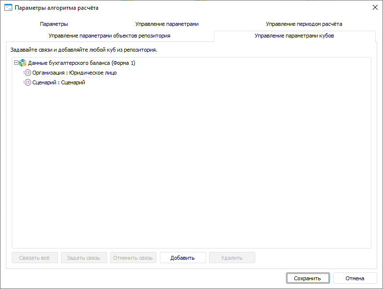

# Задание связей с параметрами кубов: Алгоритм расчёта показателей, настольное приложение

Задание связей с параметрами кубов: Алгоритм расчёта показателей, настольное приложение
-

# Задание связей с параметрами кубов

Связи предназначены для управления параметрами [кубов](AddRepoObject.htm)
 с помощью параметров алгоритма расчёта. При [использовании](DataView.htm)
 кубов в блоках алгоритма значения параметров алгоритма будут автоматически
 передаваться в связанные параметры этих кубов.

Задание связей параметров алгоритма расчёта с параметрами кубов выполняется
 на вкладке «Управление параметрами кубов»
 в диалоге «[Параметры
 алгоритма расчёта](Set_up_calculation_parameters.htm)»:

[Для открытия
 диалога](javascript:TextPopup(this))

	Для открытия диалога «Параметры
	 алгоритма расчёта» нажмите кнопку  «Настройка» в группе «Параметры
	 расчёта» на вкладке «Расчёт»
	 [ленты инструментов](Beginning_of_work.htm).

Изначально на вкладке отображаются только параметры всех кубов, добавленных
 в алгоритм расчёта:

	- на вкладке «[Параметры](Parameters_of_the_calculation_algorithm.htm)»
	 окна «Параметры алгоритма расчёта»;

	- на странице настройки параметров [блоков
	 расчёта](../Calculation_block/Parameters.htm), [блоков
	 агрегации](../Aggregation_block/ParametersArrg.htm), [блоков
	 функций](../Function_Block/ParametersFunc.htm), [блоков
	 линейной оптимизации](../Linear_optimization_block/Parameters_LinOpt.htm);

	- на странице настройки приёмников данных [блоков
	 расчёта](../Calculation_block/Master_calculation_block_page_consumer.htm) и [блоков
	 агрегации](../Aggregation_block/Aggregation_block_Receiver.htm);

	- на странице настройки [источников
	 данных блоков расчёта](../Calculation_block/Page_Sources.htm);

	- на странице настройки [фильтрации
	 по данным блоков расчёта](../Calculation_block/FilteringByData.htm).

На вкладке доступны следующие операции:

[Добавление куба](javascript:TextPopup(this))

	Для добавления нового куба в список нажмите кнопку «Добавить»
	 и выберите в открывшемся окне «Выбор
	 объекта» требуемый куб.

[Задание связи
 с параметром куба](javascript:TextPopup(this))

	Для задания связи параметра куба с параметром алгоритма расчёта:

		- Выделите параметр куба.

		- Нажмите кнопку «Задать
		 связь». Будет отображён диалог «Связь
		 параметров расчёта», в котором выберите параметр алгоритма
		 расчёта, связываемый с параметром куба:

	

	Для связывания доступны параметры одного
	 [типа данных](Parameters_of_the_calculation_algorithm.htm),
	 а также все параметры типа «Отметка».

	В результате параметр алгоритма расчёта будет связан с параметром
	 куба. Задайте связи для всех требуемых параметров кубов.

	Совет. Для автоматического
	 создания связей между параметрами типа «Отметка»
	 нажмите кнопку «Связать все».

	После задания связей появится возможность оперировать параметрами
	 куба через параметры алгоритма расчёта.

	При изменении значения параметра алгоритма расчёта, связанного с
	 параметром куба, используемого в блоках, появится информационное окно
	 с сообщением о необходимости перепроверки настроек расчёта алгоритма
	 и предупреждением о перестраивании параметрических измерений и сбрасывании
	 отметки по перестраиваемым измерениям.

[Разрыв связи
 с параметром куба](javascript:TextPopup(this))

	Для разрыва связи выделите её и нажмите кнопку «Отменить
	 связь».

[Удаление куба](javascript:TextPopup(this))

	Для удаления куба из алгоритма расчёта выделите его в списке и нажмите
	 кнопку «Удалить».

	Примечание.
	 При попытке удалить куб, использующийся в каком-либо из блоков алгоритма
	 расчёта, появится окно с предупреждением о невозможности удаления:
	 «Куб "<название_куба>"
	 не может быть удален, т.к. используется в блоке "<название_блока>"».

См. также:

[Начало
 работы с расширением «Алгоритмы расчёта» в веб-приложении](../../Web/Work/Beginning_of_work.htm) | [Добавление и настройка параметров](Set_up_calculation_parameters.htm)

		Справочная
		 система на версию 10.9
		 от 18/08/2025,
		 © ООО «ФОРСАЙТ»,
