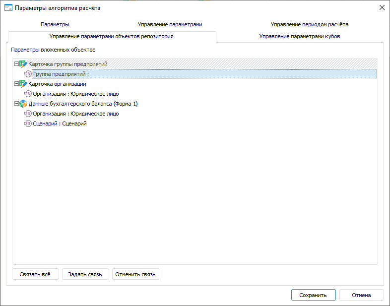

# Задание связей с параметрами объектов репозитория: Алгоритм расчёта показателей, настольное приложение

Задание связей с параметрами объектов репозитория: Алгоритм расчёта показателей, настольное приложение
-

# Задание связей с параметрами объектов репозитория

Связи предназначены для управления параметрами [объектов
 репозитория](AddRepoObject.htm) с помощью параметров алгоритма расчёта. При [открытии](DataView.htm)
 объектов репозитория значения параметров алгоритма будут передаваться
 в связанные параметры этих объектов.

Задание связей параметров алгоритма расчёта с параметрами объектов репозитория
 выполняется на вкладке «Управление параметрами
 объектов репозитория» в диалоге «[Параметры
 алгоритма расчёта](Set_up_calculation_parameters.htm)»:

[Для открытия
 диалога](javascript:TextPopup(this))

	Для открытия диалога «Параметры
	 алгоритма расчёта» нажмите кнопку  «Настройка» в группе «Параметры
	 расчёта» на вкладке «Расчёт»
	 [ленты инструментов](Beginning_of_work.htm).

На вкладке отображаются параметры объектов репозитория, добавленных
 в алгоритм расчёта.

Для задания связи параметра объекта репозитория с параметром алгоритма
 расчёта:

	- Выделите параметр объекта репозитория.

	- Нажмите кнопку «Задать связь».
	 Будет отображён диалог «Связь параметров
	 расчёта»:

Выберите параметр алгоритма расчёта, связываемый
 с параметром объекта, и нажмите кнопку «ОК».

Для связывания доступны параметры одного
 [типа данных](Parameters_of_the_calculation_algorithm.htm),
 а также все параметры типа «Отметка».

В результате параметр алгоритма расчёта будет связан с параметром объекта
 репозитория. Задайте связи для всех требуемых параметров объектов репозитория.

Совет. Для автоматического
 создания связей между параметрами нажмите кнопку «Связать
 все».

Перед [открытием объекта репозитория](DataView.htm) отображается
 окно «[
	Установка значений параметров](uinav.chm::/02_Navigator/General_Principles_of_Work.htm#open_param_object)»
 при выполнении следующих условий:

	- если все параметры объекта не связаны с параметрами алгоритма
	 расчёта;

	- если хотя бы один параметр объекта не связан с параметром алгоритма
	 расчёта и для него не задано значение по умолчанию;

	- если хотя бы одно значение параметра алгоритма расчёта, связанного
	 с параметром объекта, не задано на [панели
	 параметров](Beginning_of_work.htm).

Примечание.
 Если задана связь с параметром куба, имеющего сохранённое [OLAP-представление](UiNavObj.chm::/Cube/Work_Cube/UiMd_Cube_Work_Cube.htm),
 то при открытии этого куба отобразится информационное окно с сообщением:
 «У выбранного куба существует сохранённое представление, управление параметрами
 открытия будет проигнорировано». Куб будет открыт в сохранённом представлении.

Для разрыва связи выделите связанный параметр объекта репозитория и
 нажмите кнопку «Отменить связь».

См. также:

[Начало
 работы с расширением «Алгоритмы расчёта» в веб-приложении](../../Web/Work/Beginning_of_work.htm) | [Добавление и настройка параметров](Set_up_calculation_parameters.htm)

		Справочная
		 система на версию 10.9
		 от 18/08/2025,
		 © ООО «ФОРСАЙТ»,
