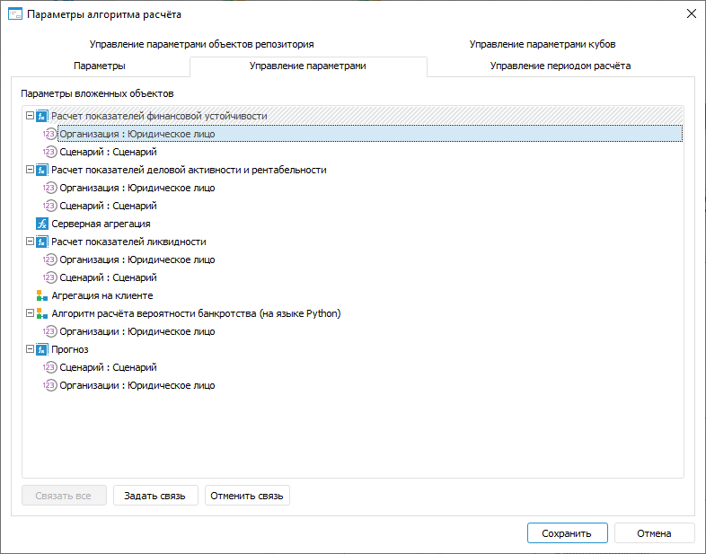
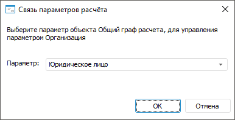

# Задание связей параметров: Алгоритм расчёта показателей, настольное приложение

Задание связей параметров: Алгоритм расчёта показателей, настольное приложение
-

# Задание связей параметров

Связи предназначены для управления параметрами блоков с помощью параметров
 алгоритма расчёта. При расчёте значения параметров алгоритма будут передаваться
 в связанные параметры блоков.

Задание связей параметров алгоритма расчёта с параметрами блоков выполняется
 на вкладке «Управление параметрами»
 в диалоге «[Параметры
 алгоритма расчёта](Set_up_calculation_parameters.htm)»:

[Для открытия
 диалога](javascript:TextPopup(this))

	Для открытия диалога «Параметры
	 алгоритма расчёта» нажмите кнопку  «Настройка» в группе «Параметры
	 расчёта» на вкладке «Расчёт»
	 [ленты инструментов](Beginning_of_work.htm).

Изначально на вкладке отображаются только параметры всех блоков.

Для задания связи параметра блока с параметром алгоритма расчёта:

	- Выделите параметр блока.

	- Нажмите кнопку «Задать связь».
	 Будет отображён диалог «Связь параметров
	 расчёта», в котором выберите параметр алгоритма расчёта, связываемый
	 с параметром блока:

Для связывания доступны только параметры
 одного [типа](Parameters_of_the_calculation_algorithm.htm).

В результате параметр алгоритма расчёта будет связан с параметром блока.
 Задайте связи для всех параметров блоков.

Совет. Для автоматического
 создания связей между параметрами типа «Отметка»
 нажмите кнопку «Связать все».

Для разрыва связи выделите её и нажмите кнопку «Отменить
 связь».

См. также:

[Начало
 работы с расширением «Алгоритмы расчёта» в веб-приложении](../../Web/Work/Beginning_of_work.htm) | [Добавление и настройка параметров](Set_up_calculation_parameters.htm)

		Справочная
		 система на версию 10.9
		 от 18/08/2025,
		 © ООО «ФОРСАЙТ»,
