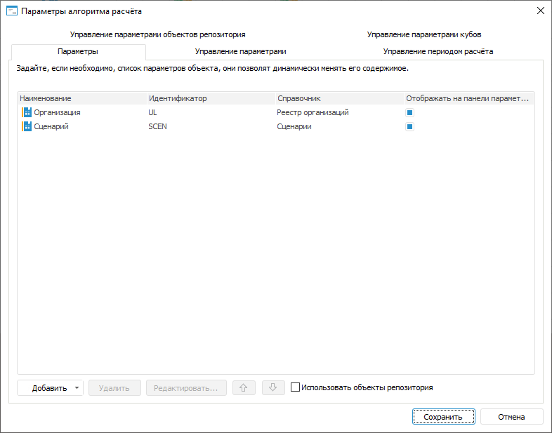

# Добавление параметров: Алгоритм расчёта показателей, настольное приложение

Добавление параметров: Алгоритм расчёта показателей, настольное приложение
-

# Добавление параметров

Параметры алгоритма позволяют динамически управлять [расчётом
 связанных блоков](Manage_settings.htm) и [периодом
 расчёта](Calculation_period_management.htm) алгоритма.

Добавление параметров алгоритма расчёта выполняется на вкладке «Параметры» в диалоге «[Параметры алгоритма расчёта](Set_up_calculation_parameters.htm)»:

[Для открытия
 диалога](javascript:TextPopup(this))

	Для открытия диалога «Параметры
	 алгоритма расчёта» нажмите кнопку  «Настройка» в группе «Параметры
	 расчёта» на вкладке «Расчёт»
	 [ленты инструментов](Beginning_of_work.htm).

Для задания значений параметров, которые будут использоваться при [расчёте алгоритма](Perform_calculations.htm), используйте
 [панель параметров](Beginning_of_work.htm). Порядок отображения
 параметров на данной панели совпадает с порядком следования параметров
 на вкладке «Параметры» в диалоге
 «Параметры алгоритма расчёта».

Если алгоритм расчёта расположен в [контейнере](UiNavObj.chm::/Container/Container.htm)
 или [бизнес-приложении](Constructor.chm::/Intro/Designer_business_applications.htm),
 то на вкладке «Параметры» будет
 отображаться флажок «Использовать объекты
 репозитория». По умолчанию флажок снят и при [добавлении
 параметра](Parameters_of_the_calculation_algorithm.htm#add) в качестве его свойств могут использоваться только те объекты
 репозитория, которые содержатся в соответствующем контейнере или бизнес-приложении.
 Для использования любых объектов репозитория в качестве свойств параметра
 установите флажок «Использовать объекты
 репозитория».

[Добавление
 параметра](javascript:TextPopup(this))

	Добавьте новый или уже существующий параметр.

	Для добавления нового параметра:

		- нажмите кнопку «Добавить»;

		- дважды щёлкните по свободному пространству
		 в списке параметров.

	Будет открыт диалог «Свойства параметра
	 объекта», в котором задайте настройки параметра.

	Для добавления существующего параметра из другого блока:

		- Вызовите раскрывающееся меню кнопки «Добавить».
		 Будет отображён список, содержащий блоки с параметрами.

		- Выберите блок, параметр которого должен быть добавлен в
		 алгоритм расчёта. Будет отображён список параметров блока.

		- Выберите один из параметров.

	В результате в алгоритм расчёта будет добавлен параметр, настройки
	 которого полностью совпадают с настройками выбранного параметра. Добавленный
	 параметр алгоритма расчёта и выбранный параметр блока будут [автоматически
	 связаны](Manage_settings.htm).

[Редактирование
 параметра](javascript:TextPopup(this))

	Для редактирования настроек выбранного параметра:

		- нажмите кнопку «Редактировать»;

		- дважды щёлкните по параметру.

	Будет открыт диалог «Свойства параметра
	 объекта», в котором измените настройки параметра.

[Изменение порядка
 следования параметров](javascript:TextPopup(this))

	Порядок следования параметров влияет на порядок их отображения на
	 вкладке «[Управление
	 параметрами](Manage_settings.htm)» в диалоге «[Параметры
	 алгоритма расчёта](Set_up_calculation_parameters.htm)».

	Для изменения порядка следования выделенного параметра используйте
	 кнопки  и .

[Удаление параметра](javascript:TextPopup(this))

	Для удаления выбранного параметра нажмите кнопку «Удалить».
	 Будет запрошено подтверждение удаления параметра. В случае положительного
	 ответа параметр будет удалён, также параметр будет удален во всех
	 настройках алгоритма расчёта.

## Настройка параметра

Настройка параметра выполняется в диалоге «Свойства
 параметра объекта»:

Укажите:

	- Наименование. Наименование
	 параметра должно нести смысловую нагрузку, раскрывать его функциональность.
	 Свойство является обязательным;

	- Идентификатор. Идентификатор
	 параметра должен быть уникальным. Идентификатор должен состоять из
	 букв латинского алфавита. Может включать цифры и знаки подчёркивания
	 и обязательно должен начинаться с буквы. Свойство является обязательным;

	- Тип параметра. Выберите
	 тип параметра:

		- Отметка. Используется
		 по умолчанию. В качестве значения параметра используется отметка
		 справочника;

		- Иерархия. В качестве
		 значения параметра используется альтернативная иерархия справочника;

		- Строковый. В качестве
		 значения параметра используется символьная строка;

		- Целый. В качестве
		 значения параметра используется целое число;

		- Вещественный. В
		 качестве значения параметра используется вещественное число;

		- Дата. В качестве
		 значения параметра используется дата;

Примечание.
 Тип параметра можно изменить только на этапе создания параметра.

	- Источник.
	 При необходимости выберите куб, содержащий управляющие/управляемые
	 измерения на странице «[Управляющие измерения](uinavobj.chm::/cube/createcube/master_calculation/uimd_cube_createcube_master_calculation_managed_dim.htm)»
	 в мастере соответствующего куба. Поле доступно только для параметров
	 типа «Отметка» и «Иерархия».

Примечание.
 После выбора куба в раскрывающемся списке «Справочник»
 будут доступны только те справочники, которые состоят в выбранном кубе.

Если справочник не содержится в списке управляющих/управляемых
 измерений, но состоит в кубе, то отметка или альтернативная иерархия справочника
 будет использоваться в качестве значений параметра. Данный справочник
 можно выбрать в раскрывающемся списке «Справочник»
 без указания куба в раскрывающемся списке «Источник».

Если справочник содержится в списке управляющих/управляемых
 измерений, то соблюдайте порядок добавления параметров алгоритма расчёта
 для корректного отображения набора элементов справочника в зависимости
 от настроенного управления:

		- Параметры, управляющие параметрами куба.

		- Параметры, основанные на управляющих измерениях куба. Для
		 каждого измерения должна быть задана отметка по элементам.

		- Параметры, основанные на управляемых измерениях куба. Набор
		 элементов управляемых измерений зависит от отметки элементов управляющих
		 измерений.

	- Справочник. Выберите
	 справочник, к которому будет привязан параметр. Отметка или альтернативная
	 иерархия справочника будет использоваться в качестве значений параметра.
	 Поле доступно только для параметров типа «Отметка»
	 и «Иерархия» и является для
	 них обязательным;

Примечание.
 Если в раскрывающемся списке «Источник»
 выбран куб, то в раскрывающемся списке «Справочник»
 будут доступны только те справочники, которые состоят в выбранном кубе.

	- Значение по умолчанию.
	 Выберите в раскрывающемся списке или введите с клавиатуры значение
	 параметра по умолчанию;

Примечание.
 Если для параметра на панели параметров задана [связь
 с параметром куба](Manage_cubes_settings.htm), то при изменении значения параметра по умолчанию
 его отметка на панели параметров будет сброшена.

	- Отображать на панели параметров.
	 Снимите флажок для скрытия параметра на [панели
	 параметров](Beginning_of_work.htm). При [расчёте
	 алгоритма](Perform_calculations.htm) будет использоваться значение параметра, заданное по
	 умолчанию. По умолчанию флажок установлен, значения параметров доступны
	 для изменения на панели параметров перед расчётом алгоритма.

См. также:

[Начало
 работы с расширением «Алгоритмы расчёта» в веб-приложении](../../Web/Work/Beginning_of_work.htm) | [Добавление и настройка параметров](Set_up_calculation_parameters.htm)

		Справочная
		 система на версию 10.9
		 от 18/08/2025,
		 © ООО «ФОРСАЙТ»,
