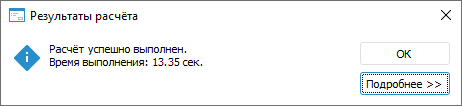

# Расчёт алгоритма: Настольное приложение

Расчёт алгоритма: Настольное приложение
-

# Расчёт алгоритма

Для расчёта алгоритма:

	- Задайте даты расчёта и значения параметров на [панели
	 параметров](Beginning_of_work.htm).

	- Настройте выполнение расчёта с помощью окна «Настройка
	 выполнения расчёта».

[Для
 открытия окна](javascript:TextPopup(this))

	Для открытия окна «Настройка
	 выполнения расчёта» нажмите кнопку  «Настройка выполнения расчёта» на
	 вкладке «Расчёт» ленты инструментов.

Задайте параметры:

		- Проверять арифметические операции. Установите флажок для проверки
		 арифметических операций, используемых в [формулах
		 расчёта](../Calculation_block/Formula.htm). Если при
		 расчёте алгоритма в формуле производится деление на ноль, то будет
		 выдано соответствующее сообщение с указанием формулы расчёта и
		 блока:

Для коррекции указанной формулы нажмите кнопку
 «Остановить», после чего будет
 остановлен расчёт алгоритма. Отредактируйте формулу вручную и выполните
 повторный расчёт алгоритма.

Для пропуска ошибки нажмите кнопку «Пропустить». После чего рассчитываемые
 элементы пропускаются и результатом такого расчёта является пустое значение.

При снятом флажке проверка арифметических
 операций в формулах не выполняется. Если производится деление на ноль,
 то рассчитываемые элементы пропускаются и результатом такого расчёта является
 пустое значение;

Примечание.
 Проверку арифметических операций можно не выполнять, если формула расчёта
 задана верно и в результате расчёта допустимо содержание пустых значений.

		- Не сохранять результат
		 в БД. Установите флажок для [расчёта
		 алгоритма целиком](Perform_calculations.htm#full) или [расчёта
		 отдельных блоков](Perform_calculations.htm#part) без сохранения данных. При снятом флажке
		 результаты расчёта алгоритма сохраняются;

		- Многопоточный расчет.
		 Установите флажок для ускорения расчёта [блоков
		 расчёта](../Calculation_block/Calculation_unit.htm) и [блоков
		 контроля](../Control_Block/Control_Block.htm), если установлен флажок «[Многопоточный
		 расчет](../Calculation_block/Master_calculation_block_page_consumer.htm)» в мастере редактирования блока расчёта или
		 блока контроля. Для блоков агрегации выполняется только однопоточный
		 расчёт. Для получения подробной информации о многопоточном расчёте
		 обратитесь к разделу «[Как
		 выполнять многопоточный расчёт?](../../FAQ/MultiThreadedCalculation.htm)». По умолчанию флажок снят и
		 выполняется однопоточный расчёт алгоритма;

		- Поточечный расчет.
		 Установите флажок для изменения способа расчёта [формул](../Calculation_block/Formula.htm)
		 во всех [блоках
		 расчёта](../Calculation_block/Calculation_unit.htm) и [блоках
		 контроля](../Control_Block/Control_Block.htm), которые содержатся в алгоритме. При поточечном расчёте
		 алгоритма выполняется последовательный расчёт формул в каждой
		 точке данных: сначала формулы рассчитываются по первой точке данных,
		 затем по второй точке и так далее. Такой расчёт можно использовать,
		 если данные по текущей календарной точке зависят от данных, рассчитанных
		 по предыдущей календарной точке. При снятом флажке используется
		 векторный расчёт, то есть формулы рассчитываются по всем точкам
		 данных.

[Схемы
 расчёта формул](javascript:TextPopup(this))

	Расчёт элементов измерения, значения
	 которых рассчитывают формулы, при использовании поточечного расчёта
	 алгоритма:

	

	Расчёт элементов измерения, значения
	 которых рассчитывают формулы, без использования поточечного расчёта
	 алгоритма:

	

Примечание.
 Флажок доступен, если в алгоритме расчёта содержатся [блоки
 расчёта](../Calculation_block/Calculation_unit.htm) и [блоки
 контроля](../Control_Block/Control_Block.htm), для которых заданы [формулы
 расчёта](../Calculation_block/Formula.htm).

Если установлен флажок «[Поточечный
 расчет](../Calculation_block/Additional_Calculation_and_Data_Saving_Parameters.htm)» для конкретных формул расчёта, то расчёт может выполняться
 несколькими способами. Способы расчёта формул приведены на схемах ниже.

[Схемы
 расчёта формул](javascript:TextPopup(this))

	Расчёт элементов измерения, значения
	 которых рассчитывают формулы, при использовании поточечного расчёта
	 алгоритма и поточечного расчёта каждой формулы в блоке:

	

	Расчёт элементов измерения, значения
	 которых рассчитывают формулы, без использования поточечного расчёта
	 алгоритма, но с использованием поточечного расчёта каждой формулы
	 в блоке:

	

	Расчёт элементов измерения, значения
	 которых рассчитывают формулы, без использования поточечного расчёта
	 алгоритма, но с использованием поточечного расчёта формул, например,
	 только в блоке 1:

	

Если в формуле расчёта используются элементы
 атрибута [версионного
 справочника](UiNavObj.chm::/reference_book/FAQ/UiRds_Work_RDS_Elements_work_2.htm), то при расчёте алгоритма значения элементов
 будут одинаковыми для каждой календарной точки.

Важно.
 Использование параметра приводит к снижению производительности и продолжительному
 расчёту алгоритма.

Если в алгоритме расчёта содержатся [блоки
 агрегации](../Aggregation_block/Aggregation_block.htm), то при использовании поточечного расчёта алгоритма невозможен
 расчёт агрегации для одной календарной точки. Выберите способ расчёта
 блоков агрегации с помощью переключателей:

			- Не рассчитывать агрегацию.
			 Блоки агрегации не будут рассчитаны;

			- Рассчитать до поточечного
			 расчёта. Блоки агрегации будут рассчитаны до поточечного
			 расчёта блоков расчёта и блоков контроля;

			- Рассчитать после поточечного
			 расчёта. По умолчанию. Блоки агрегации будут рассчитаны
			 после поточечного расчёта блоков расчёта и блоков контроля.

Примечание.
 Порядок расчёта блоков агрегации в [дереве
 расчёта](Beginning_of_work.htm) учитывается только при использовании поточечного расчёта конкретных
 формул расчёта. При использовании поточечного расчёта алгоритма порядок
 расчёта блоков агрегации зависит от выбранного способа расчёта.

Для применения заданных параметров нажмите
 кнопку «Применить».

	- Если в нескольких блоках используется разная отметка одного
	 и того же источника, установите флажок «Загружать
	 данные отдельно от остальных» в контекстном меню этих блоков
	 в дереве расчёта. Раздельная загрузка данных в таком случае выполняется
	 быстрее и сокращает общее время расчёта алгоритма. Флажок доступен
	 для всех видов блоков.

	- Выполните [расчёт алгоритма
	 целиком](Perform_calculations.htm#full) или [расчёт отдельных
	 блоков](Perform_calculations.htm#part).

После выполнения действий будет выполнен расчёт алгоритма и отображен
 диалог с результатами. Если при расчёте возникла ошибка, то будет отображено
 соответствующее сообщение.

Совет. Для ускорения
 расчёта алгоритма обратитесь к разделу «[Как
 ускорить расчёт алгоритма?](../../FAQ/Acceleration_of_Algorithm_Calculation.htm)».

## Расчёт алгоритма целиком

Для расчёта алгоритма целиком:

	- нажмите кнопку  «Рассчитать
	 алгоритм» в группе «Запуск
	 расчёта» на вкладке «Расчёт»
	 ленты инструментов;

	- нажмите клавишу F5.

Будет запущен расчёт алгоритма. Для остановки расчёта нажмите кнопку
  «Остановить» в группе «Запуск
 расчёта» на вкладке «Расчёт»
 ленты инструментов.

Совет. Для запрета
 остановки расчёта алгоритма обратитесь к разделу «[Как
 запретить остановку расчёта алгоритма?](../../FAQ/AlgorithmMultuThread.htm)».

Во время выполнения расчёта все объекты алгоритма доступны для чтения.
 Например, можно посмотреть настройки блока расчёта или [открыть
 результаты расчёта](DataView.htm) блока в инструменте «Аналитические
 запросы (OALP)».

После завершения расчёта будет отображён диалог «Результаты
 расчёта» с результатами расчёта алгоритма. Например:

Для получения более подробной информации о результатах расчёта алгоритма
 нажмите кнопку «Подробнее». После
 чего будет отображён подробный результат расчёта алгоритма в виде таблицы:

Таблица содержит следующие столбцы:

	- Наименование. Отображает
	 наименования каждого этапа расчёта алгоритма и наименования рассчитанных
	 объектов алгоритма расчёта;

	- Кол-во
	 изм. точек. Отображает количество рассчитанных точек в приёмниках
	 данных после расчёта [блоков
	 расчёта](../Calculation_block/Calculation_unit.htm). Рассчитанные точки соответствуют изменённым значениям
	 в ячейках таблицы при [открытии приёмника](DataView.htm)
	 на просмотр. Если в настройках выполнения расчёта установлен флажок
	 «Поточечный расчёт», то в
	 результате расчёта алгоритма в строке «Расчёт» будет отображаться
	 только общая сумма количества изменённых точек без указания рассчитанных
	 блоков;

	- Выполнение (сек.). Отображает
	 время, затраченное на каждый этап расчёта алгоритма и на расчёт каждого
	 объекта алгоритма расчёта.

При необходимости скопируйте таблицу результатов расчёта с помощью кнопки
 «Скопировать в буфер обмена».

Для скрытия подробной информации о результатах нажмите кнопку «Скрыть».

Если при расчёте возникла ошибка, то будет отображено соответствующее
 сообщение.

Примечание.
 Если в структуре алгоритма расчёта содержатся [ветвления](CalculationConditions.htm),
 то при расчёте алгоритма проверяются условия выполнения веток. В результате
 проверки загружаются только те источники данных, которые заданы для объектов,
 содержащихся в удовлетворяющих условиям ветках. Данная оптимизация позволяет
 сократить время загрузки данных.

## Расчёт отдельных блоков

Для расчёта только выделенных блоков:

	- Выделите в рабочей области или дереве расчёта блоки, которые
	 надо рассчитать.

	Для выбора нескольких блоков в рабочей области используйте клавишу
	 SHIFT, в дереве расчёта - клавишу CTRL или SHIFT.

	- Нажмите кнопку  «Рассчитать выделенные» в группе
	 «Запуск расчёта» на вкладке
	 «Расчёт» ленты инструментов.

После завершения расчёта будет отображен диалог с результатами. Если
 при расчёте возникла ошибка, то будет отображено соответствующее сообщение.

См. также:

[Начало
 работы с расширением «Алгоритмы расчёта» в веб-приложении](../../Web/Work/Beginning_of_work.htm) | [Работа с готовым алгоритмом расчёта](Work.htm) | [Как выполнять многопоточный
 расчёт?](../../FAQ/MultiThreadedCalculation.htm)

		Справочная
		 система на версию 10.9
		 от 18/08/2025,
		 © ООО «ФОРСАЙТ»,
