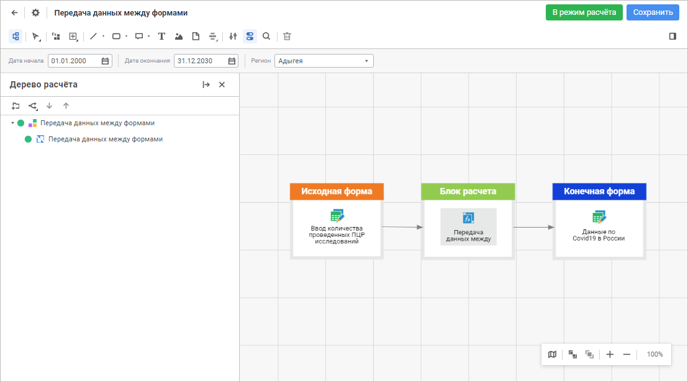

# Автоматизация методик и алгоритмов

Автоматизация методик и алгоритмов
-

# Автоматизация методик и алгоритмов

Для построения алгоритмов расчёта предназначено расширение «Алгоритмы
 расчёта»:

Расширение «Алгоритмы расчёта»
 предназначено для конструирования и проведения комплексных расчётов по
 методикам и алгоритмам.

Ключевые возможности:

	- создание методик расчётов в виде многоуровневых графов на едином
	 графическом пространстве;

	- использование разнородных источников данных из репозитория;

	- гибкий редактор формул со встроенными функциями и прикладным
	 сценарным языком;

	- построение алгоритмов на виртуальных источниках (DataSet) без
	 привязки к определённым источникам данных;

	- параметризированный и частичный расчёт алгоритма.

Для начала работы с расширением
 в веб-приложении смотрите статью «[Начало работы с расширением
 «Алгоритмы расчёта» в веб-приложении](Web/Work/Beginning_of_work.htm)».

Для начала работы с расширением
 в настольном приложении смотрите статью «[Начало
 работы с расширением «Алгоритмы расчёта» в настольном приложении](Desktop/Work/Beginning_of_work.htm)».

Если остались вопросы, смотрите
 статью «[Вопросы
 и ответы](FAQ/FAQ_CalculationAlgorithm.htm)».

См. также:

[Начало
 работы с расширением «Алгоритмы расчёта» в веб-приложении](Web/Work/Beginning_of_work.htm) | [Начало
 работы с расширением «Алгоритмы расчёта» в настольном приложении](Desktop/Work/Beginning_of_work.htm) |
 [Вопросы и ответы](FAQ/FAQ_CalculationAlgorithm.htm)

		Справочная
		 система на версию 10.9
		 от 18/08/2025,
		 © ООО «ФОРСАЙТ»,
