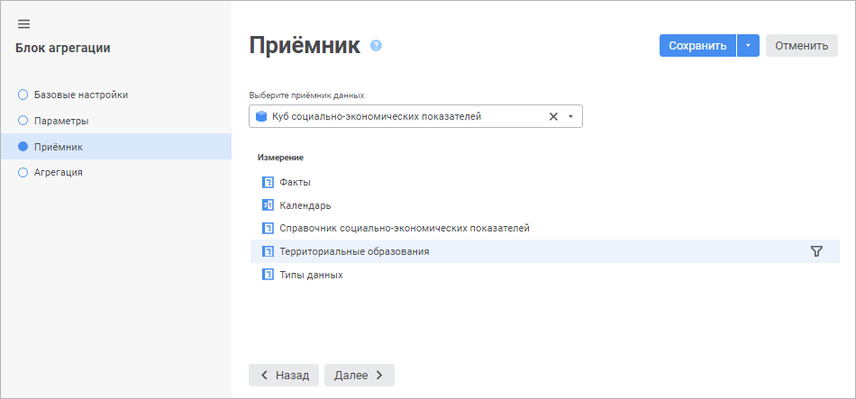

# Выбор и настройка приёмника данных: Блок агрегации, веб-приложение

Выбор и настройка приёмника данных: Блок агрегации, веб-приложение
-

# Выбор и настройка приёмника данных

Приёмник определяет объект, в который будут агрегированы и выгружены
 данные после расчёта блока. В качестве приёмника могут использоваться
 следующие объекты репозитория:

	- [стандартный
	 куб](UiNavObj.chm::/Cube/CreateCube/Master_Standart/UiMd_Cube_CreateCube_Master_Standart.htm);

	- [представление-куб](UiNavObj.chm::/Cube/CreateCube/Master_Calculation/UiMd_Cube_CreateCube_Master_Calculation.htm);

	- [виртуальный
	 куб](UiNavObj.chm::/Cube/CreateCube/Master_Virtual_Cube/UiMd_Cube_CreateCube_Master_Virtual.htm);

	- [база
	 данных временных рядов](UiNavObj.chm::/TimeSeriesDatabase/CreateTimeSeriesDatabase.htm).

Выбор и настройка приёмника данных выполняется на странице «Приёмник»
 в [мастере редактирования блока агрегации](Aggregation_block.htm):

Для выбора и настройки приёмника данных:

	- Выберите объект, который будет использоваться в качестве приёмника
	 данных, в раскрывающемся списке.

Для быстрого выбора объекта в поле для поиска введите его название/идентификатор/ключ,
 в зависимости от настроек отображения. Поиск будет выполняться автоматически
 по мере ввода текста. Список будет содержать объекты, наименования/идентификаторы/ключи
 которых содержат вводимый текст.

Для настройки отображения объектов репозитория
 в списке нажмите кнопку  «Отображение объекта» и выберите
 в раскрывающемся меню вариант отображения:

	- Наименование. Объекты
	 отображаются под своими наименованиями. Вариант по умолчанию;

	- Идентификатор. Объекты
	 отображаются под своими идентификаторами;

	- Ключ. Объекты отображаются
	 под своими ключами.

Выбрать можно несколько вариантов. Идентификатор
 и ключ будут указаны в скобках.

	- Настройте фильтрацию по элементам для выделенного измерения
	 с помощью кнопки  «Задать
	 фильтр», которая расположена напротив измерения приёмника данных.

После выполнения действия будет открыт диалог
 «[<наименование измерения>
 - настройка фильтрации](#filter)», в котором задайте настройки фильтрации
 измерения приёмника данных.

В результате будет настроен приёмник данных в блоке агрегации.

## Настройка фильтрации измерения приёмника данных

Фильтрация позволяет выполнять расчёт только по части элементов измерения.

Для выбора элементов измерения, по которым будет рассчитываться блок,
 используйте диалог «<наименование измерения> - настройка фильтрации»:

Порядок настройки:

	- Выберите элементы, по которым будет рассчитываться блок. Установите
	 один из переключателей:

		- Все элементы. Расчёт
		 блока будет идти по всем элементам измерения;

		- Элементы. Расчёт
		 блока будет идти по элементам измерения, выбранным в данном списке;

		- Параметры. Расчёт
		 блока будет идти по элементам, заданным параметром. Способ
		 доступен, если блок содержит параметры.

Для работы с [отметкой
 элементов](UiSelection.chm::/Selection/Selection_of_the_dimension_elements.htm#selection) измерения используйте команды контекстного
 меню.

Для расчёта блока по всем элементам, кроме
 отмеченных, установите флажок «Исключить
 выбранные элементы» при необходимости.

	- Добавьте расширенные условия фильтрации при необходимости. При
	 выполнении расчёта блока атрибуты элементов будут соответствовать
	 заданным условиям. Работа с группой параметров условия аналогична
	 работе с диалогом «[Расширенный фильтр](../Calculation_block/Calculation_Formula_Generation.htm#aggrsetup)».

	- Нажмите кнопку «Применить».

После выполнения действий блок будет рассчитываться только по
 элементам, соответствующим настроенному фильтру.

Примечание.
 При использовании календаря расчёт блока выполняется по пересечению отметки
 календарного измерения, заданной в настройках фильтрации, и [периода
 расчёта алгоритма](../Work/Calculation_period_management.htm), заданного на панели параметров.

См. также:

[Вставка и настройка блоков агрегации](Aggregation_block.htm)

		Справочная
		 система на версию 10.9
		 от 18/08/2025,
		 © ООО «ФОРСАЙТ»,
