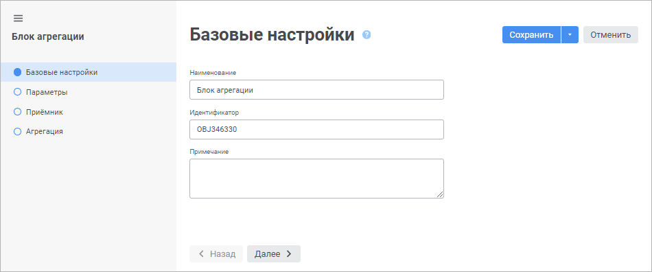

# Настройка базовых свойств: Блок агрегации, веб-приложение

Настройка базовых свойств: Блок агрегации, веб-приложение
-

# Настройка базовых свойств

Настройка базовых свойств блока агрегации выполняется на странице «Базовые настройки» в [мастере
 редактирования блока агрегации](Aggregation_block.htm):

Задайте значения свойств:

	- Наименование. Наименование
	 блока должно нести смысловую нагрузку, раскрывать его функциональность.
	 Свойство является обязательным;

	- Идентификатор. Идентификатор
	 блока должен быть уникальным в рамках алгоритма расчёта. Он состоит
	 только из букв латинского алфавита, цифр и знаков подчёркивания. Идентификатор
	 может начинаться с любого допустимого символа, кроме цифры. Свойство
	 является обязательным;

	- Примечание. Примечание
	 может содержать любую информацию по усмотрению пользователя.

См. также:

[Вставка
 и настройка блоков агрегации](Aggregation_block.htm)

		Справочная
		 система на версию 10.9
		 от 18/08/2025,
		 © ООО «ФОРСАЙТ»,
