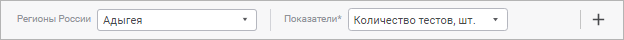

# Выбор рассчитываемого элемента и календарной динамики расчёта: Алгоритм расчёта показателей, веб-приложение

Выбор рассчитываемого элемента и календарной динамики расчёта: Алгоритм расчёта показателей, веб-приложение
-

# Выбор рассчитываемого элемента и календарной динамики расчёта

При составлении [формулы расчёта](Formula.htm) в качестве
 рассчитываемого элемента используются элементы измерения [приёмника
 данных](Master_calculation_block_page_consumer.htm).

Для определения элемента, значения которого рассчитывает формула, предназначена
 панель рассчитываемых элементов:

Для отображения/скрытия панели рассчитываемых элементов нажмите кнопку
  «Выходная переменная».

По умолчанию на панели отображаются нефильтруемые измерения, которые
 не отмечены в списке измерений [приёмника
 данных](Master_calculation_block_page_consumer.htm). Такие измерения являются обязательными для заполнения и отмечаются
 символом «*». Для фильтруемого измерения можно выбрать элемент, по которому
 будет выполняться расчёт вне зависимости от заданной фильтрации на странице
 «[Приёмник](../../Desktop/Calculation_block/Master_calculation_block_page_consumer.htm)» в мастере редактирования
 блока расчёта или контроля.

Для выбора элемента измерения:

	- из нефильтруемого измерения:

		- Щёлкните по раскрывающемуся списку измерения на панели рассчитываемых
		 элементов. Будет отображён список элементов измерения.

		- Выберите элемент в списке для каждого измерения.

	- из фильтруемого измерения:

		- Нажмите кнопку  «Добавить
		 измерение», расположенную в правой части панели рассчитываемых
		 элементов. Будет отображён список фильтруемых измерений.

		- Выберите измерение. Выбранное измерение будет отображено
		 на панели рассчитываемых элементов.

		- Щёлкните по раскрывающемуся списку измерения на панели рассчитываемых
		 элементов. Будет отображён список элементов измерения.

		- Выберите элемент в списке для каждого добавленного измерения.

После выполнения действий будет выбран рассчитываемый элемент измерения.

Далее перейдите к [формированию
 формулы расчёта](Calculation_Formula_Generation.htm).

## Выбор календарной динамики

Выберите календарную динамику расчёта формулы в раскрывающемся списке
 «Шаг динамики» на [панели
 параметров расчёта](Formula.htm):

	- годовая;

	- полугодовая;

	- квартальная;

	- месячная;

	- недельная;

	- дневная.

Расчёт формулы зависит от переключателя «[Задать
 период расчёта](Additional_Calculation_and_Data_Saving_Parameters.htm)»:

	- если переключатель переведён в активное состояние, то расчёт
	 формулы вычисляется на каждом шаге календарной динамики расчёта в
	 рамках заданного периода расчёта алгоритма;

	- если переключатель переведён в неактивное состояние, то шаг
	 динамики влияет на [смещение](Additional_Calculation_and_Data_Saving_Parameters.htm)
	 дат, заданных с учётом количества периодов.

Если календарная динамика формулы расчёта отличается от [календарной
 динамики операнда](Calculation_Formula_Generation.htm#calendar), то в результате расчёта формулы данные будут рассчитаны
 по календарной динамике формулы. Например, если для формулы задана месячная
 динамика расчёта, а для операнда годовая, то расчёт данных будет выполняться
 по месяцам.

См. также:

[Настройка
 формул расчёта](Formula.htm) | [Формирование
 формулы расчёта](Calculation_Formula_Generation.htm)

		Справочная
		 система на версию 10.9
		 от 18/08/2025,
		 © ООО «ФОРСАЙТ»,
