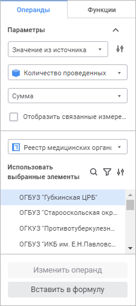
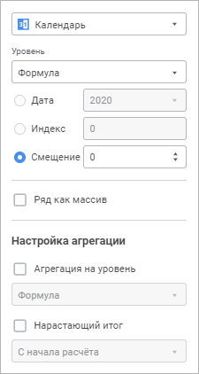
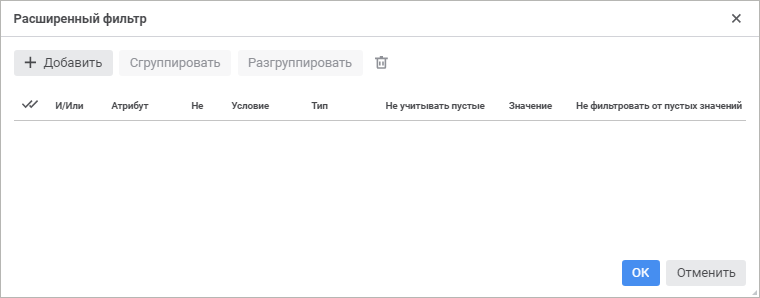
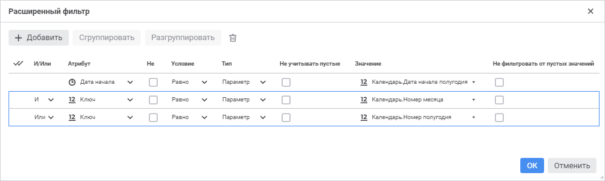
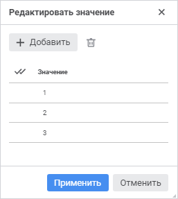
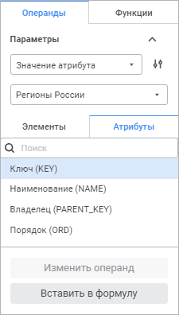
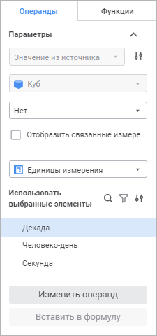
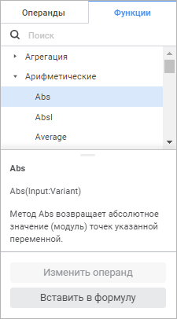

# Формирование формулы расчёта: Алгоритм расчёта показателей, веб-приложение

Формирование формулы расчёта: Алгоритм расчёта показателей, веб-приложение
-

# Формирование формулы расчёта

	Формула расчёта формируется в [области формул](Formula.htm)
	 и используется для преобразования данных из источника в приёмник.

	В формуле допускается использование операндов, функций, арифметических
	 операций, цифр, знаков сравнения и круглых скобок.

	Операнд - это элемент данных из источника, над которым выполняются
	 действия при расчёте формулы. Функция - это последовательность
	 действий, выполняемых над операндом при расчёте формулы.

	Операнды и функции вставляются с помощью боковой панели. Цифры,
	 знаки сравнения и круглые скобки вводятся с клавиатуры.

	Доступные типы операндов:

		- на основе отметки элементов
		 измерений. Применяется, если в формуле предполагается использовать
		 значение данных, полученное по заданной отметке элементов измерений;

		- на основе атрибутов измерений.
		 Применяется, если в формуле предполагается использовать значение
		 указанного атрибута, полученное по заданной отметке измерения.

	Календарная динамика операндов должна совпадать с календарной динамикой
	 формулы. Если в формуле требуются операнды с календарной динамикой,
	 отличной от календарной динамики формулы, то используйте функции [агрегации](UiNav.chm::/GUI/Expression_editor_func.htm#aggregation).
	 Они позволяют привести календарную динамику операндов к календарной
	 динамике формулы.

	[Пример использования
	 функций агрегации](javascript:TextPopup(this))

		Например, есть формула расчёта потери энергии с месячной динамикой:

		{ Потребление электроэнергии субъектом РФ[t]
		 } * { Потери электроэнергии[Годы.t] } / { Потребление электроэнергии
		 субъектом РФ[Годы.t] }

		Операнды «{ Потери электроэнергии[Годы.t] }» и «{ Потребление
		 электроэнергии субъектом РФ[Годы.t] }» имеют годовую динамику.
		 Для корректного расчёта их данные нужно дезагрегировать с годовой
		 динамики на месячную с помощью функции Interpolate:

		{ Потребление электроэнергии субъектом РФ[t]
		 } * Interpolate({ Потери электроэнергии[Годы.t] } / { Потребление
		 электроэнергии субъектом РФ[Годы.t] },MsInterpolateType.Repeat_,MsFrequency.Monthly)

## Вставка операнда на основе отметки
	 измерений

	Результатом расчёта операнда будет значение данных, полученное по
	 заданной отметке элементов измерений.

	Для вставки операнда на основе отметки измерений:

		- Перейдите на вкладку «Операнды»
		 на боковой панели.

		- Выберите в раскрывающемся списке тип операнда «Значение
		 из источника».

	При необходимости выберите вид отображения
	 элементов измерения источника данных на боковой панели и в области
	 формул с помощью кнопки  «Отображение
	 элементов измерения»:

			- Наименование. По умолчанию;

			- Идентификатор;

			- Наименование и идентификатор.

	При изменении вида отображения элементов
	 изменяется вид отображения соответствующих операндов в формуле.

		- Выберите в раскрывающемся списке источник данных, используемый
		 операндом. Будут отображены элементы измерений выбранного источника.
		 Например:

	

		- При необходимости выберите в раскрывающемся списке метод
		 агрегации, если операнд должен выполнять агрегацию.

	Агрегация позволят использовать в формуле
	 несколько значений элементов из измерения операнда, агрегированных
	 выбранным способом. Агрегация может быть настроена по любому измерению
	 операнда, кроме календарного.

	Совет.
	 После создания операнда можно настроить расчёт агрегации только по
	 тем значениям измерения, которые соответствуют определённым правилам.
	 Для получения подробной информации обратитесь к разделу «[Настройка
	 фильтрации агрегируемых значений операнда](Calculation_Formula_Generation.htm#aggrsetup)».

		- При необходимости установите флажок «Отобразить
		 связанные измерения», если в операнде должны участвовать
		 связанные измерения источника данных. [Связь
		 измерений](Page_Sources.htm#link) задаётся на этапе выбора [источников
		 данных](Page_Sources.htm) блока расчёта.

		- Для каждого измерения выберите
		 элемент, на основе которого формируется операнд. Если операнд
		 должен выполнять агрегацию выберите несколько элементов, по которым
		 будет выполняться агрегация.

Для изменения вида отображения элементов
 по существующим [атрибутам](UiNavObj.chm::/reference_book/Master_RDS_reference_book/Attributes.htm)
 измерения выполните команду «Настройки
 отображения» в контекстном меню списка элементов и выберите один
 из атрибутов. Скрытые атрибуты недоступны для использования. По умолчанию
 в области формул и списке элементов на боковой панели отображаются наименования
 элементов. При изменении вида отображения элементов изменяется вид отображения
 соответствующих операндов в формуле.

Для отметки всех элементов измерения выполните
 команду «Отметить всё» в контекстном
 меню списка элементов.

Для снятия отметки со всех элементов измерения
 выполните команду «Снять отметку со всех»
 в контекстном меню списка элементов.

Для разворачивания иерархии списка элементов
 выполните команду «Развернуть всё»
 в контекстном меню списка элементов.

Для сворачивания иерархии списка элементов
 выполните команду «Свернуть всё»
 в контекстном меню списка элементов.

Если для операнда настроена агрегация, то
 для применения схемы отметки, настроенной в справочнике, выполните команду
 «Применить схему отметки» в контекстном
 меню списка элементов.

	Если источник данных содержит [управляющие
	 измерения](uinavobj.chm::/cube/createcube/master_calculation/uimd_cube_createcube_master_calculation_managed_dim.htm), то при выборе элемента управляющего
	 измерения будет обновлен набор элементов в управляемых измерениях.

	Для настройки способа выбора элементов
	 нажмите кнопку  «Настройка
	 выбора элементов». После чего будет открыто окно «Настройка
	 выбора элементов»:

	

	Задайте способ выбора элементов:

			- Все. Будут выбраны
			 все элементы. Способ доступен, если операнд выполняет агрегацию;

			- Выбранные. По
			 умолчанию. Будут выбраны элементы, отмеченные пользователем;

			- Из параметра.
			 Значение элемента задаётся параметром, выбранным в данном
			 диалоге. Для выбора доступны [собственные
			 параметры блока расчёта](Parameters.htm) или добавленные в блок [параметры
			 алгоритма расчёта](../Work/Parameters_of_the_calculation_algorithm.htm). Параметры должны иметь тип «Отметка».

		- Если для операнда требуются настройки
		 календаря, отличные от всей формулы, то выберите календарное измерение:

	

	Примечание.
	 Измерение отсутствует, если в [приёмнике
	 данных](Master_calculation_block_page_consumer.htm) календарь используется как обычное измерение.

	Задайте настройки календаря для операнда:

			- В раскрывающемся списке «Уровень»
			 выберите календарную динамику операнда. По умолчанию выбран
			 элемент «Формула»
			 и календарная динамика операнда совпадает с календарной динамикой
			 формулы.

	Примечание.
	 Если календарная динамика операнда отличается от [календарной
	 динамики формулы расчёта](Calculated_Element_Select.htm#frequency), то в результате расчёта формулы данные
	 будут рассчитаны по календарной динамике формулы.

			- Выберите способ получения календарных данных:

				- Дата. Используется,
				 если требуется зафиксировать дату, на которую будут взяты
				 данные операнда. Например, данные за 2018 год;

				- Индекс.
				 Используется, если требуется зафиксировать точку ряда,
				 на которую будут взяты данные операнда. Например, на третью
				 точку от начала ряда;

				- Смещение.
				 По умолчанию. Используется, если все данные операнда надо
				 сместить вперёд или назад на определённое количество точек
				 во временном периоде относительно всей формулы. Например,
				 в формуле используются данные начиная с 2000 года, а в
				 операнде со смещением будут использоваться данные начиная
				 с 2003 года.

	Задайте способ передачи операнда в расчёт
	 с помощью флажка «Ряд как массив»:

			- флажок снят.
			 По умолчанию. Точка операнда, используемая в формуле, будет
			 зависеть от даты, на которую выполняется расчёт.

	Например, формула имеет годовую динамику
	 и рассчитывается с 2000 по 2018 годы. В расчёте формулы за 2000 год
	 будет использоваться значение операнда за 2000 год, в расчёте формулы
	 за 2001 год - значение операнда за 2001 год и так далее;

			- флажок установлен.
			 В формуле все значения операнда будут представлены в виде
			 массива, а не точки. При вставке в уравнение операнда данного
			 типа используйте обработчик, преобразующий операнд к одному
			 значению. Обработчиком может выступать статистическая, математическая
			 или пользовательская функция.

			Например, в формуле необходимо использовать минимальное значение
			 операнда {X}. Для этого следует установить флажок «Ряд
			 как массив» и использовать функцию нахождения минимума: Min({X}).

	Задайте настройки агрегации календаря
	 для операнда:

			- Агрегация на уровень.
			 Установите флажок, если нужно повысить календарную динамику
			 операнда. В соответствующем раскрывающемся списке выберите
			 динамику, в которой должны быть данные операнда.

			Например, формула имеет годовую динамику, а операнд в формуле
			 - месячную. Для корректного использования операнда в формуле
			 установите флажок «Агрегация
			 на уровень» и выберите динамику «Формула»
			 или «Год»;

			- Нарастающий итог.
			 Установите флажок, если операнд надо вычислять с нарастающим
			 итогом. В соответствующем раскрывающемся списке выберите период,
			 с которого будет рассчитываться нарастающий итог.

	Вычисление операнда с нарастающим позволяет
	 в текущем периоде учитывать данные за предыдущие периоды. Например,
	 есть операнд со следующими значениями: 2015 г - 3, 2016г - 5, 2017г.
	 - 9, 2018г. - 4. Если установить флажок «Нарастающий
	 итог» и выбрать период «С
	 начала расчёта», то при вычислении будут использоваться следующие
	 значения операнда: 2015 г - 3, 2016г - 8, 2017г. - 17, 2018г. - 21.

		- В области формул установите курсор в место вставки операнда
		 и нажмите кнопку «Вставить в
		 формулу» на боковой панели.

	Операнд на основе отметки измерений будет вставлен в формулу. Например:

	{ Финансовые показатели! ПОКАЗАТЕЛИ ФИНАНСОВОЙ
	 УСТОЙЧИВОСТИ | На отчетную дату отчетного периода[t] }

	В начале текста операнда идёт название источника данных, заканчивающееся
	 восклицательным знаком. Далее через вертикальную черту идут названия
	 элементов, отмеченных в измерениях.

	Если в окне «[Настройка
	 выбора элементов](#elementselection)» указано, что отметка измерения задаётся
	 параметром, то название параметра будет указано в фигурных скобках.
	 Например:

	{ Финансовые показатели! ПОКАЗАТЕЛИ ЛИКВИДНОСТИ,
	 ПОКАЗАТЕЛИ ДЕЛОВОЙ АКТИВНОСТИ | {Отчётная дата}[t] }

	Настройки агрегации влияют на отображения текста операнда:

		- если для операнда настроена агрегация, то в начале текста
		 операнда отображается символ ∑, например:

	{ ∑ Финансовые показатели!
	 ПОКАЗАТЕЛИ ЛИКВИДНОСТИ | На отчетную дату отчетного периода[t]
	 }

		- если агрегируется два элемента, то они указываются через
		 запятую. Например:

	{ ∑ Финансовые показатели!
	 ПОКАЗАТЕЛИ ЛИКВИДНОСТИ, ПОКАЗАТЕЛИ ДЕЛОВОЙ АКТИВНОСТИ | На отчетную
	 дату отчетного периода[t] }

	Если агрегируется три и более элемента,
	 то указывается только первый и последний элементы через многоточие.
	 Например:

	{ ∑ Финансовые показатели!
	 ПОКАЗАТЕЛИ ЛИКВИДНОСТИ...ДОПОЛНИТЕЛЬНЫЕ ПАРАМЕТРЫ | На отчетную
	 дату отчетного периода[t] }

		- если в диалоге «[Настройка
		 выбора элементов](#elementselection)» указано, что для агрегации выбраны
		 все элементы измерения, то вместо списка отмеченных элементов
		 отображается текст «Все».
		 Например:

	{ ∑ Финансовые показатели!
	 Все | На отчетную дату отчетного периода[t] }

		- если для агрегируемого измерения настроена [фильтрация](#aggrsetup),
		 то тексте операнда для фильтруемого измерения будет добавлено
		 слово «Фильтр», а фильтруемые
		 элементы помещены в круглые скобки. Например:

	{ ∑ Финансовые
	 показатели! Фильтр(ПОКАЗАТЕЛИ ЛИКВИДНОСТИ...ДОПОЛНИТЕЛЬНЫЕ ПАРАМЕТРЫ) |
	 На отчетную дату отчетного периода[t] }

	[t] в конце операнда означает полную отметку по календарному измерению,
	 используемую по умолчанию. Символ [t] будет дополнен или изменён в
	 зависимости от заданных календарных настроек:

		- если раскрывающемся списке «Уровень»
		 выбрана календарная динамика, отличающаяся от календарной динамики
		 формулы, то она будет отображена перед символом t, отделённая
		 точкой. Например, выбрана полугодовая динамика:

	{ Финансовые показатели!
	 ПОКАЗАТЕЛИ ЛИКВИДНОСТИ | На отчетную дату отчетного периода[Полугодия.t]
	 }

		- если в поле «Дата»
		 указано определённое значение, то оно будет отображено в конце
		 операнда в квадратных скобках. Например, указан 2018 год:

	{ Финансовые показатели!
	 ПОКАЗАТЕЛИ ЛИКВИДНОСТИ | На отчетную дату отчетного периода[2018]
	 }

		- если в поле «Индекс»
		 зафиксирована точка ряда, на которую будут взяты данные операнда,
		 то она будет отображена в конце операнда в квадратных скобках.
		 Например, на третью точку от начала ряда:

	{ Финансовые показатели!
	 ПОКАЗАТЕЛИ ЛИКВИДНОСТИ | На отчетную дату отчетного периода[3]
	 }

		- если в поле «Смещение»
		 задано смещение отличное от нуля, то его размер будет указан в
		 квадратных скобках вместе с [t]. Например, в поле «Смещение»
		 указано значение -1:

	{ Финансовые показатели!
	 ПОКАЗАТЕЛИ ЛИКВИДНОСТИ | На отчетную дату отчетного периода[t-1]
	 }

### Настройка фильтрации агрегируемых значений
	 операнда

	Если для операнда на основе отметки измерений применяется агрегация
	 данных, то можно настроить фильтрацию агрегируемых значений и выполнять
	 агрегацию только по тем значениям измерения, которые соответствуют
	 определённым условиям. Фильтрация элементов измерения выполняется
	 за счёт наложения условий на значения атрибутов измерения.

	Для настройки фильтрации откройте окно «Расширенный
	 фильтр»:

		- Щёлкните по операнду в области формул.

		- Перейдите на вкладку «Операнды»
		 на боковой панели и убедитесь, что для операнда в раскрывающемся
		 списке «Агрегация» выбран
		 какой-либо метод агрегации.

		- Выберите в раскрывающемся списке измерение, для которого
		 настраивается фильтрация агрегируемых значений, и нажмите кнопку
		  «Расширенный фильтр».

	После выполнения действий будет открыто окно
	 «Расширенный фильтр»:

	

	Задайте условия фильтрации агрегируемых значений:

		- Нажмите кнопку  «Добавить».
		 В таблицу будет добавлена новая строка для задания условия.

		- В столбце «И/Или»
		 выберите один из логических операторов с помощью раскрывающегося
		 списка:

			- И. По умолчанию.
			 Фильтрация элементов измерения будет выполняться при удовлетворении
			 всех условий фильтрации;

			- Или. Фильтрация
			 элементов измерения будет выполняться при удовлетворении одного
			 из условий фильтрации. Проверка условий выполняется последовательно.

	Для группировки условий фильтрации
	 последовательно установите флажки напротив условий в первом столбце
	 и нажмите кнопку «Сгруппировать».
	 После выполнения действий выбранные условия фильтрации будут сгруппированы:

	

	Примечание.
	 Для группы правил применяется условие, выбранное для первого правила.

	Для разгруппировки условий фильтрации
	 установите флажки напротив каждого условия в группе и нажмите кнопку
	 «Разгруппировать».

		- В столбце «Атрибут»
		 выберите атрибут измерения, для которого будет выполняться проверка
		 условия фильтрации. Если атрибут измерения содержит [множественное
		 значение](UiNavObj.chm::/reference_book/Master_RDS_reference_book/Attributes/Attribute.htm), то при проверке условия фильтрации
		 будут сравниваться все значения атрибута. Если хотя бы одно значение
		 атрибута удовлетворяет условию, то элемент измерения будет автоматически
		 удовлетворять условию.

	Для фильтрации элементов измерения по
	 атрибутам [связанного
	 справочника](UiNavObj.chm::/reference_book/Master_RDS_reference_book/Link_Property.htm) выберите в списке атрибут, связанный
	 с этим справочником. После чего в столбце «Значение»
	 будет отображаться список элементов связанного справочника.

		- Установите флажок в столбце «Не»,
		 если требуется задать обратное условие. Например, значение атрибута
		 не равно пяти.

		- В столбце «Условие»
		 выберите один из типов условия:

			- Равно. Используйте данное
			 условие для определения, равен ли атрибут, выбранный в столбце
			 «Атрибут», заданному
			 значению, указанному в столбце «Значение»;

			- Не равно. Используйте данное
			 условие для определения, не равен ли атрибут, выбранный в
			 столбце «Атрибут»,
			 заданному значению, указанному в столбце «Значение»;

			- Больше. Используйте данное
			 условие для определения, больше ли атрибут, выбранный в столбце
			 «Атрибут», заданного
			 значения, указанного в столбце «Значение»;

			- Больше или равно.
			 Используйте данное условие для определения, больше или
			 равен ли атрибут, выбранный в столбце «Атрибут»,
			 заданного значения, указанного в столбце «Значение»;

			- Меньше. Используйте данное
			 условие для определения, меньше ли атрибут, выбранный в столбце
			 «Атрибут», заданного
			 значения, указанного в столбце «Значение»;

			- Меньше или равно.
			 Используйте данное условие для определения, меньше или
			 равен ли атрибут, выбранный в столбце «Атрибут»,
			 заданного значения, указанного в столбце «Значение»;

			- Между. Используйте данное
			 условие для определения, находится ли атрибут, выбранный в
			 столбце «Атрибут»,
			 в диапазоне заданных значений, указанных в столбце «Значение», включая границы
			 диапазона. Данный тип условия доступен, если выбран атрибут
			 следующего [типа
			 данных](UiNavObj.chm::/reference_book/Master_Table_reference_book/UiMd_reference_book_Master_Table_page1_AttProps.htm): целочисленный, вещественный, дата
			 и время;

	Примечание.
	 Условие проверяет точное совпадение с одним из заданных значений в
	 столбце «Значение».

			- В. Используйте данное
			 условие для определения, входит ли атрибут, выбранный в столбце
			 «Атрибут», в одно
			 из заданных значений, указанных в столбце «Значение».

			- Содержит.
			 Используйте данное условие для определения, содержит ли атрибут,
			 выбранный в столбце «Атрибут»,
			 заданное значение, указанное в столбце «Значение»;

			- Начинается с.
			 Используйте данное условие для определения, начинается ли
			 атрибут, выбранный в столбце «Атрибут»,
			 с заданного значения, указанное в столбце «Значение».

			- Заканчивается на.
			 Используйте данное условие для определения, заканчивается
			 ли атрибут, выбранный в столбце «Атрибут»,
			 на заданное значение, указанное в столбце «Значение».

	Примечание.
	 Набор отображаемых типов условия зависит [типа
	 данных](UiNavObj.chm::/reference_book/Master_RDS_reference_book/Attributes/Attribute.htm) атрибута и типа сравниваемого значения,
	 выбранных в столбцах «Атрибут»
	 и «Тип» соответственно.

		- В столбце «Тип»
		 выберите тип сравниваемого значения:

			- Значение. Значение
			 атрибута задаётся напрямую конкретным значением;

			- Параметр. Значение
			 атрибута задаётся динамически через параметр или атрибут измерения,
			 содержащийся в параметре. Данный тип сравниваемого значения
			 недоступен, если выбран тип условия «Между».

		- Установите флажок в столбце «Не
		 учитывать пустые», если требуется не фильтровать элементы
		 измерения, у которых есть пустые значения по атрибуту, указанному
		 в столбце «Атрибут». Например,
		 если флажок установлен в [блоке
		 расчёта](Calculation_unit.htm), то при [расчёте
		 алгоритма](../Work/Perform_calculations.htm), содержащего данный блок, не будут исключаться элементы
		 с пустыми значениями из расчёта.

		- В столбце «Значение»
		 укажите сравниваемое значение или выберите в раскрывающемся списке
		 параметр/атрибут измерения, задающий данное значение.

	[Тип
	 данных](UiNavObj.chm::/reference_book/Master_RDS_reference_book/Attributes/Attribute.htm) значения задается в соответствии с атрибутом.
	 Если расширенный фильтр задается для календарного измерения, то для
	 атрибута «Тип блока календаря»
	 в качестве значения будет доступен выбор уровней календарного измерения.

	Примечание.
	 Если задано условие на уровень, который исключен из календарного измерения,
	 то выбранное значение атрибута будет сброшено.

	Если выбран атрибут измерения «Ключ», «Идентификатор»
	 или «Владелец», то в качестве
	 значения будет доступен выбор элементов измерения по наименованию.
	 Доступны множественная отметка.

	Если атрибут измерения [связан](UiNavObj.chm::/reference_book/Master_RDS_reference_book/Link_Property.htm)
	 с другим справочником, то в качестве значения будет доступен выбор
	 элементов связанного справочника.

	Если выбрано условие «в»,
	 то для ввода значения нажмите кнопку «Редактировать».
	 В открывшемся окне «Редактировать
	 значение» нажмите кнопку 
	 «Добавить». Будет добавлена
	 строка для ввода значения:

	

	Для удаления значения установите флажок
	 в первом столбце напротив значения и нажмите кнопку  «Удалить».

	После завершения ввода значений нажмите
	 кнопку «Применить». Заданные
	 значения будут отображены в одной строке через запятую в столбце «Значение».

	Если выбрано условие «в»,
	 то для работы с [отметкой
	 элементов](UiSelection.chm::/Selection/Selection_of_the_dimension_elements.htm#selection) измерения используйте команды контекстного
	 меню.

		- Установите флажок в столбце «Не
		 фильтровать от пустых значений», если для сравнения используется
		 значение параметра в столбце «Значение».
		 Результат расчёта при установленном флажке зависит от того, какое
		 значение принимает параметр:

			- если параметр принимает единственное значение, то из
			 расчёта не будут исключаться элементы с пустыми значениями;

			- если параметр принимает множественное значение, то из
			 расчёта будут исключаться элементы с пустыми значениями.

	Примечание.
	 Доступно только для типа сравниваемого значения «Параметр».

		- Повторите шаги для добавления нескольких условий фильтрации.

	После выполнения действий будет настроена фильтрация агрегируемых
	 значений операнда.

	Для удаления условия фильтрации установите флажок в первом столбце
	 напротив условия и нажмите кнопку  «Удалить».

## Вставка операнда на основе атрибутов
	 измерений

	Результатом расчёта операнда будет значение указанного атрибута,
	 полученное по заданной отметке измерения.

		- Перейдите на вкладку «Операнды»
		 на боковой панели.

		- Выберите в раскрывающемся списке тип операнда «Значение
		 атрибута».

		- Выберите в раскрывающемся списке измерение источника данных,
		 используемое операндом. Будут отображены списки с элементами и
		 атрибутами выбранного измерения. Например:

	

		- Если для операнда требуется переопределить отметку элементов
		 измерения, заданную на этапе добавления [приёмника](Master_calculation_block_page_consumer.htm)
		 и [источников](Page_Sources.htm) данных, то установите
		 флажок «Переопределить отметку»
		 и задайте отметку на вкладке «Элементы»
		 аналогично [вставке операнда на основе
		 отметки измерений](#operandselection).

	Для поиска элемента или атрибута начните
	 вводить его наименование частично или целиком в строке поиска. После
	 выполнения действия будут отображены элементы или атрибуты, наименования
	 которых удовлетворяют условиям поиска.

		- На вкладке «Атрибуты»
		 выберите атрибут, на основе значений которого формируется операнд.

		- В области формул установите курсор в место вставки операнда
		 и нажмите кнопку «Вставить в
		 формулу» на боковой панели.

	После выполнения действий в формулу будет вставлен операнд на основе
	 атрибутов измерений. Например:

	{Финансовые показатели!ПОКАЗАТЕЛИ ДЕЛОВОЙ АКТИВНОСТИ.Наименование}

	В начале текста операнда идёт название источника данных, заканчивающееся
	 восклицательным знаком. Далее идёт название измерения или название
	 отмеченного элемента, если была переопределена отметка элементов измерения.
	 Затем через точку указано наименование выбранного атрибута.

## Изменение операнда

	Для изменения вставленного операнда:

		- Щёлкните по операнду в области формул. На боковой панели
		 будут отображены настройки операнда без возможности изменения
		 источника данных:

	

		- Измените настройки операнда.

		- Нажмите кнопку «Изменить
		 операнд» на боковой панели.

	После выполнения действий будут внесены изменения в настройки выбранного
	 операнда.

## Вставка функций

	Доступны следующие способы вставки функций:

	[С помощью
	 боковой панели](javascript:TextPopup(this))

			- Перейдите на вкладку «Функции»
			 на боковой панели. Будет отображён сгруппированный по категориям
			 список функций, доступных для использования в формуле.

			- Выберите функцию на боковой панели. В нижней части панели
			 появится подсказка с описанием выбранной функции:

		

		Для быстрого поиска функции начните
		 печатать её наименование частично или полностью в строке поиска.

			- Установите курсор в место вставки функции в области
			 формул.

			- Нажмите кнопку «Вставить
			 в формулу» на боковой панели или дважды щёлкните по
			 выбранной функции. Функция будет вставлена в область формул.

			- Задайте параметры функции.

		В результате выполнения действий функция будет вставлена в формулу.

	[С помощью
	 сочетания клавиш](javascript:TextPopup(this))

			- Установите курсор в место вставки функции в области
			 формул.

			- Нажмите сочетание клавиш CTRL+ПРОБЕЛ. Появится всплывающая
			 подсказка со списком функций, доступных для использования
			 в формуле. Для быстрого поиска функции во всплывающей подсказке
			 начните печатать её наименование частично или полностью в
			 области формул.

			- Выберите функцию из всплывающей подсказки и нажмите
			 ENTER. Функция будет вставлена в область формул.

			- Задайте параметры функции.

		В результате выполнения действий функция будет вставлена в формулу.

	Для получения описания доступных функций обратитесь к разделу «[Функции, доступные
	 в редакторе выражения](uinav.chm::/GUI/expression_editor_func.htm)».

	Примечание.
	 Для повышения производительности продукта «Форсайт. Аналитическая платформа»
	 используйте условный оператор [?:](fore.chm::/08_operators/Fore_If.htm)
	 вместо функции [Iif](uinav.chm::/GUI/Function/Logical/Func_Logical_Iif.htm).

См. также:

[Настройка
 формул расчёта](Formula.htm) | [Настройка
 дополнительных параметров расчёта и сохранения данных](Additional_Calculation_and_Data_Saving_Parameters.htm)

		Справочная
		 система на версию 10.9
		 от 18/08/2025,
		 © ООО «ФОРСАЙТ»,
