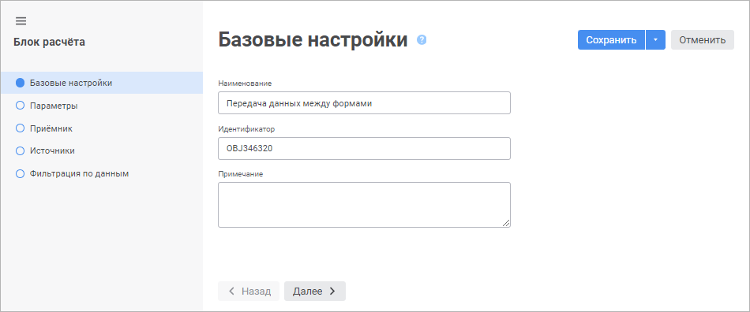

# Вставка и настройка блоков расчёта: Веб-приложение

Вставка и настройка блоков расчёта: Веб-приложение
-

# Вставка и настройка блоков расчёта

Блок расчёта предназначен для выполнения расчётов по заданным параметрам.

[Создание
 нового блока расчёта](javascript:TextPopup(this))

	Для создания нового блока расчёта:

	- в [навигаторе
	 объектов](GetStarted.chm::/Interface/Interface_Navigator.htm) нажмите кнопку  «Создать» в главном меню и выберите
	 тип объекта на боковой панели «[Новый
	 объект](UiNav.chm::/02_Navigator/General_Principles_of_Work.htm#add_object)».

	- в [расширении
	 «Алгоритмы расчёта»](../Work/Beginning_of_work.htm#create) выполните
	 одно из действий:

			- выполните команду  «Блок
			 расчёта» в раскрывающемся меню кнопки  «Добавить
			 блок» на [панели
			 инструментов](../Work/Beginning_of_work.htm);

			- выполните команду «Создать
			 >  Блок расчёта» в контекстном
			 меню [рабочей области](../Work/Beginning_of_work.htm).

[Редактирование
 готового блока расчёта](javascript:TextPopup(this))

	Для редактирования готового блока расчёта:

	- в [навигаторе
	 объектов](GetStarted.chm::/Interface/Interface_Navigator.htm) выделите блок и выполните одно из действий:

		- выполните команду «Редактировать»
		 в контекстном меню блока;

		- выполните команду «Редактировать
		 в новой вкладке» в контекстном меню блока;

		- выполните команду «Редактировать
		 в новом окне» в контекстном меню блока;

		- нажмите клавишу F4;

		- в [расширении
		 «Алгоритмы расчёта»](../Work/Beginning_of_work.htm#create)
		 выполните команду «Редактировать»
		 в контекстном меню блока, расположенного в [дереве
		 расчёта](../Work/Beginning_of_work.htm) или на [рабочей
		 области](../Work/Beginning_of_work.htm).

Создание и редактирование выполняется с помощью мастера редактирования
 блока расчёта, в котором настраиваются параметры блока:

Настройка блока расчёта состоит из следующих шагов:

	- [Настройка базовых свойств](Basic_Properties.htm).

	- [Добавление параметров](Parameters.htm).

	- [Выбор и
	 настройка приёмника данных](Master_calculation_block_page_consumer.htm).

	- [Выбор и настройка источников данных](Page_Sources.htm).

	- [Настройка фильтрации по данным](FilteringByData.htm).

	- [Настройка формул расчёта](Formula.htm).

Для сохранения настроек:

	- нажмите кнопку «Сохранить»;

	- выполните команду «Сохранить
	 и закрыть» в раскрывающемся меню кнопки «Сохранить».
	 По завершению выполнения команды будут сохранены заданные настройки
	 и закрыт мастер редактирования блока расчёта.

Примечание.
 Команда «Сохранить и закрыть»
 доступна только при открытии блока расчёта на [редактирование](Calculation_unit.htm#edit).

См. также:

[Построение
 алгоритма расчёта](../Work/Construction_of_the_calculation_algorithm.htm)

		Справочная
		 система на версию 10.9
		 от 18/08/2025,
		 © ООО «ФОРСАЙТ»,
