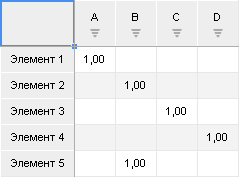
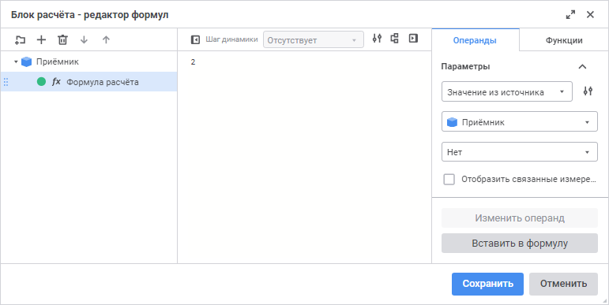
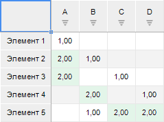
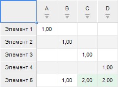
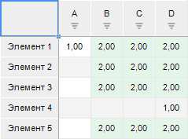
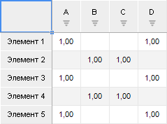
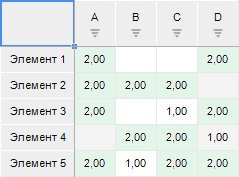
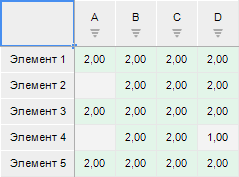

# Примеры фильтрации по данным: Блок расчёта

Примеры фильтрации по данным: Блок расчёта
-

# Примеры фильтрации по данным

При расчёте [блока расчёта](Calculation_unit.htm) накладывается
 множество условий фильтрации на [приёмник
 данных](Master_calculation_block_page_consumer.htm). Кроме фильтрации элементов измерений приёмника могут использоваться
 [фильтры](FilteringByData.htm) для дополнительной фильтрации
 по данным этих кубов, имеющих общие измерения с приёмником.

В фильтрации учитываются:

	- отметка элементов измерений приёмника данных;

	- отметки элементов измерений фильтров;

	- данные, содержащиеся в фильтрах.

Отметка элементов общих измерений фильтруется последовательно: сначала
 применяется первый фильтр, затем к оставшимся данным применяется второй
 фильтр и так до последнего. При расчёте данных на результирующую отметку
 фильтров накладывается отметка элементов измерений приёмника.

Также для управления отметками элементов измерений приёмника и фильтров
 доступна дополнительная фильтрация элементов измерений, заданная в [расширенном фильтре](FilteringByData.htm#filtering).

Рассмотрим примеры объединения разных условий фильтрации по данным в
 приёмнике.

## Фильтрация данных с одним фильтром

Исходные данные приёмника и фильтра, имеющих общие измерения:

	- приёмник:

	- фильтр:

Используемая формула расчёта:

Источник данных не задан.

Если в приёмнике и фильтрах задана полная отметка измерений и снят флажок
 «[Исключить
 измерение](FilteringByData.htm#receiver_filter)» для измерений фильтра, то данные приёмника будут
 рассчитаны по данным фильтра:

Если в приёмнике задана неполная отметка измерений (из отметки исключён
 «Элемент 4»), в фильтре задана
 неполная отметка измерений (из отметки исключёны «А»
 и «Элемент 2») и снят флажок «Исключить измерение» для измерений
 фильтра, то данные приёмника будут рассчитаны по данным фильтра:

Пример того же случая, но с установленным флажком «Исключить
 измерение» для измерения «Элементы»
 фильтра:

## Фильтрация данных с двумя фильтрами

Исходные данные приёмника, источника и фильтра, имеющих общие измерения:

	- приёмник:

	- источник:

	- фильтр:

Приёмник с источником связаны по ключам измерений. Источник используется
 в качестве второго фильтра.

Используемая формула расчёта:

Если в приёмнике и фильтрах задана полная отметка измерений и снят флажок
 «Исключить измерение» для измерений
 фильтра, то данные приёмника будут рассчитаны по данным фильтра:

Если в приёмнике задана неполная отметка измерений (из отметки исключён
 «Элемент 4»), в первом фильтре
 задана неполная отметка измерений (из отметки исключёны «А»
 и «Элемент 2»), во втором фильтре
 задана неполная отметка измерений (из отметки исключён «D»)
 и снят флажок «Исключить измерение»
 для измерений фильтров, то данные приёмника будут рассчитаны по данным
 фильтра:

Пример того же случая, но с установленным флажком «Исключить
 измерение» для измерения «Элементы»
 в первом фильтре:

См. также:

[Настройка
 фильтрации по данным](FilteringByData.htm)

		Справочная
		 система на версию 10.9
		 от 18/08/2025,
		 © ООО «ФОРСАЙТ»,
