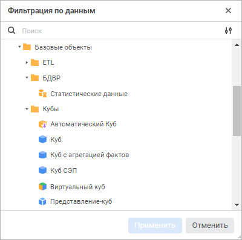
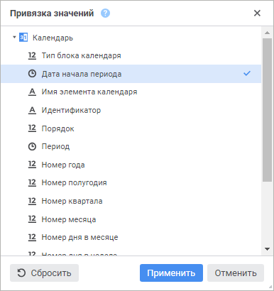
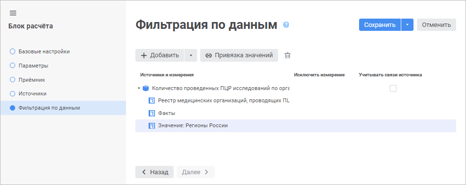

# Настройка фильтрации по данным: Блок расчёта, веб-приложение

Настройка фильтрации по данным: Блок расчёта, веб-приложение
-

# Настройка фильтрации по данным

	Фильтрация по данным предназначена для дополнительной фильтрации
	 измерений приёмника данных по наличию данных в фильтрах.

	Настройка фильтрации по данным выполняется на странице «Фильтрация
	 по данным» в [мастере редактирования
	 блока расчёта](Calculation_unit.htm):

	

	Для настройки фильтрации по данным:

		- Добавьте один или несколько фильтров:

			- для добавления фильтра, содержащегося в блоке, вызовите
			 раскрывающееся меню кнопки 
			 «Добавить». Меню содержит
			 список кубов, используемых в качестве [приёмника](Master_calculation_block_page_consumer.htm)
			 и [источников данных](Page_Sources.htm) блока расчёта;

			- для добавления фильтра из репозитория:

				- Нажмите кнопку 
				 «Добавить». Будет
				 открыто окно «Фильтрация
				 по данным»:

	

				- Выберите объект, который будет использоваться в
				 качестве фильтра, и нажмите кнопку «Применить».

	Для быстрого выбора объекта в поле для
	 поиска введите его название/идентификатор/ключ, в зависимости от настроек
	 отображения. Поиск будет выполняться автоматически по мере ввода текста.
	 Список будет содержать объекты, наименования/идентификаторы/ключи
	 которых содержат вводимый текст.

	Для настройки отображения объектов репозитория
	 в списке нажмите кнопку  «Отображение
	 объекта» и выберите в раскрывающемся меню вариант отображения:

					- Наименование.
					 Объекты отображаются под своими наименованиями. Вариант
					 по умолчанию;

					- Идентификатор.
					 Объекты отображаются под своими идентификаторами;

					- Ключ.
					 Объекты отображаются под своими ключами.

	Выбрать можно несколько вариантов. Идентификатор
	 и ключ будут указаны в скобках.

	В результате выполнения действий будет
	 добавлен фильтр. При необходимости, аналогичным образом добавьте ещё
	 фильтры.

	Примечание.
	 При дальнейшей настройке дополнительной фильтрации элементов измерения
	 [приёмника](Master_calculation_block_page_consumer.htm)
	 по значениям указанного атрибута добавьте фильтр, структура которого
	 отличается от структуры приёмника, но содержит хотя бы одно общее
	 измерение. Фильтрация элементов происходит только в общих измерениях
	 фильтра и приёмника.

	Если добавленный
	 фильтр содержит хотя бы одно общее измерение с [приёмником](Master_calculation_block_page_consumer.htm),
	 то по умолчанию фильтрация элементов будет происходить только в общих
	 измерениях. При необходимости установите флажок «Исключить
	 измерение» для исключения измерения из фильтрации. В этом случае
	 для фильтрации будет учитываться только отметка элементов измерения
	 и данные фильтра. Отметка элементов измерения приёмника не будет участвовать
	 в фильтрации по данным. Если фильтр и приёмник не содержат общих измерений,
	 то флажок «Исключить измерение»
	 не отображается.

	Если добавленный фильтр является [источником](Page_Sources.htm),
	 то для него будет доступен флажок «Учитывать
	 связи источника». При необходимости установите флажок для фильтрации
	 данных по [связям](Page_Sources.htm#link) измерений источника
	 данных с измерениями приёмника. Актуально, если связи настроены не
	 по одному и тому же атрибуту в рамках одного измерения. Настройка
	 связей измерений выполняется на странице «[Источники](Page_Sources.htm)».

		- Выделите измерение фильтра, для которого будет настраиваться
		 фильтрация.

		- Задайте [настройки
		 фильтрации измерения](FilteringByData.htm#filtering).

		- Выполните [привязку
		 значения фильтра](FilteringByData.htm#filter_cube) для дополнительной фильтрации элементов
		 измерения [приёмника](Master_calculation_block_page_consumer.htm)
		 по значениям указанного атрибута. При использовании дополнительной
		 фильтрации отметка элементов измерения приёмника зависит от значений
		 отмеченных элементов измерений выбранного фильтра и учитывается
		 при расчёте алгоритма. Если значения элементов равны значению
		 указанного атрибута, то по измерениям фильтра передаётся отметка
		 элементов в приёмник и при расчёте алгоритма выполняется фильтрация
		 элементов в соответствии с полученной отметкой.

	После выполнения действий будет настроена фильтрация по данным.

	Для удаления фильтра и настроек фильтрации, связанных с ним,
	 выделите куб и нажмите кнопку 
	 «Удалить».

	Примечание.
	 При выполнении многопоточного расчёта настроенная фильтрации по данным
	 влияет на общее время расчёта алгоритма. Для получения подробной информации
	 обратитесь к разделу «[Как
	 выполнять многопоточный расчёт?](../../FAQ/MultiThreadedCalculation.htm#multithread)».

	Для получения подробной информации о работе фильтрации обратитесь
	 к разделу «[Примеры фильтрации
	 по данным](Examples_Filtering_Data.htm)».

## Настройка фильтрации измерения

	Для выбора элементов измерения, по которым будет рассчитываться
	 блок, выделите измерение фильтра и откройте окно «<наименование измерения> - настройка фильтрации» с помощью
	 кнопки  «Задать
	 фильтр», которая расположена напротив измерения фильтра
	 и отображается при наведении указателя мыши на отмеченное измерение.

	После выполнения одного из действий будет открыто окно «<наименование измерения> - настройка фильтрации»:

	

Порядок настройки:

	- Выберите элементы, по которым будет рассчитываться блок. Установите
	 один из переключателей:

		- Все элементы. Расчёт
		 блока будет идти по всем элементам измерения;

		- Элементы. Расчёт
		 блока будет идти по элементам измерения, выбранным в данном списке;

		- Параметры. Расчёт
		 блока будет идти по элементам, заданным параметром. Способ
		 доступен, если блок содержит параметры.

Для работы с [отметкой
 элементов](UiSelection.chm::/Selection/Selection_of_the_dimension_elements.htm#selection) измерения используйте команды контекстного
 меню.

Для расчёта блока по всем элементам, кроме
 отмеченных, установите флажок «Исключить
 выбранные элементы» при необходимости.

	- Добавьте расширенные условия фильтрации при необходимости. При
	 выполнении расчёта блока атрибуты элементов будут соответствовать
	 заданным условиям. Работа с группой параметров условия аналогична
	 работе с диалогом «[Расширенный фильтр](Calculation_Formula_Generation.htm#aggrsetup)».

	- Нажмите кнопку «Применить».

После выполнения действий блок будет рассчитываться только по
 элементам, соответствующим настроенному фильтру.

## Привязка значения фильтра

	Для привязки значения фильтра по атрибуту измерения [приёмника](Master_calculation_block_page_consumer.htm):

		- Выберите добавленный фильтр, отличающийся от приёмника.

		- Нажмите кнопку  «Привязка
		 значений».

	После выполнения действия будет открыто
	 окно «Привязка значений»:

	

	В окне отображаются измерения, которые
	 содержатся в приёмнике, но не содержатся в выбранном фильтре.

		- Выберите атрибут измерения, по значениям которого будут
		 отфильтрованы элементы измерения приёмника.

	Для сброса отметки атрибута измерения
	 нажмите кнопку  «Сбросить»
	 при необходимости.

		- Нажмите кнопку «Применить».

	После выполнения действий будет выполнена привязка значений атрибута
	 измерения приёмника для фильтрации элементов по отметке фильтра.
	 Измерение приёмника добавляется в состав фильтра и доступно для
	 [настройки фильтрации](FilteringByData.htm#filtering):

	

См. также:

[Вставка и настройка блоков расчёта](Calculation_unit.htm)

		Справочная
		 система на версию 10.9
		 от 18/08/2025,
		 © ООО «ФОРСАЙТ»,
