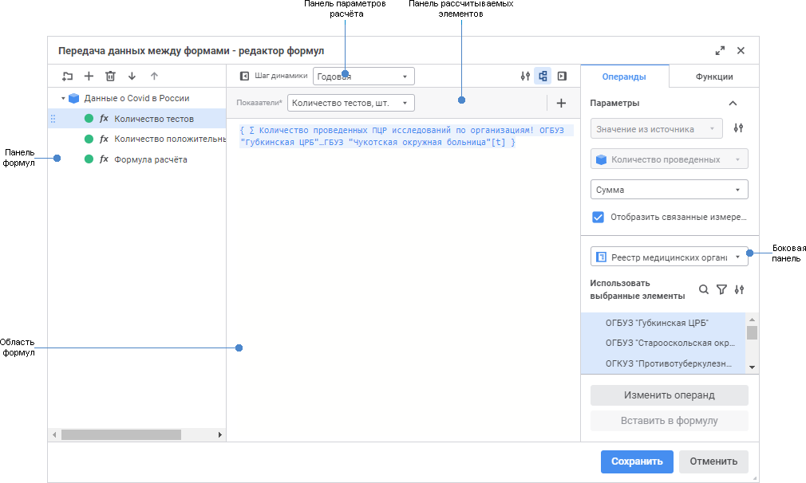

# Настройка формул расчёта: Алгоритм расчёта показателей, веб-приложение

Настройка формул расчёта: Алгоритм расчёта показателей, веб-приложение
-

# Настройка формул расчёта

Формулы расчёта определяют, каким образом данные из [источников](Page_Sources.htm)
 будут преобразованы перед загрузкой в [приёмник](Master_calculation_block_page_consumer.htm).

Для настройки формул расчёта:

	- выполните команду «Редактор
	 формул» в контекстном меню [блока
	 расчёта](Calculation_unit.htm) или [блока
	 контроля](../Control_Block/Control_Block.htm);

	- дважды щёлкните по блоку расчёта или блоку контроля.

После выполнения действия будет открыт диалог «<наименование блока> - редактор формул»:

Для настройки формулы расчёта:

	- [Создайте формулу](Formula_Creation.htm).

	- [Выберите рассчитываемый
	 элемент измерения и календарную динамику расчёта](Calculated_Element_Select.htm).

	- [Сформируйте формулу
	 расчёта](Calculation_Formula_Generation.htm).

	- [Настройте
	 дополнительные параметры расчёта и сохранения данных](Additional_Calculation_and_Data_Saving_Parameters.htm).

В результате будет настроена формула расчёта. Если требуется, то аналогичным
 образом настройте ещё формулы.

Формулы будут рассчитаны в том порядке, в котором они следуют на панели
 формул. Для изменения порядка следования формул используйте кнопки  «Вверх» и  «Вниз» или механизм Drag&Drop.

Важно. Если
 в формулах используется один и тот же источник данных в качестве операнда,
 то учитывайте порядок расчёта формул. Формула A, в которой используется
 результат расчёта формулы B, должна следовать после формулы B, в которой
 выполняется расчёт результирующего источника данных. Данные источника
 изменяются после расчёта первой формулы и в последующих формулах используется
 измененный набор данных.

Для исключения формул из расчёта выделите их с зажатой клавишей CTRL
 или SHIFT и выполните команду «Исключить
 из расчёта» в контекстном меню. Если формулы сгруппированы в папке,
 то для исключения из расчёта всех формул в папке выполните аналогичную
 команду в контекстном меню папки. Для расчёта исключенных элементов выполните
 команду «Включить в расчёт» в
 контекстном меню.

Для удаления формулы:

	- Выделите формулу.

	- Выполните одно из действий:

		- нажмите кнопку  «Удалить»
		 на панели формул;

		- выполните одноименную команду контекстного меню формулы.

После выполнения действий формула будет удалена из списка формул.

См. также:

[Вставка
 и настройка блоков расчёта](Calculation_unit.htm)

		Справочная
		 система на версию 10.9
		 от 18/08/2025,
		 © ООО «ФОРСАЙТ»,
