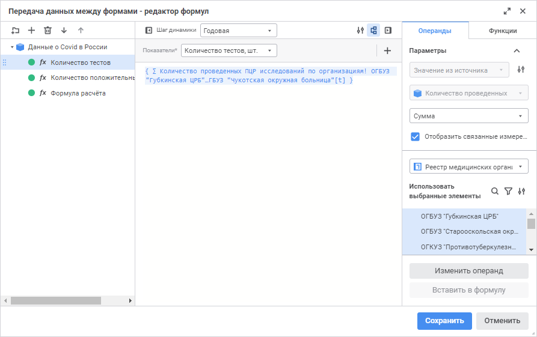

# Создание формулы расчёта: Алгоритм расчёта показателей, веб-приложение

Создание формулы расчёта: Алгоритм расчёта показателей, веб-приложение
-

# Создание формулы расчёта

	Для создания формулы:

		- Откройте окно «[Редактор
		 формул](Formula.htm)».

	[Для
	 открытия окна](javascript:TextPopup(this))

				- выполните команду «Редактор
				 формул» в контекстном меню [блока
				 расчёта](Calculation_unit.htm) или [блока
				 контроля](../Control_Block/Control_Block.htm);

				- дважды щёлкните по блоку расчёта или блоку контроля.

	

		- Выполните одно из действий:

			- нажмите кнопку  «Добавить
			 формулу» на панели формул;

			- выполните команду  «Добавить формулу» в контекстном
			 меню папки или панели формул.

		- Введите наименование формулы и нажмите клавишу ENTER. По
		 умолчанию формула добавляется с наименованием «Формула
		 расчёта».

	После выполнения действий формула будет добавлена в конец списка
	 формул или в текущую папку. Далее перейдите к [выбору
	 рассчитываемого элемента и календарной динамики расчёта](Calculated_Element_Select.htm).

	Для работы с формулой доступны следующие операции:

		- [переименование формулы](Formula_Creation.htm#rename);

		- [добавление примечания
		 к формуле](Formula_Creation.htm#note);

		- [группировка формул](Formula_Creation.htm#group);

		- [копирование формулы
		 в буфер обмена](Formula_Creation.htm#copy);

		- [вставка формулы из
		 буфера обмена](Formula_Creation.htm#paste).

## Переименование формулы

	Для переименования формулы:

		- Выполните команду «Переименовать»
		 в контекстном меню формулы. После чего наименование формулы будет
		 переведено в режим редактирования.

		- Введите новое наименование формулы и нажмите клавишу ENTER.

	После выполнения действий формула будет переименована.

	Также переименование формулы доступно с помощью окна «[Свойства формулы](#note)».

## Добавление примечания к формуле

	Для добавления примечания к формуле:

		- Выполните команду «Свойства»
		 в контекстном меню формулы. После чего будет открыто окно «Свойства формулы»:

	

		- Задайте параметры:

			- Наименование.
			 При необходимости измените наименование формулы;

			- Примечание.
			 Введите краткое описание назначения формулы.

		- Нажмите кнопку «Применить».

	После выполнения действий будет добавлено примечание к формуле.

## Группировка формул

	Для группировки формул с помощью папок:

		- Добавьте папку:

			- нажмите кнопку  «Добавить
			 папку» на панели формул;

			- выполните команду  «Добавить папку» в контекстном
			 меню папки или панели формул.

	После выполнения одного из действий папка
	 будет добавлена в конец списка формул или в текущую папку.

		- Введите название папки.

		- Повторите шаги для добавления набора папок.

		- Переместите формулы в папку или из папки с помощью механизма
		 Drag&Drop. В папке могут содержать формулы и другие папки
		 с формулами.

	После выполнения действий формулы будут сгруппированы по папкам.

	Для удаления папки:

		- Выделите папку.

		- Выполните одно из действий:

			- нажмите кнопку  «Удалить»
			 на панели формул;

			- выполните команду  «Удалить» в контекстном меню
			 папки.

	После выполнения действий папка будет удалена со всеми формулами
	 и папками, содержащимися в ней.

## Копирование формулы в буфер обмена

	Для копирования формулы в буфер обмена:

		- выполните команду  «Копировать»
		 в контекстном меню формулы;

		- выделите формулу и используйте сочетание клавиш CTRL+C.

	После выполнения одного из действий формула будет скопирована в
	 буфер обмена.

## Вставка формулы из буфера обмена

	Для вставки формулы из буфера обмена:

		- выполните команду  «Вставить»
		 в контекстном меню панели формул;

		- используйте сочетание клавиш CTRL+V.

	После выполнения одного из действий в конец списка формул будет
	 вставлена формула из буфера обмена.

См. также:

[Настройка
 формул расчёта](Formula.htm) | [Выбор
 рассчитываемого элемента](Calculated_Element_Select.htm)

		Справочная
		 система на версию 10.9
		 от 18/08/2025,
		 © ООО «ФОРСАЙТ»,
