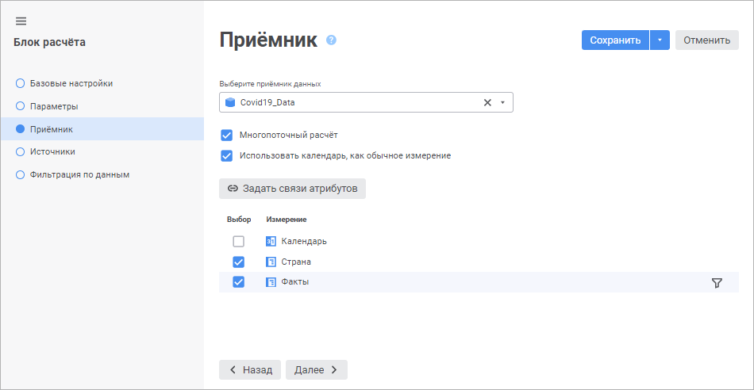
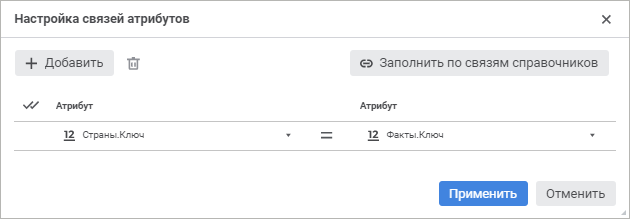
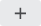
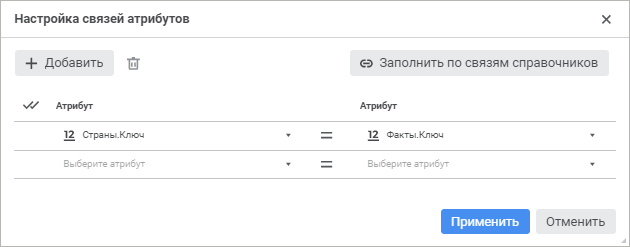
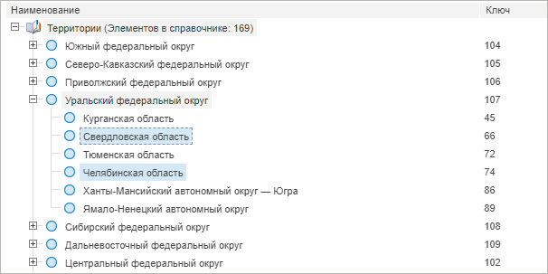
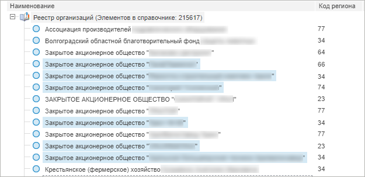
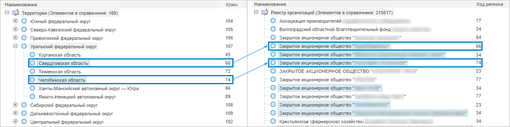

# Выбор и настройка приёмника данных: Блок расчёта, веб-приложение

Выбор и настройка приёмника данных: Блок расчёта, веб-приложение
-

# Выбор и настройка приёмника данных

Приёмник определяет объект, в который будут выгружены данные после расчёта
 блока. В качестве приёмника могут использоваться следующие объекты репозитория:

	- [стандартный
	 куб](UiNavObj.chm::/Cube/CreateCube/Master_Standart/UiMd_Cube_CreateCube_Master_Standart.htm);

	- [представление-куб](UiNavObj.chm::/Cube/CreateCube/Master_Calculation/UiMd_Cube_CreateCube_Master_Calculation.htm);

	- [виртуальный
	 куб](UiNavObj.chm::/Cube/CreateCube/Master_Virtual_Cube/UiMd_Cube_CreateCube_Master_Virtual.htm);

	- [база
	 данных временных рядов](UiNavObj.chm::/TimeSeriesDatabase/CreateTimeSeriesDatabase.htm).

Выбор и настройка приёмника данных выполняется на странице «Приёмник»
 в [мастере редактирования блока расчёта](Calculation_unit.htm):

Для выбора и настройки приёмника данных:

	- Выберите объект, который будет использоваться в качестве приёмника
	 данных, в раскрывающемся меню.

Для быстрого выбора объекта в поле для поиска введите его название/идентификатор/ключ,
 в зависимости от настроек отображения. Поиск будет выполняться автоматически
 по мере ввода текста. Список будет содержать объекты, наименования/идентификаторы/ключи
 которых содержат вводимый текст.

Для настройки отображения объектов репозитория
 в списке нажмите кнопку  «Отображение объекта» и выберите
 в раскрывающемся меню вариант отображения:

	- Наименование. Объекты
	 отображаются под своими наименованиями. Вариант по умолчанию;

	- Идентификатор. Объекты
	 отображаются под своими идентификаторами;

	- Ключ. Объекты отображаются
	 под своими ключами.

Выбрать можно несколько вариантов. Идентификатор
 и ключ будут указаны в скобках.

После выполнения действия на боковой панели
 будут отображены объекты, наименования которых удовлетворяют условиям
 поиска.

	- Выберите роль календаря. По умолчанию
	 календарь рассматривается в качестве календарного измерения, и по
	 нему нельзя задать фильтрацию или настроить формулу расчёта. Для работы
	 с календарём в качестве обычного измерения установите флажок «Использовать календарь, как обычное измерение».
	 Календарь будет отображён в списке измерений приёмника, и с ним можно
	 работать как с обычным измерением. Для работы с календарём как с календарным
	 измерением снимите флажок.

Примечание.
 Изменение роли календаря доступно, если для блока расчёта не заданы [формулы](Formula.htm).

	- Отметьте флажками измерения приёмника, по которым будет выполняться
	 фильтрация по элементам. Фильтрация позволяет выполнять расчёт только
	 по части элементов измерения. Также фильтруемые измерения не участвуют
	 в составлении [формул расчёта](Formula.htm) блока. Формулы
	 составляются только для нефильтруемых измерений.

Если отметка измерения используется в [формулах расчёта](Formula.htm), то при установке флажка выдается
 подтверждение на сброс отметки. После подтверждения действия будет сброшена
 отметка в термах формулы и [настройка
 способа выбора элементов](Calculated_Element_Select.htm) операнда из параметра. Также изменится [настройка фильтрации измерения](FilteringByData.htm#filtering)
 на фильтрацию по всем элементам измерения.

Примечание.
 После сброса отметки отредактируйте термы в [формуле](Formula.htm)
 вручную.

	- Настройте фильтрацию по элементам для отмеченного флажком измерения
	 с помощью кнопки  «Задать
	 фильтр», которая расположена напротив измерения приёмника данных
	 и отображается при наведении указателя мыши на отмеченное измерение.

После выполнения действия будет открыт диалог
 «[<наименование измерения> - настройка фильтрации](Master_calculation_block_page_consumer.htm#filter)»,
 в котором задайте настройки фильтрации измерения приёмника данных.

	- Настройте для измерений фильтрацию по связям атрибутов.
	 Фильтрация уменьшает количество элементов, по которым выполняется
	 расчёт, на основе связей атрибутов.

	Для применения данного вида фильтрации:

		- Убедитесь, что флажками отмечены хотя бы два измерения.

		- Нажмите кнопку  «Задать
		 связи атрибутов». Будет отображен диалог «[Настройка связей атрибутов](#filter_attributes)»,
		 в котором задайте [настройки фильтрации](#filter_attributes).

	- При необходимости установите флажок «Многопоточный
	 расчет» для выполнения многопоточного расчёта блока. Многопоточный
	 расчёт блока будет выполняться, если установлен флажок «Многопоточный
	 расчет» в окне «[Настройка выполнения
	 расчёта](../../Desktop/Work/Perform_calculations.htm)». По умолчанию флажок снят, и расчёт блока выполняется
	 в один поток.

Примечание.
 Использование многопоточного расчёта для блока расчёта доступно только
 при отметке хотя бы одного измерения приёмника в шаге 3.

Для получения подробной информации о многопоточном
 расчёте обратитесь к разделу «[Как
 выполнять многопоточный расчёт?](../../FAQ/MultiThreadedCalculation.htm)».

В результате будет настроен приёмник данных в блоке расчёта.

## Настройка фильтрации измерения приёмника данных

Фильтрация позволяет выполнять расчёт только по части элементов измерения.
 Также фильтруемые измерения не участвуют в составлении [формул](Formula.htm)
 расчёта блока. Формулы составляются только для нефильтруемых измерений.

Для выбора элементов измерения, по которым будет рассчитываться блок,
 используйте диалог «<наименование измерения> - настройка фильтрации»:

Порядок настройки:

	- Выберите элементы, по которым будет рассчитываться блок. Установите
	 один из переключателей:

		- Все элементы. Расчёт
		 блока будет идти по всем элементам измерения;

		- Элементы. Расчёт
		 блока будет идти по элементам измерения, выбранным в данном списке;

		- Параметры. Расчёт
		 блока будет идти по элементам, заданным параметром. Способ
		 доступен, если блок содержит параметры.

Для работы с [отметкой
 элементов](UiSelection.chm::/Selection/Selection_of_the_dimension_elements.htm#selection) измерения используйте команды контекстного
 меню.

Для расчёта блока по всем элементам, кроме
 отмеченных, установите флажок «Исключить
 выбранные элементы» при необходимости.

	- Добавьте расширенные условия фильтрации при необходимости. При
	 выполнении расчёта блока атрибуты элементов будут соответствовать
	 заданным условиям. Работа с группой параметров условия аналогична
	 работе с диалогом «[Расширенный фильтр](Calculation_Formula_Generation.htm#aggrsetup)».

	- Нажмите кнопку «Применить».

После выполнения действий блок будет рассчитываться только по
 элементам, соответствующим настроенному фильтру.

Примечание.
 При использовании [календаря как обычного измерения](#calendar)
 расчёт блока будет выполняться по периоду, заданному в настройках фильтрации
 календарного измерения. В этом случае заданный на панели параметров [период расчёта алгоритма](../Work/Calculation_period_management.htm)
 будет игнорироваться.

## Настройка фильтрации по связям атрибутов

Фильтрация уменьшает количество элементов, по которым выполняется расчёт,
 на основе связей атрибутов.

Для добавления связей атрибутов используйте диалог «Настройка
 связей атрибутов».

[Для
 отображения диалога](javascript:TextPopup(this))

		- Откройте страницу «Приёмник»
		 в [мастере редактирования блока
		 расчёта](Calculation_unit.htm).

		- Выберите приёмник в раскрывающемся списке «Выберите
		 приёмник данных».

		- Отметьте флажками необходимые измерения для фильтрации.

	Примечание.
	 Флажками должны быть отмечены хотя бы два измерения.

		- Нажмите кнопку  «Задать
		 связи атрибутов».

Для добавления связи атрибутов:

	- Нажмите кнопку  «Добавить». После чего будет добавлена
	 строка для выбора атрибутов измерений:

	- Выберите атрибут измерения, по отметке которого будет выполняться
	 фильтрация, в левом раскрывающемся списке.

	- Выберите атрибут связываемого измерения в правом раскрывающемся
	 списке. Именно в этом измерении будет выполнятся фильтрация.

	- Установите флажок «Не учитывать
	 связь при пустом значении» в раскрывающемся списке соответствующего
	 атрибута для исключения из расчёта связей с пустыми значениями атрибутов.
	 В результате, если атрибут содержит пустое значение, то связь в расчёте
	 не участвует. Если не исключить данную связь, то при расчёте возникнет
	 ошибка.

	- При необходимости повторите предыдущие шаги для добавления нескольких
	 связей атрибутов.

Совет. Для автоматического
 добавления связей на основе информации, на которой строятся измерения,
 нажмите кнопку  «Заполнить
 по связям справочников». Возможность доступна только для измерений,
 основанных на справочниках НСИ, которые связаны между собой по [атрибутам](UiNavObj.chm::/reference_book/Master_RDS_reference_book/Link.htm).

После выполнения действий будет настроена фильтрация по связям атрибутов.

Для удаления связи выделите строку с атрибутами и нажмите кнопку  «Удалить».

Для удаления всех связей выделите строки с помощью кнопки  «Отметить
 все» и нажмите кнопку  «Удалить».

### Пример фильтрации по связям атрибутов

Для примера рассмотрим два справочника НСИ: «Территории»,
 «Реестр организаций». Измерения
 содержат следующие элементы и отметку:

 

Для атрибута «Ключ » в измерении
 «Территории» добавлена связь с
 атрибутом «Код региона» в измерении
 «Реестр организаций». В результате
 в измерении «Реестр организаций»
 расчёт будет выполняться только по элементам с кодами 66 и 74:

Если не добавить связь, то в измерении «Реестр
 организаций» расчёт будет выполняться по всем отмеченным элементам.

См. также:

[Вставка
 и настройка блоков расчёта](Calculation_unit.htm)

		Справочная
		 система на версию 10.9
		 от 18/08/2025,
		 © ООО «ФОРСАЙТ»,
