# Выбор и настройка источников данных: Блок расчёта, веб-приложение

Выбор и настройка источников данных: Блок расчёта, веб-приложение
-

# Выбор и настройка источников данных

	Источники определяют объекты, на основании данных которых будет
	 выполнен расчёт блока. В качестве источников данных могут использоваться
	 следующие объекты репозитория:

		- [стандартный
		 куб](UiNavObj.chm::/Cube/CreateCube/Master_Standart/UiMd_Cube_CreateCube_Master_Standart.htm);

		- [представление-куб](UiNavObj.chm::/Cube/CreateCube/master_conception/uimd_cube_createcube_master_conception.htm);

		- [виртуальный
		 куб](UiNavObj.chm::/Cube/CreateCube/Master_Virtual_Cube/UiMd_Cube_CreateCube_Master_Virtual.htm);

		- [база
		 данных временных рядов](UiNavObj.chm::/TimeSeriesDatabase/CreateTimeSeriesDatabase.htm).

	Выбор и настройка источников данных выполняется на странице «Источники» в [мастере
	 редактирования блока расчёта](Calculation_unit.htm):

	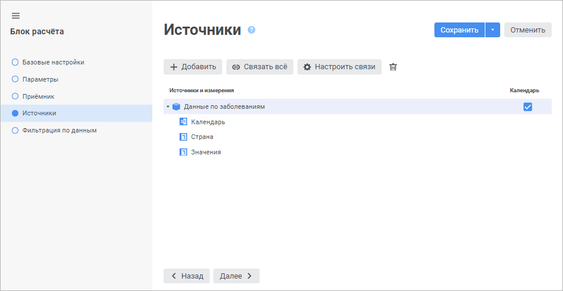

	Для выбора и настройки источника данных:

		- Нажмите кнопку  «Добавить».

	После выполнения действия будет открыто
	 окно «Источники»:

	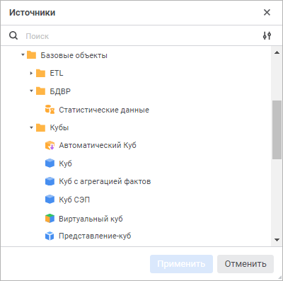

		- Выберите объект, который будет использоваться в качестве
		 источника данных, и нажмите кнопку «Применить».

Для быстрого выбора объекта в поле для поиска введите его название/идентификатор/ключ,
 в зависимости от настроек отображения. Поиск будет выполняться автоматически
 по мере ввода текста. Список будет содержать объекты, наименования/идентификаторы/ключи
 которых содержат вводимый текст.

Для настройки отображения объектов репозитория
 в списке нажмите кнопку  «Отображение объекта» и выберите
 в раскрывающемся меню вариант отображения:

	- Наименование. Объекты
	 отображаются под своими наименованиями. Вариант по умолчанию;

	- Идентификатор. Объекты
	 отображаются под своими идентификаторами;

	- Ключ. Объекты отображаются
	 под своими ключами.

Выбрать можно несколько вариантов. Идентификатор
 и ключ будут указаны в скобках.

	В результате будет добавлен источник
	 данных. Если требуется, то аналогичным образом добавьте ещё источники
	 данных.

		- Выберите роль календаря. По умолчанию календарь рассматривается
		 в качестве календарного измерения и по нему нельзя настроить связи.
		 Для работы с календарём в качестве обычного измерения установите
		 флажок «Календарь», расположенный
		 рядом с названием источника данных. Календарь будет отображён
		 в списке измерений источника и с ним можно будет работать как
		 с обычным измерением. Для работы с календарём как с календарным
		 измерением снимите флажок «Календарь».

		- Настройте связи измерений источника и приёмника данных.
		 Связи задают соответствие между измерениями источников данных
		 и измерениями приёмника данных, тем самым сокращая количество
		 рассчитываемых элементов и ускоряя расчёт блока. Для настройки
		 связей нажмите кнопку 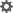 «Настроить
		 связи». Будет открыт диалог «[Настройка связей](Page_Sources.htm#link)», в котором
		 задайте связи.

	Для автоматической настройки связей по
	 идентификаторам атрибутов в одинаковых измерениях приёмника и источников
	 нажмите кнопку 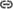 «Связать
	 всё».

	В результате будет добавлен и настроен источник данных. Если требуется,
	 то аналогичным образом добавьте ещё источники данных.

	Для удаления источника данных:

		- Выделите источник данных.

		- Нажмите кнопку  «Удалить».

	Примечание.
	 Если источник данных используется в [формулах
	 расчёта](Formula.htm), то при удалении отредактируйте термы в формуле вручную.

	После выполнения действий будет удалён выбранный источник данных.

## Настройка связей измерений источника и приёмника
	 данных

	Связи задают соответствие между измерениями источников данных и
	 измерениями приёмника данных, тем самым сокращая количество рассчитываемых
	 элементов и ускоряя расчёт блока.

	Для настройки связей измерений источника и приёмника данных используйте
	 диалог «Настройка связей».
	 Настроить связь можно в упрощённом и в расширенном режимах. Вид диалога
	 отличается в зависимости от режима настройки:

		 Упрощённый режим Расширенный режим

			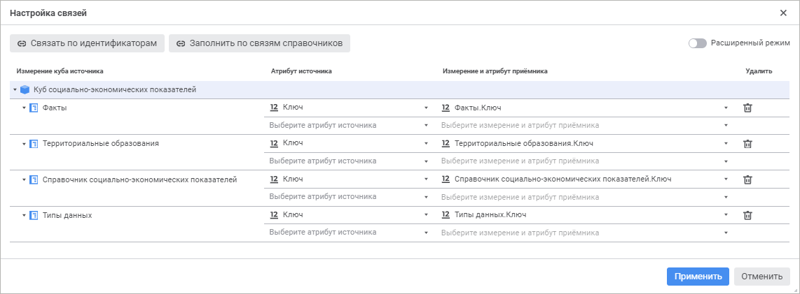

			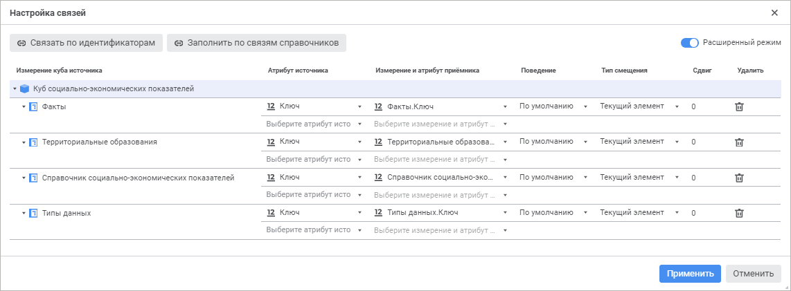

	По умолчанию окно «Настройка связей»
	 открывается в упрощённом режиме. Для доступа к дополнительным настройкам
	 переведите переключатель «Расширенный
	 режим» в активное состояние.

	В столбце «Измерение куба источника»
	 отображаются все измерения источников.

	Порядок настройки:

		- Выберите связываемый атрибут в измерении источника данных
		 в столбце «Атрибут источника».

		- Выберите атрибут из измерения приёмника данных, содержащий
		 такие же значения, что и выбранный атрибут источника в столбце
		 «Измерение и атрибут приёмника».
		 В списке содержатся только те измерения [приёмника](Master_calculation_block_page_consumer.htm),
		 для которых настроена фильтрация.

	Например, для создания связи в источнике
	 данных выбран атрибут «Ключ»
	 в измерении «Подразделения по объединениям
	 и округам». Для создания корректной связи в приёмнике надо
	 выбрать атрибут, содержащий ключ подразделения по объединениям и округам
	 в измерении, содержащем соответствующие данные.

		- Выберите принцип работы связи в столбце «Поведение»:

			- По умолчанию.
			 Используется по умолчанию. В связанном измерении источника
			 данных будут оставлены только те отмеченные элементы, для
			 которых есть соответствующий отмеченный элемент в связанном
			 измерении приёмника данных. Если соответствующий элемент в
			 источнике не найден, то возникнет ошибка в расчёте;

			- Фильтровать приёмник.
			 В связанном измерении приёмника данных будут оставлены только
			 те отмеченные элементы, для которых есть соответствующий отмеченный
			 элемент в связанном измерении источника данных;

			- Пустая точка, если
			 элемент не найден. В связанном измерении источника
			 данных будут оставлены только те отмеченные элементы, для
			 которых есть соответствующий отмеченный элемент в связанном
			 измерении приёмника данных. Если соответствующий элемент в
			 источнике не найден, то вместо него в расчёте будет использоваться
			 значение Null.

	Примечание.
	 Столбец «Поведение» доступен
	 только в расширенном режиме настройки.

		- Выберите режим смещения отметки в измерении источника в
		 столбце «Тип смещения»:

			- Текущий элемент.
			 Используется по умолчанию. Смещение отметки выполняется для
			 каждого отмеченного элемента, полученного по связи;

			- Первый элемент.
			 Смещение отметки выполняется только для первого отмеченного
			 элемента, полученного по связи. Отметка с остальных элементов
			 снимается. Если по связи получена отметка элементов, принадлежащих
			 разным родителям, то смещение отметки выполняется только для
			 первого дочернего элемента в каждой группе элементов, принадлежащих
			 одному родителю. Отметка с остальных дочерних элементов снимается.
			 При использовании данного вида смещения сдвиг может быть только
			 положительным или нулевым;

			- Последний элемент.
			 Смещение отметки выполняется только для последнего отмеченного
			 элемента, полученного по связи. Отметка с остальных элементов
			 снимается. Если по связи получена отметка элементов, принадлежащих
			 разным родителям, то смещение отметки выполняется только для
			 последнего дочернего элемента в каждой группе элементов, принадлежащих
			 одному родителю. Отметка с остальных дочерних элементов снимается.
			 При использовании данного вида смещения сдвиг может быть только
			 отрицательным или нулевым.

	Примечание.
	 Столбец «Тип смещения» доступен
	 только в расширенном режиме настройки.

		- Задайте количество элементов, на которое будет смещена отметка
		 в измерении источника, в столбце «Сдвиг».

	Примечание.
	 Столбец «Сдвиг» доступен только
	 в расширенном режиме настройки.

	В результате будет установлена связь по атрибутам между измерениями.
	 Если требуется, то аналогичным образом добавьте ещё связи атрибутов.

	Для автоматического добавления всех возможных связей на основе:

		- идентификаторов атрибутов нажмите кнопку 
		 «Связать по идентификаторам».
		 Связи будут созданы для всех одинаковых измерений в источниках
		 и приёмниках данных;

		- связей между измерениями нажмите кнопку 
		 «Заполнить по связям справочников».
		 Связи будут созданы для тех измерений, в которых содержатся [связанные
		 атрибуты](UiNavObj.chm::/reference_book/Master_RDS_reference_book/Link.htm).

	Для удаления связи между атрибутами нажмите кнопку  «Удалить»
	 в столбце «Удалить» напротив
	 соответствующей строки.

## Примеры работы связи измерений источника
	 и приёмника данных

	Приведён пример функционирования связи с разным [поведением](#behavior)
	 и с разным [смещением](#offset). Используемые измерения
	 являются абстрактными и используются для демонстрации принципов работы
	 связей. Отметка измерений демонстрируется на справочниках НСИ, являющихся
	 основой для данных измерений.

### Примеры поведения

	Например, есть измерение «Показатели»
	 в приёмнике данных и измерение «Страны»
	 в источнике данных. Измерения содержат следующие данные и в них задана
	 следующая отметка:

	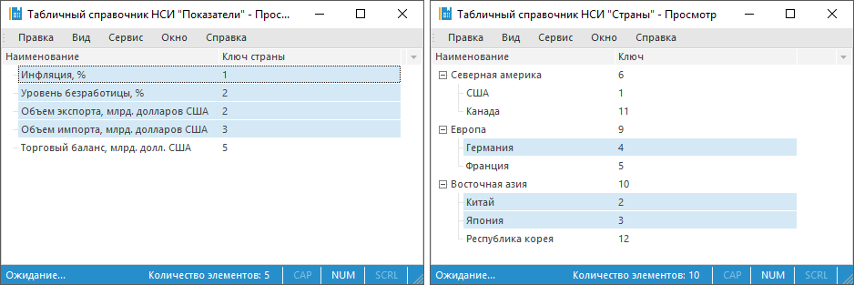

	Связь настроена между атрибутами «Ключ»
	 в измерении «Страны» и «Ключ страны» в измерении «Показатели»:

	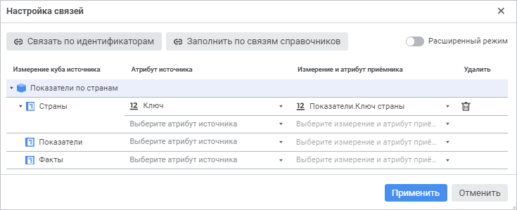

	Рассмотрим отметку, которая будет использоваться в блоке расчёта,
	 при различном поведении связи:

		- По умолчанию. В
		 связанном измерении источника данных будут оставлены только те
		 отмеченные элементы, для которых есть соответствующий отмеченный
		 элемент в связанном измерении приёмника данных. При расчёте возникнет
		 ошибка из-за того, что для элемента «Инфляция,
		 %» не зафиксирована отметка в измерении «Страны».

	Отметка, полученная при поведении связи
	 по умолчанию:

		Полученная отметка Исходная отметка Используемые настройки

			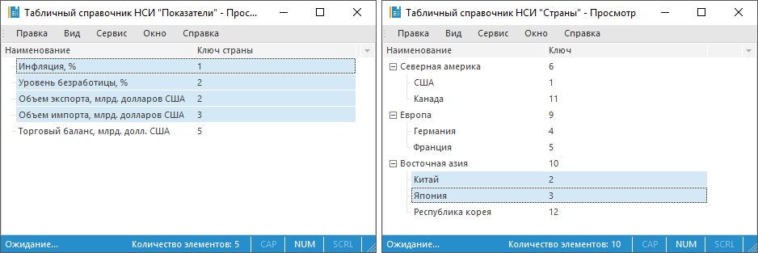

			

			

		- Фильтровать приёмник.
		 В связанном измерении приёмника данных будут оставлены только
		 те отмеченные элементы, для которых есть соответствующий отмеченный
		 элемент в связанном измерении источника данных.

	Отметка, полученная при фильтрации приёмника
	 данных:

		 Полученная отметка Исходная отметка Используемые настройки

			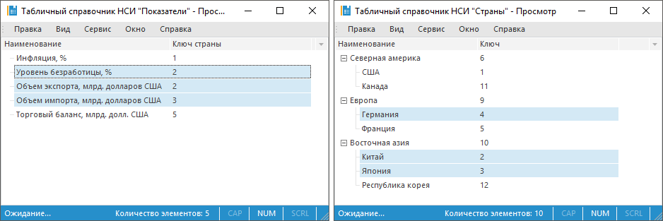

			

			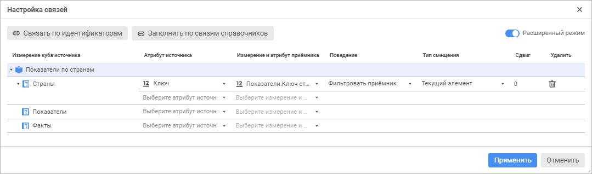

		- Пустая точка, если элемент
		 не найден. В связанном измерении источника данных будут
		 оставлены только те отмеченные элементы, для которых есть соответствующий
		 отмеченный элемент в связанном измерении приёмника данных. При
		 расчёте по элементу «Инфляция,
		 %» будет использоваться значение Null
		 в измерении «Страны».

	Отметка, полученная при замене ненайденных
	 элементов пустым значением:

		 Полученная отметка Исходная отметка Используемые настройки

			

			

			

### Примеры смещения

	Например, есть измерение «Показатели»
	 в приёмнике данных и измерение «Страны»
	 в источнике данных. Измерения содержат следующие данные и в них задана
	 следующая отметка:

	

	Связь настроена между атрибутами «Ключ»
	 в измерении «Страны» и «Ключ страны» в измерении «Показатели»:

	

	Рассмотрим отметку, которая будет использоваться в блоке расчёта,
	 при связи, использующей смещение с различным сдвигом:

		- Текущий элемент.
		 Смещение отметки выполняется от каждого элемента, полученного
		 по связи.

	Отметка, полученная при применении смещения
	 на один элемент вперёд:

		 Полученная отметка Исходная отметка Используемые настройки

			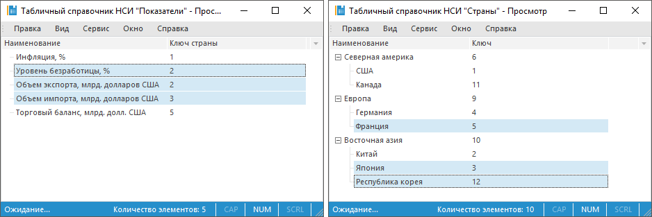

			

			

		- Первый элемент.
		 Смещение отметки выполняется только для первого отмеченного элемента,
		 полученного по связи. Отметка с остальных элементов снимается.
		 Если по связи получена отметка элементов, принадлежащих разным
		 родителям, то смещение отметки выполняется только для первого
		 дочернего элемента в каждой группе элементов, принадлежащих одному
		 родителю. Отметка с остальных дочерних элементов снимается.

	Отметка, полученная при применении смещения
	 от первого элемента на один элемент вперёд:

		 Полученная отметка Исходная отметка Используемые настройки

			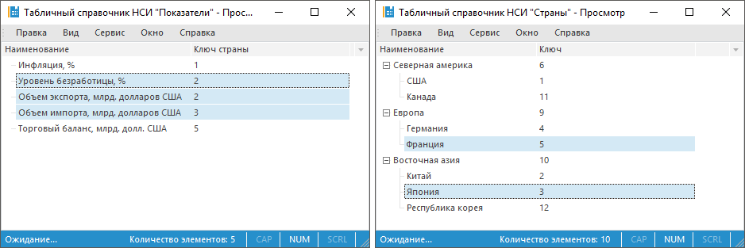

			

			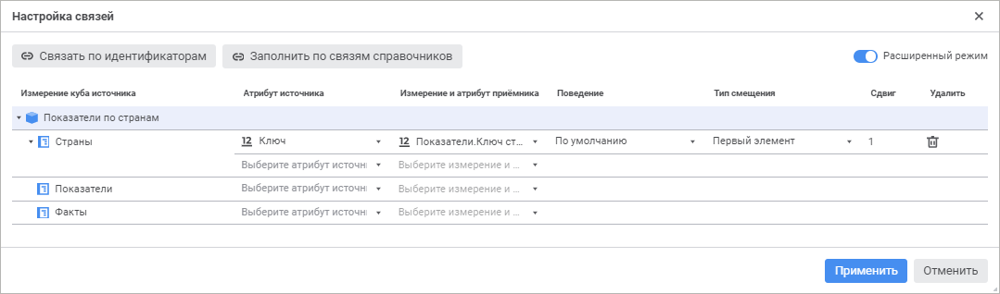

		- Последний элемент.
		 Смещение отметки выполняется только для последнего отмеченного
		 элемента, полученного по связи. Отметка с остальных элементов
		 снимается. Если по связи получена отметка элементов, принадлежащих
		 разным родителям, то смещение отметки выполняется только для последнего
		 дочернего элемента в каждой группе элементов, принадлежащих одному
		 родителю. Отметка с остальных дочерних элементов снимается.

	Отметка, полученная при применении смещения
	 от последнего элемента на один элемент назад:

		 Полученная отметка Исходная отметка Используемые настройки

			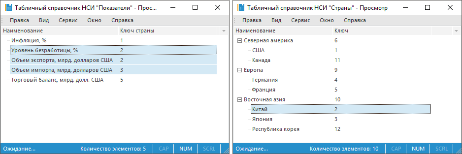

			

			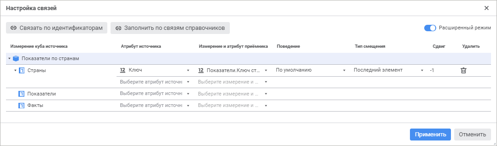

См. также:

[Вставка
 и настройка блоков расчёта](Calculation_unit.htm)

		Справочная
		 система на версию 10.9
		 от 18/08/2025,
		 © ООО «ФОРСАЙТ»,
