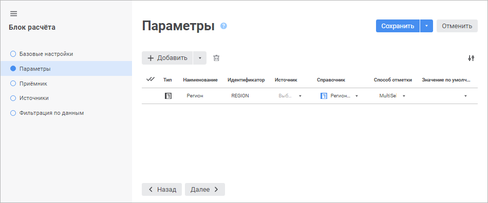
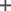
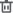
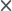

# Добавление параметров: Блок расчёта, веб-приложение

Добавление параметров: Блок расчёта, веб-приложение
-

# Добавление параметров

Параметры позволяют динамически управлять расчётом блока. Также их можно
 использовать для создания [формул расчёта блока](Formula.htm),
 настройки [фильтрации
 данных приёмника](Master_calculation_block_page_consumer.htm#filter) и фильтрации по данным источника.

Добавление параметров блока расчёта выполняется на странице «Параметры»
 в [мастере редактирования блока расчёта](Calculation_unit.htm):

[Добавление параметра](javascript:TextPopup(this))

	Добавьте новый или уже существующий параметр.

	Для добавления нового параметра нажмите кнопку 
	 «Добавить». После чего в таблице
	 параметров будет добавлена строка для описания свойств добавляемого
	 параметра.

	Для добавления существующего параметра из другого блока или
	 параметра из алгоритма расчёта:

		- Вызовите раскрывающееся меню кнопки 
		 «Добавить». Будет отображён
		 список, содержащий объекты с параметрами.

		- Выберите объект, параметр которого должен быть добавлен
		 в текущий блок. Будет отображён список параметров объекта.

		- Выберите один из параметров.

	В результате в блок будет добавлен параметр, настройки которого
	 полностью совпадают с настройками выбранного параметра. Если был выбран
	 параметр алгоритма расчёта, то добавленный параметр блока и выбранный
	 параметр алгоритма будут [автоматически
	 связаны](../Work/Manage_settings.htm).

[Редактирование
 параметра](javascript:TextPopup(this))

	Для редактирования параметра:

		- Щелкните по значению свойства в ячейке таблицы параметров.

		- Измените значение свойства.

		- Нажмите кнопку «Сохранить».

	После выполнения действий параметр будет отредактирован.

[Изменение
 порядка следования параметров](javascript:TextPopup(this))

	Порядок следования параметров влияет на порядок их отображения на
	 странице «[Управление
	 параметрами](../Work/Manage_settings.htm)» в [мастере
	 редактирования параметров алгоритма расчёта](../Work/Set_up_calculation_parameters.htm).

	Для изменения порядка следования параметров используйте механизм
	 Drag&Drop.

[Выбор отображаемых
 столбцов](javascript:TextPopup(this))

	Для выбора отображаемых столбцов в таблице параметров установите
	 флажки напротив столбцов в раскрывающемся списке кнопки  «Выбрать
	 столбцы». После чего в таблице будут отображаться только выбранные
	 столбцы.

[Удаление
 параметра](javascript:TextPopup(this))

	Для удаления параметра выделите строку с параметром и нажмите кнопку
	  «Удалить».

## Настройка параметра

Для настройки параметра задайте значения свойств, соответствующих столбцам
 таблицы:

	- Тип. Выберите тип параметра:

		- Строковый. В качестве
		 значения параметра используется символьная строка;

		- Целочисленный. В
		 качестве значения параметра используется целое число;

		- Вещественный. В
		 качестве значения параметра используется вещественное число;

		- Дата. В качестве
		 значения параметра используется дата;

		- Отметка. Используется
		 по умолчанию. В качестве значения параметра используется отметка
		 справочника;

	- Наименование. Наименование
	 параметра должно нести смысловую нагрузку, раскрывать его функциональность.
	 По умолчанию свойство принимает значение «ITEM1». Свойство является
	 обязательным;

	- Идентификатор. Идентификатор
	 параметра должен быть уникальным. Идентификатор должен состоять из
	 букв латинского алфавита. Может включать цифры и знаки подчёркивания
	 и обязательно должен начинаться с буквы. По умолчанию свойство принимает
	 значение «ITEM1». Свойство является обязательным;

	- Источник.
	 При необходимости выберите куб, содержащий управляющие/управляемые
	 измерения на странице «[Управляющие
	 измерения](uinavobj.chm::/cube/createcube/master_calculation/uimd_cube_createcube_master_calculation_managed_dim.htm)» в мастере соответствующего куба.
	 Поле доступно только для параметра типа «Отметка».

Для быстрого выбора объекта в поле для поиска
 введите его название/идентификатор/ключ, в зависимости от настроек отображения.
 Поиск будет выполняться автоматически по мере ввода текста. Список будет
 содержать объекты, наименования/идентификаторы/ключи которых содержат
 вводимый текст. Для настройки отображения объектов репозитория в списке
 нажмите кнопку  «Отображение
 объекта» и выберите в раскрывающемся меню вариант отображения:

		- Наименование. Объекты
		 отображаются под своими наименованиями. Вариант по умолчанию;

		- Идентификатор. Объекты
		 отображаются под своими идентификаторами;

		- Ключ. Объекты отображаются
		 под своими ключами.

Выбрать можно несколько вариантов. Идентификатор
 и ключ будут указаны в скобках.

Примечание.
 После выбора куба в раскрывающемся списке «Справочник»
 будут доступны только те справочники, которые состоят в выбранном кубе.

Если справочник не содержится в списке управляющих/управляемых
 измерений, но состоит в кубе, то отметка или альтернативная иерархия справочника
 будет использоваться в качестве значений параметра. Данный справочник
 можно выбрать в раскрывающемся списке «Справочник»
 без указания куба в раскрывающемся списке «Источник».

Если справочник содержится в списке управляющих/управляемых
 измерений, то соблюдайте порядок добавления параметров алгоритма расчёта
 для корректного отображения набора элементов справочника в зависимости
 от настроенного управления:

		- Параметры, управляющие параметрами куба.

		- Параметры, основанные на управляющих измерениях куба. Для
		 каждого измерения должна быть задана отметка по элементам.

		- Параметры, основанные на управляемых измерениях куба. Набор
		 элементов управляемых измерений зависит от отметки элементов управляющих
		 измерений.

Для отмены выбора куба, заданного в качестве
 значения свойства параметра «Источник»,
 нажмите кнопку  «Очистить»,
 расположенную напротив наименования куба.

	- Справочник. Выберите
	 [справочник](UiNavObj.chm::/reference_book/Master_RDS_reference_book/Master_RDS.htm),
	 к которому будет привязан параметр. Отметка или альтернативная иерархия
	 справочника будет использоваться в качестве значений параметра. Поле
	 доступно только для параметра типа «Отметка»
	 и является для него обязательным.

Для быстрого выбора объекта в поле для поиска
 введите его название/идентификатор/ключ, в зависимости от настроек отображения.
 Поиск будет выполняться автоматически по мере ввода текста. Список будет
 содержать объекты, наименования/идентификатор/ключ которых содержат вводимый
 текст. Для настройки отображения объектов репозитория в списке нажмите
 кнопку  «Отображение
 объекта» и выберите в раскрывающемся меню вариант отображения:

		- Наименование. Объекты
		 отображаются под своими наименованиями. Вариант по умолчанию;

		- Идентификатор. Объекты
		 отображаются под своими идентификаторами;

		- Ключ. Объекты отображаются
		 под своими ключами.

Выбрать можно несколько вариантов. Идентификатор
 и ключ будут указаны в скобках;

Примечание.
 Если в раскрывающемся списке «Источник»
 выбран куб, то в раскрывающемся списке «Справочник»
 будут доступны только те справочники, которые состоят в выбранном кубе.

	- Способ отметки. Выберите
	 в раскрывающемся списке способ отметки элементов справочника:

		- None. Тип отметки
		 не задан. По умолчанию используется способ отметки «MultiSelect»;

		- SingleSelect. Единичная
		 отметка: возможна отметка только одного элемента;

		- SingleSelectNullable.
		 Единичная отметка с возможностью установки пустого значения;

		- MultiSelect. Множественная
		 отметка.

Для инвертирования отметки элемента щелкните
 по нему.

Щелчок с удержанием клавиши SHIFT снимает
 отметку со всех элементов и отмечает элементы (кроме свернутых), находящиеся
 между сфокусированным элементом и элементом, на котором производится щелчок.

Щелчок с удержанием клавиши CTRL приводит
 к установке/снятию отметки элемента и всех подчиненных ему элементов.
 При вызове контекстного меню в области элемента, элемент фокусируется,
 но не выделяется;

		- MultiSelectStandart.
		 Множественная отметка. При щелчке по элементу будет выделен только
		 выбранный элемент.

Для отметки нескольких элементов при щелчке
 удерживайте зажатой клавишу SHIFT или CTRL.

Щелчок с удержанием клавиши SHIFT снимает
 отметку со всех элементов и отмечает элементы (кроме свернутых), находящиеся
 между сфокусированным элементом и элементом, на котором производится щелчок.

Щелчок с удержанием клавиши CTRL приводит
 к установке/снятию отметки элемента;

	- Значение по умолчанию.
	 Выберите в раскрывающемся списке или введите с клавиатуры значение
	 параметра по умолчанию.

Примечание.
 При изменении типа параметра значение по умолчанию сбрасывается.

См. также:

[Вставка и настройка блоков расчёта](Calculation_unit.htm)

		Справочная
		 система на версию 10.9
		 от 18/08/2025,
		 © ООО «ФОРСАЙТ»,
