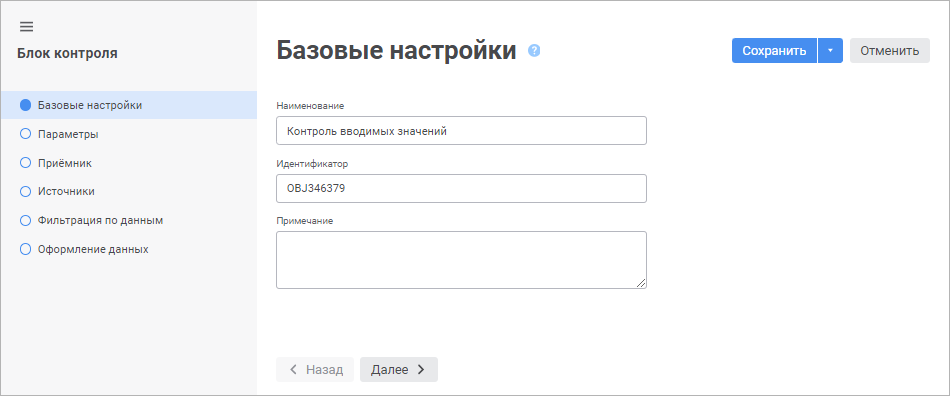

# Вставка и настройка блоков контроля: Веб-приложение

Вставка и настройка блоков контроля: Веб-приложение
-

# Вставка и настройка блоков контроля

Блок контроля предназначен для проверки вводимых данных в расширении
 «[Интерактивные формы ввода данных](DataEntryForms.chm::/DataEntryForms_Purpose.htm)». Возможность доступна, если
 при построении формы ввода был [выбран
 алгоритм расчёта](DataEntryForms.chm::/web/Table/Calculation_Practices.htm), содержащий блок контроля.

[Создание
 нового блока контроля](javascript:TextPopup(this))

	Для создания нового блока контроля:

	- в [навигаторе
	 объектов](GetStarted.chm::/Interface/Interface_Navigator.htm) нажмите кнопку  «Создать» в главном меню и выберите
	 тип объекта на боковой панели «[Новый
	 объект](UiNav.chm::/02_Navigator/General_Principles_of_Work.htm#add_object)».

	- в [расширении
	 «Алгоритмы расчёта»](../Work/Beginning_of_work.htm#create) выполните
	 одно из действий:

			- выполните команду 
			 «Блок контроля» в
			 раскрывающемся меню кнопки  «Добавить
			 блок» на [панели
			 инструментов](../Work/Beginning_of_work.htm);

			- выполните команду «Создать
			 >  Блок контроля» в контекстном
			 меню [рабочей области](../Work/Beginning_of_work.htm).

[Редактирование
 готового блока контроля](javascript:TextPopup(this))

	Для редактирования готового блока контроля:

	- в [навигаторе
	 объектов](GetStarted.chm::/Interface/Interface_Navigator.htm) выделите блок и выполните одно из действий:

		- выполните команду «Редактировать»
		 в контекстном меню блока;

		- выполните команду «Редактировать
		 в новой вкладке» в контекстном меню блока;

		- выполните команду «Редактировать
		 в новом окне» в контекстном меню блока;

		- нажмите клавишу F4;

		- в [расширении
		 «Алгоритмы расчёта»](../Work/Beginning_of_work.htm#create)
		 выполните команду «Редактировать»
		 в контекстном меню блока, расположенного в [дереве
		 расчёта](../Work/Beginning_of_work.htm) или на [рабочей
		 области](../Work/Beginning_of_work.htm).

Создание и редактирование выполняется с помощью мастера редактирования
 блока контроля, в котором настраиваются параметры блока:

Настройка блока контроля выполняется аналогично настройке [блока
 расчёта](../Calculation_block/Calculation_unit.htm) и состоит из следующих шагов:

	- [Настройка
	 базовых свойств](../Calculation_block/Basic_Properties.htm).

	- [Добавление параметров](../Calculation_block/Parameters.htm).

	- [Выбор
	 и настройка приёмника данных](../Calculation_block/Master_calculation_block_page_consumer.htm).

	- [Выбор и настройка
	 источников данных](../Calculation_block/Page_Sources.htm).

	- [Настройка
	 фильтрации по данным](../Calculation_block/FilteringByData.htm).

	- [Настройка оформления данных,
	 не прошедших контроль](Style_ControlBlock.htm). Шаг присутствует только в блоке контроля.

	- [Настройка формул
	 расчёта](../Calculation_block/Formula.htm). Все заданные формулы должны быть направлены на проверку
	 значений и возвращать результат логического типа. Например, формула,
	 проверяющая, что для показателя задано значение или что заданное значение
	 в интервале от 0 до 100.

Для сохранения настроек:

	- нажмите кнопку «Сохранить»;

	- выполните команду «Сохранить
	 и закрыть» в раскрывающемся меню кнопки «Сохранить».
	 По завершению выполнения команды будут сохранены заданные настройки
	 и закрыт мастер редактирования блока контроля.

Примечание.
 Команда «Сохранить и закрыть»
 доступна только при открытии блока контроля на [редактирование](Control_Block.htm#edit).

См. также:

[Построение
 алгоритма расчёта](../Work/Construction_of_the_calculation_algorithm.htm)

		Справочная
		 система на версию 10.9
		 от 18/08/2025,
		 © ООО «ФОРСАЙТ»,
