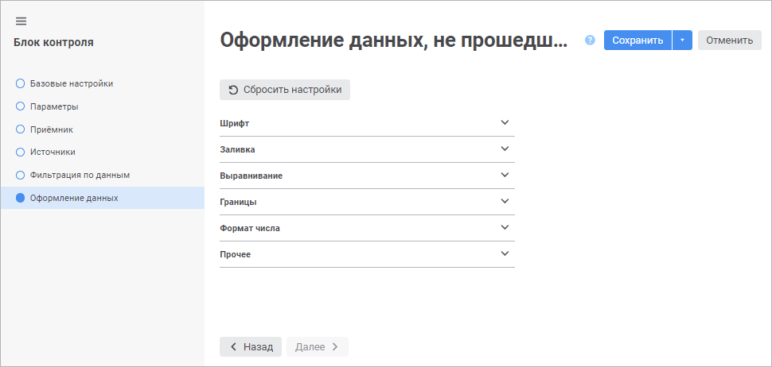
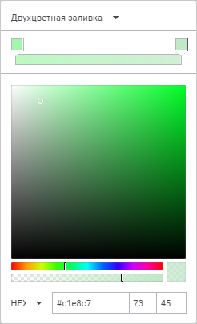
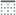
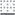
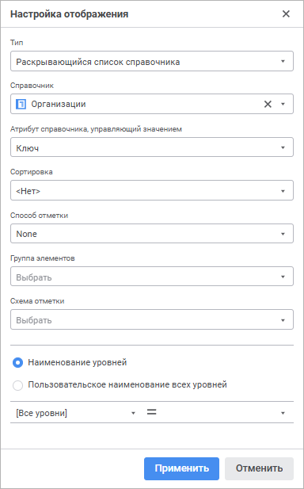

# Настройка оформления данных, не прошедших контроль: Блок контроля, веб-приложение

Настройка оформления данных, не прошедших контроль: Блок контроля, веб-приложение
-

# Настройка оформления данных, не прошедших контроль

Настройка оформления позволяет в [форме
 ввода](DataEntryForms.chm::/dataentryforms_purpose.htm) визуально выделить данные, которые не
 прошли контроль.

Для настройки стиля оформления используйте страницу «Оформление
 данных, не прошедших контроль» в [мастере
 редактирования блока контроля](Control_Block.htm):

Для задания стиля используйте следующие вкладки:

[Шрифт](javascript:TextPopup(this))

	Для настройки шрифта задайте параметры:

		- Шрифт. Выберите
		 один из доступных шрифтов в раскрывающемся списке. При необходимости
		 можно загрузить [пользовательские
		 шрифты](Setup.chm::/UiWebSetup/03_Setup_Web/General_for_linux/Loading_Custom_Fonts.htm);

		- Размер шрифта. Установите
		 требуемый размер шрифта. Размер задаётся в пунктах, его можно
		 выбрать из раскрывающегося списка или ввести вручную. Диапазон
		 допустимых значений: [6; 36];

		- Цвет. Выберите цвет
		 текста в раскрывающейся палитре или задайте его в формате RGB
		 или HEX;

		- Начертание.
		 Выберите начертание шрифта:

			- B.
			 Полужирное начертание;

			- I.
			 Курсивное начертание;

			- U.
			 Подчеркивание текста;

			- S.
			 Зачёркивание текста.

	При нажатой кнопке будет использоваться
	 соответствующий стиль начертания. Доступно использование нескольких
	 стилей одновременно, например, нажатие кнопок «B»
	 и «I»
	 даёт полужирное курсивное начертание;

		- Выравнивание
		 текста в ячейке. Задайте выравнивание текста относительно
		 ячейки:

			- По левому
			 краю. Используется по умолчанию;

			- По центру;

			- По правому
			 краю;

			- По ширине.

	Выбрать можно только один
	 вариант.

[Заливка](javascript:TextPopup(this))

	Для настройки заливки задайте параметры:

		- Цвет заливки. В
		 раскрывающемся меню кнопки «Цвет
		 заливки» выберите:

	

			- Тип заливки.
			 Настройка доступна для регламентного отчёта, формы ввода,
			 информационной панели и блока расчёта:

				- Без заливки.
				 По умолчанию;

				- Сплошная заливка;

				- Двухцветная заливка.
				 Доступна для регламентного отчёта, формы ввода и блока
				 расчёта;

			- Цвет заливки:

				- для сплошной заливки в цветовой палитре выберите
				 цвет или задайте его в формате RGB или HEX;

				- для двухцветной заливки в цветовой палитре выберите
				 цвет или задайте его в формате RGB или HEX для начала
				 и конца градиента;

			- Прозрачность
			 цвета заливки. Измените прозрачность цвета заливки
			 с помощью бегунка или введите число в поле;

			- Угол
			 наклона заливки. Введите угол наклона двухцветной заливки;

		- Тип штриховки. При
		 необходимости добавьте штриховку. По умолчанию параметр принимает
		 значение «Без штриховки».
		 В раскрывающемся списке содержатся образцы всех возможных штриховок;

		- Цвет штриховки.
		 Параметр отображается после выбора типа штриховки. В раскрывающейся
		 палитре выберите цвет или задайте его в формате RGB или HEX.

[Выравнивание](javascript:TextPopup(this))

	Для определения способа расположения значения внутри ячейки используйте
	 группу настроек «Выравнивание».
	 Значение может быть выровнено по горизонтали и по вертикали с учётом
	 заданных отступов от границ ячейки и угла поворота. Для строковых
	 значений дополнительно может быть задан способ переноса.

	Задайте способы расположения значений внутри ячейки:

		- Выравнивание. Задайте
		 способ выравнивания значений:

			- По
			 горизонтали. Возможные варианты:

				- По значению.
				 Выравнивание зависит от содержимого ячейки (ячеек). Если
				 ячейка содержит только цифры (включая разделители разрядов,
				 знак отделения дробной части и знак процента), то выравнивание
				 будет производиться по правому краю, в противном случае
				 - по левому. Значение по умолчанию;

				- По левому краю.
				 Значение прижимается к левой границе ячейки;

				- По центру.
				 Значение размещается на равном расстоянии от левой и правой
				 границ ячейки с учётом заданных отступов;

				- По правому краю.
				 Значение прижимается к правой границе ячейки;

				- По ширине.
				 Значение размещается по ширине ячейки;

			- По
			 вертикали. Возможные варианты:

				- По верхнему краю.
				 Значение прижимается к верхней границе ячейки;

				- По центру.
				 Значение размещается на равном расстоянии от верхней и
				 нижней границ ячейки с учётом заданных отступов;

				- По нижнему краю.
				 Значение прижимается к нижней границе ячейки. Значение
				 по умолчанию;

		- Отступы. Задайте
		 отступы содержимого от границ ячейки: в каждом поле задайте размер
		 отступа от соответствующей границы ячейки;

		- Поворот текста.
		 Задайте угол наклона текста в ячейке;

		- Перенос. Задайте
		 способ переноса текста в ячейке:

			- Не переносить.
			 Перенос производиться не будет. Весь текст располагается в
			 одну строку;

			- По словам. Текст
			 ячейки будет переноситься по словам. Расположение переноса
			 определяется шириной ячейки.

[Границы](javascript:TextPopup(this))

	Для настройки границ ячеек доступны следующие параметры:

		- Отображение границ.
		 Параметр предназначен для установки и снятия границ ячеек. Доступны
		 следующие режимы:

			- . Отобразить все границы;

			- . Отобразить
			 только внешние границы;

			- . Отобразить
			 только внутренние границы;

			- . Не отображать границы.

	Для режимов, управляющих только одним
	 типом границ, доступна множественная отметка:

			- . Отобразить
			 внутреннюю горизонтальную границу;

			- . Отобразить
			 внутреннюю вертикальную границу;

			- . Отобразить
			 левую границу;

			- . Отобразить
			 правую границу;

			- . Отобразить
			 верхнюю границу;

			- . Отобразить
			 нижнюю границу;

		- Тип линии. В раскрывающемся
		 списке выберите тип линии;

		- Цвет заливки. В
		 раскрывающемся меню кнопки «Цвет
		 заливки» выберите:

	

			- Тип заливки.
			 Настройка доступна для регламентного отчёта, формы ввода,
			 информационной панели и блока расчёта:

				- Без заливки.
				 По умолчанию;

				- Сплошная заливка;

			- Цвет заливки. В
			 цветовой палитре выберите цвет или задайте его в формате RGB
			 или HEX;

			- Прозрачность цвета
			 заливки. Измените прозрачность цвета заливки с помощью
			 бегунка или введите число в поле.

[Формат числа](javascript:TextPopup(this))

	Для изменения настроек формата данных, в раскрывающемся списке выберите
	 один из поддерживаемых форматов данных. В зависимости от выбранного
	 формата будут доступны различные настройки:

		- Общий.
		 Равносильно отмене форматирования. При выборе общего формата доступны
		 настройки:

			- Разделитель дробной
			 части. Выберите вид разделителя в раскрывающемся списке;

		- Числовой.
		 Формат установлен по умолчанию. При выборе числового формата доступны
		 настройки:

			- Десятичных знаков.
			 Выберите число отображаемых знаков после запятой;

			- Отрицательные числа.
			 Выберите вид отображения отрицательных чисел;

			- Разделитель групп разрядов.
			 Установите флажок для применения настройки разделителя группы
			 разрядов. По умолчанию снят;

			- Разделитель дробной
			 части. Выберите вид разделителя в раскрывающемся списке;

			- Разделитель группы
			 разрядов. Выберите вид разделителя в раскрывающемся
			 списке;

		- Процентный.
		 При выборе процентного формата доступны настройки:

			- Десятичных знаков.
			 Выберите число отображаемых знаков после запятой;

			- Разделитель дробной
			 части. Выберите вид разделителя в раскрывающемся списке.

	При использовании процентного формата
	 значение чисел умножается на 100 и добавляется знак «%». Ввод чисел
	 в ячейку при данном формате будет по-разному обрабатываться в зависимости
	 от использования знака «%». Например, при вводе «40%» в ячейке будет
	 отражено «40%», при этом значение в ячейке 0,4. Если вводится «40»,
	 то в ячейке отображается «4000%», при этом значение в ячейке будет
	 40;

		- Денежный.
		 При выборе денежного формата доступны настройки:

			- Десятичных знаков.
			 Задаёт число отображаемых знаков после запятой;

			- Обозначение.
			 Задаёт обозначение валюты;

			- Отрицательные числа.
			 Выберите вид отображения отрицательных чисел;

			- Разделитель дробной
			 части. Выберите вид разделителя в раскрывающемся списке;

			- Разделитель группы
			 разрядов. Выберите вид разделителя в раскрывающемся
			 списке;

		- Дата.
		 При выборе формата «Дата»
		 доступны настройки:

			- Тип. Выберите
			 формат отображения даты в раскрывающемся списке;

		- Время.
		 При выборе формата «Время»
		 доступны настройки:

			- Тип. Выберите
			 формат отображения времени в раскрывающемся списке;

		- Экспоненциальный.
		 Данный формат используется для представления числа в экспоненциальном
		 виде. При выборе экспоненциального формата доступны настройки:

			- Десятичных знаков.
			 Выберите число отображаемых знаков после запятой;

			- Разделитель дробной
			 части. Выберите вид разделителя в раскрывающемся списке;

		- Текстовый.
		 Равносильно отмене форматирования. Текстовый формат устанавливается
		 по умолчанию для ячеек, содержащих нечисловые значения;

		- Дополнительный.
		 При выборе дополнительного формата доступны настройки:

			- Тип. Для автоматического
			 преобразования значения выберите предустановленный вариант:

				- Почтовый индекс;

				- Номер телефона;

				- Табельный номер;

		- Пользовательский.
		 Содержит кодовые представления всех доступных форматов данных.
		 При выборе пользовательского формата доступны настройки:

			- Тип.
			 Для автоматического преобразования значения выберите предустановленный
			 вариант:

				- Валюта.
				 Выберите формат отображения валюты в раскрывающемся списке;

				- Дата и время.
				 Выберите формат отображения времени в раскрывающемся списке;

				- Числа. Выберите
				 формат числа в раскрывающемся списке;

				- Прочее.
				 Выберите другой формат отображения в раскрывающемся списке;

			- Разделитель
			 дробной части. Выберите вид разделителя в раскрывающемся
			 списке;

			- Разделитель
			 группы разрядов. Выберите вид разделителя в раскрывающемся
			 списке.

	Для настройки редактора ячейки задайте параметры отображения данных
	 в виде специально сформированной строки, в которой указывается вид
	 редактора, значение по умолчанию и т.д. Строка может быть отредактирована:

		- в поле «Настройка редактора
		 ячейки»;

		- с помощью окна «Настройка
		 отображения». Для открытия окна нажмите кнопку  «Настройка отображения»:

	

	Настройка редактора ячейки аналогична [настройке редактора
	 значений](uinav.chm::/gui/ValueEditorParameters.htm). По умолчанию параметр отображения данных
	 устанавливается в соответствии с выбранным форматом.

	Для отображения всегда активного редактора ячейки снимите флажок
	 «Показывать редактор только при активации
	 ячейки». По умолчанию флажок установлен, редактор отображается
	 только при активации ячейки.

[Прочее](javascript:TextPopup(this))

	Задайте прочие настройки:

		- для заполнения пустых или нулевых ячеек введите текст, число
		 или символы в соответствующих полях. Значения, которыми заполняются
		 пустые ячейки, в том числе и числовые, не будут сохранены в источнике;

		- для управления защитой ячейки от редактирования, скрытия
		 содержимого ячейки или запрета выделения задайте:

			- Защищаемая ячейка.
			 При установке флажка содержимое ячеек будет защищено от редактирования;

			- Скрыть формулы.
			 При установке флажка содержимое ячеек, содержащих формулу,
			 будет скрыто и недоступно для редактирования. При этом данные,
			 полученные по формуле, будут отображены в ячейке;

			- Запретить выделение.
			 При установке флажка ячейка станет невыделяемой при открытии
			 формы в режиме просмотра. Контекстное меню для такой ячейки
			 вызываться не будет. При попытке выделения запрещенной для
			 выделения ячейки фокус остается на предыдущей выделенной ячейке
			 до тех пор, пока не будет выделена другая ячейка, доступная
			 для выделения. Перемещение в таблице с помощью клавиатуры
			 осуществляется по разрешенным ячейкам. При выделении диапазона
			 ячеек, в котором есть невыделяемые ячейки, все невыделяемые
			 ячейки остаются невыделенными;

			- Текст подсказки.
			 Введите текст всплывающей подсказки для защищенной ячейки;

		- для определения необходимости вывода содержимого ячейки
		 на печать установите/снимите флажок «Выводить
		 на печать». При снятии флага «Выводить
		 на печать» содержимое ячейки на печать не выводится. При
		 экспорте текст и гиперссылки, содержащиеся в такой ячейке, а также
		 настройки ее фона экспортироваться не будут. По умолчанию этот
		 флаг установлен для всех ячеек данных.

Для сброса заданного стиля и возврата к стилю по умолчанию нажмите кнопку
  «Сбросить настройки».

Примечание.
 На этапе построения формы ввода при выборе алгоритма расчёта задаются
 собственные [настройки
 стиля](DataEntryForms.chm::/desktop/Table/Calculation_Practices.htm#common) для данных, не прошедших контроль. Данные настройки
 имеют более высокий приоритет по сравнению с настройками стиля в блоке
 контроля. Например, если заданы настройки шрифта в форме ввода и в блоке
 контроля, то для оформления данных, не прошедших контроль, будут применены
 настройки шрифта из формы ввода.

См. также:

[Вставка
 и настройка блоков контроля](Control_Block.htm)

		Справочная
		 система на версию 10.9
		 от 18/08/2025,
		 © ООО «ФОРСАЙТ»,
