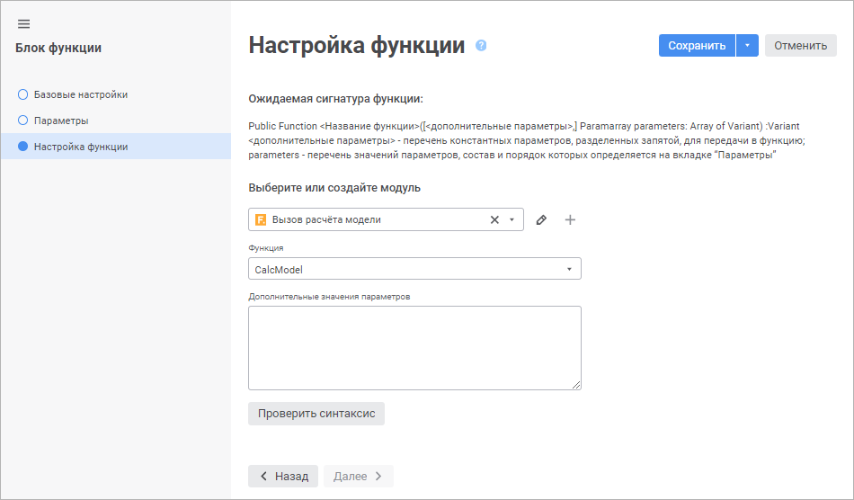

# Выбор пользовательской функции: Блок функции, веб-приложение

Выбор пользовательской функции: Блок функции, веб-приложение
-

# Выбор пользовательской функции

Функция определяет, каким образом будет выполняться расчёт блока. Функция
 должна быть написана в модуле Fore и иметь следующую сигнатуру:

Public Function <название
 функции>([<дополнительные
 параметры>,]Paramarray parameters: Array Of Variant): Variant;

Где:

	- [<дополнительные параметры>,].
	 Константные пользовательские параметры, которые могут дополнительно
	 управлять расчётом функции. Если параметров несколько, то они перечисляются
	 через запятую. Могут отсутствовать;

Примечание.
 Если дополнительные параметры не заданы в сигнатуре функции, но заданы
 на странице «Настройка функции»
 в [мастере редактирования блока функции](Function_Block.htm),
 то они будут содержаться перед значениями параметров блока в переменной
 parameters.

	- parameters. Массив значений
	 параметров блока, состав и порядок которых задан на странице «[Параметры](ParametersFunc.htm)»
	 в мастере редактирования блока функции. Значения параметров должны
	 быть приведены к интерфейсу [IDimSelection](KeDims.chm::/interface/IDimSelection/IDimSelection.htm)
	 для получения отметок элементов справочников, которые используются
	 в качестве параметров блока.

Результат функции можно вывести в консоль среды разработки или использовать
 его с помощью интерфейса [ITsCalculationContext](KeTransform.chm::/Interface/ITsCalculationContext/ITsCalculationContext.htm).
 В процессе расчёта алгоритма результат функции не используется.

Для получения примера функции обратитесь к разделу «[Пример
 пользовательской функции](#example)».

Выбор пользовательской функции выполняется на странице «Настройка
 функции» в [мастере редактирования
 блока функции](Function_Block.htm):

Для выбора пользовательской функции:

	- Выберите вариант использования модуля с функцией:

		- Выбрать существующий модуль
		 из репозитория. Выберите в раскрывающемся списке модуль
		 с функцией. Для быстрого поиска модуля начните вводить его наименование
		 частично или целиком;

		- Создать новый модуль. Для
		 создания модуля нажмите кнопку 
		 «Создать». При выборе
		 данного варианта будет осуществлен переход на страницу среды разработки
		 для создания нового модуля, содержащего требуемую сигнатуру функции.
		 Создание нового модуля доступно, если в раскрывающемся списке
		 не выбран существующий модуль.

После выполнения действия выбранный модуль
 будет отображен на странице мастера.

Для редактирования выбранного модуля нажмите
 кнопку  «Редактировать».
 После выполнения действия будет осуществлен переход на страницу среды
 разработки для редактирования модуля.

Для отмены использования выбранного модуля
 нажмите кнопку  «Удалить»
 в раскрывающемся списке.

	- Выберите пользовательскую функцию в раскрывающемся списке «Функция». В списке содержатся только
	 те функции модуля, которые имеют требуемую сигнатуру.

	- Если в сигнатуре функции определены константные пользовательские
	 параметры, то задайте их значения в поле «Дополнительные
	 значения параметров». Если параметров несколько, то их значения
	 приводятся через запятую. Строковые параметры приводятся в кавычках.

	- Проверьте правильность задания параметров функции с помощью
	 кнопки «Проверить синтаксис».
	 Если всё настроено верно, то будет отображено соответствующее сообщение,
	 в обратном случае - сообщение об ошибке.

В результате будет выбрана пользовательская функция, рассчитываемая
 блоком.

## Пример пользовательской функции

Пример выполняет команду СУБД, ключ которой передаётся в качестве константного
 пользовательского параметра. Команда СУБД содержит параметры, идентификаторы
 которых совпадают с идентификаторам справочников, используемых в качестве
 [параметров](ParametersFunc.htm) блока функции.

Для выполнения примера добавьте ссылки на системные сборки: Db, Dimensions,
 Metabase, Ui.

	Public Function callDBCommand(Command: Integer; Paramarray parameters: Array Of Variant): Variant;

	Var

	    Desc: IMetabaseObjectDescriptor;

	    ComInst: ISQLCommandInstance;

	    i: integer;

	    Prms: IMetabaseObjectParamValues;

	    Prm: IMetabaseObjectParamValue;

	    Sel: IDimSelection;

	Begin

	    // Выполним действия, если выдан диалог подтверждения с заданным сообщением

	    If WinApplication.ConfirmationBox("Выполнение расчёта может занять продолжительное время. Продолжить?") Then

	        // Получим команду СУБД

	        Desc := MetabaseClass.Active.Item(Command);

	        // Создадим копию параметров команды СУБД с пустыми значениями

	        Prms := Desc.Params.CreateEmptyValues;

	        // Заполним копию параметров команды СУБД значениями параметров из блока

	        For i := 0 To parameters.Length - 1 Do

	            // Получим значение параметра блока функции

	            Sel := parameters[i];

	            // Выведем в консоль значение параметра

	            Debug.Writeline(Sel.ToString);

	            // Получим параметр команды СУБД по идентификатору справочника, используемого в качестве параметра блока

	            Prm := Prms.FindById(Sel.Dimension.Ident);

	            // Присвоим значение параметра блока значению параметра команды СУБД

	            If Prm <> Null Then

	                Prm.Value := Sel.ToVariant;

	            End If;

	        End For;

	        // Откроем команду СУБД с полученными значениями параметров из блока

	        ComInst := Desc.Open(Prms) As ISQLCommandInstance;

	        // Запустим команду СУБД на выполнение

	        ComInst.Execute;

    End If;

	    Return 0;

	End Function callDBCommand;

После выполнения функции будет запущено выполнение команды СУБД с параметрами,
 значения которых были получены из блока функции. В консоль будут выведены
 значения полученных параметров.

См. также:

[Вставка
 и настройка блоков функций](Function_Block.htm)

		Справочная
		 система на версию 10.9
		 от 18/08/2025,
		 © ООО «ФОРСАЙТ»,
