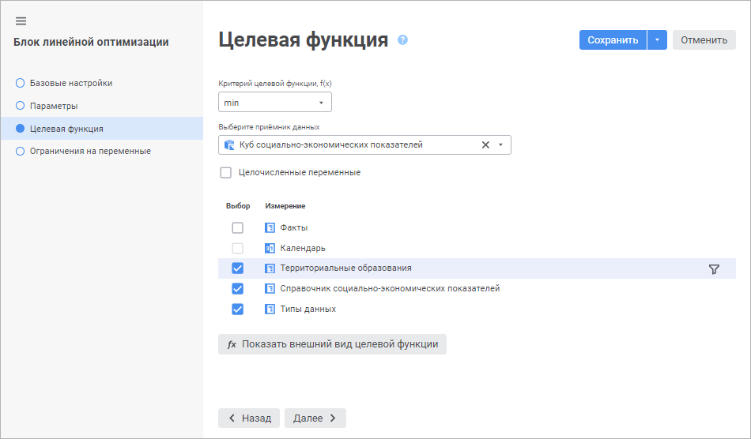

# Настройка целевой функции: Блок линейной оптимизации, веб-приложение

Настройка целевой функции: Блок линейной оптимизации, веб-приложение
-

# Настройка целевой функции

Целевая функция - это функция для которой управляющие переменные должны
 быть подобраны таким образом, чтобы целевая функция приняла минимальное
 или максимальное значение.

Выбор цели оптимизации целевой функции, управляющих переменных и приёмника
 данных, в который будут выгружены результаты оптимизации выполняется на
 странице «Целевая функция» в мастере
 редактирования блока линейной оптимизации:

Для формирования целевой функции:

	- Выберите цель оптимизации целевой функции в раскрывающемся списке
	 «Критерий целевой функции, f(x)»:

		- min. Используется
		 по умолчанию. Значения управляющих переменных будут подобраны
		 таким образом, чтобы целевая функция имела минимальное значение;

		- max. Значения управляющих
		 переменных будут подобраны таким образом, чтобы целевая функция
		 имела максимальное значение.

	- Выберите приёмник данных, в который будут выгружены результаты
	 расчёта блока. В блоке линейной оптимизации предполагается, что все
	 управляющие переменные будут сформированы на основе измерений приёмника
	 данных. Таким образом выбранный приёмник должен содержать измерения,
	 позволяющие сформировать полный набор управляющих переменных. Если
	 измерение используется в качестве управляющей переменной, то оно называется
	 измерением управляющей переменной.

Для быстрого выбора объекта в поле для поиска введите его название/идентификатор/ключ,
 в зависимости от настроек отображения. Поиск будет выполняться автоматически
 по мере ввода текста. Список будет содержать объекты, наименования/идентификаторы/ключи
 которых содержат вводимый текст.

Для настройки отображения объектов репозитория
 в списке нажмите кнопку  «Отображение объекта» и выберите
 в раскрывающемся меню вариант отображения:

	- Наименование. Объекты
	 отображаются под своими наименованиями. Вариант по умолчанию;

	- Идентификатор. Объекты
	 отображаются под своими идентификаторами;

	- Ключ. Объекты отображаются
	 под своими ключами.

Выбрать можно несколько вариантов. Идентификатор
 и ключ будут указаны в скобках.

	- Если все управляющие переменные целочисленные, то установите
	 флажок «Целочисленные переменные».
	 В результате будет решаться целочисленная задача линейной оптимизации.
	 Данная задача применяется, если управляющие переменные обладают свойством
	 неделимости. Например, целочисленная управляющая переменная - это
	 количество автомобилей в транспортной компании. Не может быть половины
	 автомобиля, следовательно, он обладает свойством неделимости.

	- Выберите измерения управляющих переменных. Для выбора измерения
	 отметьте его флажком. Все оставшиеся измерения будут использованы
	 для итеративного решения задачи оптимизации. Для преобразования измерения
	 управляющей переменной в обычное измерение снимите с него флажок.

	- Для выполнения расчётов только по части элементов настройте
	 фильтрацию по элементам. Для этого наведите курсор на требуемое измерение
	 в списке и нажмите кнопку  «Настройка
	 фильтрации» около него. Будет открыт диалог «[Настройка фильтрации](#filter)», в котором задайте
	 настройки фильтрации измерения приёмника данных.

В результате будет настроена целевая функция.

Для просмотра целевой функции нажмите кнопку 
 «[Показать
 внешний вид целевой функции](ViewTagretFunction_LinOpt.htm)».

## Настройка фильтрации измерения приёмника данных

Фильтрация позволяет выполнять расчёт только по части элементов измерения.

Для выбора элементов измерения, по которым будет рассчитываться блок,
 используйте диалог «Настройка фильтрации»:

Порядок настройки:

	- Выберите элементы, по которым будет рассчитываться блок. Установите
	 один из переключателей:

		- Все элементы. Расчёт
		 блока будет идти по всем элементам измерения;

		- Элементы. Расчёт
		 блока будет идти по элементам измерения, выбранным в данном списке;

		- Параметры. Расчёт
		 блока будет идти по элементам, заданным параметром. Способ
		 доступен, если блок содержит параметры.

Для работы с [отметкой
 элементов](UiSelection.chm::/Selection/Selection_of_the_dimension_elements.htm#selection) измерения используйте команды контекстного
 меню.

Для расчёта блока по всем элементам, кроме
 отмеченных, установите флажок «Исключить
 выбранные элементы» при необходимости.

	- Добавьте расширенные условия фильтрации при необходимости. При
	 выполнении расчёта блока атрибуты элементов будут соответствовать
	 заданным условиям. Работа с группой параметров условия аналогична
	 работе с диалогом «[Расширенный фильтр](../Calculation_block/Calculation_Formula_Generation.htm#aggrsetup)».

	- Нажмите кнопку «Применить».

После выполнения действий блок будет рассчитываться только по
 элементам, соответствующим настроенному фильтру.

См. также:

[Вставка и настройка блоков линейной
 оптимизации](Linear_optimization_block.htm)

		Справочная
		 система на версию 10.9
		 от 18/08/2025,
		 © ООО «ФОРСАЙТ»,
