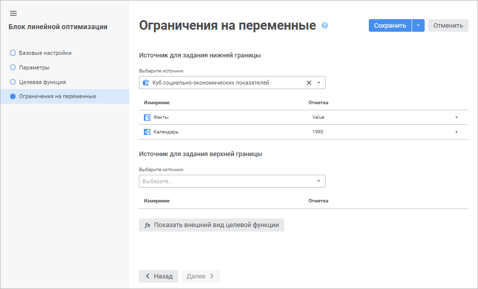
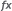

# Настройка простых ограничений управляющих переменных: Блок линейной оптимизации, веб-приложение

Настройка простых ограничений управляющих переменных: Блок линейной оптимизации, веб-приложение
-

# Настройка простых ограничений управляющих переменных

Ограничения на переменные позволяют задать простые условия, накладываемые
 на значения управляющих переменных. Условие является простым, если оно
 соответствует следующим критериям:

	- в нём участвует одна управляющая переменная;

	- для управляющей переменной задан единичный коэффициент.

Например, x1 ≥ 25
 или 100 ≤ x2 ≤ 254, где x1 и x2 -
 это управляющие переменные с единичным коэффициентом.

Для настройки простых ограничений управляющих переменных используйте
 страницу «Ограничения на переменные»
 в мастере редактирования блока линейной оптимизации:

Отдельно задаются верхняя и нижняя границы ограничений. Нижняя граница
 - это минимально допустимое значение управляющей переменной, верхняя граница
 - максимально допустимое значение. Для каждой управляющей переменной можно
 задать только нижнюю границу, только верхнюю границу, обе границы или
 вообще не накладывать ограничений.

Например, ограничение x1 ≥ 25
 задаётся только с помощью верхней границы. А ограничение 100 ≤ x2 ≤
 254 требует задания верхней и нижней границ.

Для ввода простых ограничений управляющих переменных:

	- Выберите источник данных для хранения значений верхних и нижних
	 границ. Данный источник должен содержать все измерения управляющих
	 переменных, выбранные при [настройке
	 целевой функции](TargetFunction_LinOpt.htm).

Для быстрого выбора объекта в поле для поиска введите его название/идентификатор/ключ,
 в зависимости от настроек отображения. Поиск будет выполняться автоматически
 по мере ввода текста. Список будет содержать объекты, наименования/идентификаторы/ключи
 которых содержат вводимый текст.

Для настройки отображения объектов репозитория
 в списке нажмите кнопку  «Отображение объекта» и выберите
 в раскрывающемся меню вариант отображения:

	- Наименование. Объекты
	 отображаются под своими наименованиями. Вариант по умолчанию;

	- Идентификатор. Объекты
	 отображаются под своими идентификаторами;

	- Ключ. Объекты отображаются
	 под своими ключами.

Выбрать можно несколько вариантов. Идентификатор
 и ключ будут указаны в скобках.

	- Задайте отметку по фиксированным измерениям источника данных.
	 В фиксированные измерения попадают все измерения источника, кроме
	 тех, которые используются в качестве измерений управляющих переменных.

В результате будут заданы ограничения управляющих переменных.

Для просмотра целевой функции нажмите кнопку 
 «[Показать
 внешний вид целевой функции](ViewTagretFunction_LinOpt.htm)».

См. также:

[Вставка и настройка блоков линейной
 оптимизации](Linear_optimization_block.htm)

		Справочная
		 система на версию 10.9
		 от 18/08/2025,
		 © ООО «ФОРСАЙТ»,
