# Настройка оформления алгоритма расчёта: Веб-приложение

Настройка оформления алгоритма расчёта: Веб-приложение
-

# Настройка оформления алгоритма расчёта

	При настройке оформления алгоритма расчёта:

		- [Настройте оформление
		 рабочей области](AlgorithmDecor.htm#settings_param).

		- [Добавьте](AlgorithmDecor.htm#insert_objects)
		 и [настройте ](AlgorithmDecor.htm#objects_settings)объекты
		 оформления алгоритма расчёта.

	Примечание.
	 Настройка оформления блоков алгоритма расчёта, объектов репозитория
	 и вложенных алгоритмов расчёта аналогична [настройке
	 оформления текстового блока](AlgorithmDecor.htm#p_text).

## Настройка оформления рабочей области

	Для настройки оформления рабочей области нажмите кнопку  «Параметры
	 рабочей области» на [панели
	 инструментов](Beginning_of_work.htm). После чего будет открыта боковая панель «Настройки
	 рабочей области»:

	

	Задайте параметры:

		- Отображать сетку.
		 Снимите флажок для скрытия сетки на рабочей области. По умолчанию
		 флажок установлен, сетка отображается;

		- Отображать пересечения.
		 Установите флажок для отображения перегиба линий при пересечении
		 прямых/угловых линий и стрелок на рабочей области:

	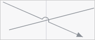

	По умолчанию флажок снят, пересечения
	 прямых/угловых линий и стрелок отображаются без перегиба линий. Состояние
	 флажка не сохраняется, при открытии алгоритма расчёта флажок всегда
	 будет снят;

		- Цвет фона/Цвет сетки. Выберите цвет фона/сетки
		 в раскрывающейся палитре цветов.

Для выбора доступны стандартные и пользовательские цвета. По умолчанию
 палитра содержит только стандартные цвета.

Для создания пользовательского цвета:

	- Нажмите кнопку  «Добавить
	 цвет». Откроется расширенная палитра цветов.

	- Выберите цвет в расширенной палитре цветов, на странице браузера
	 с помощью пипетки или задайте код цвета в формате RGB/HEX.

После выполнения действий пользовательский цвет будет создан и добавлен
 в палитру.

Примечание.
 Максимально возможное количество пользовательских цветов в палитре равно
 23.

Для удаления пользовательского цвета из палитры выполните команду «Удалить» контекстного меню выбранного
 цвета.

Для изменения непрозрачности цвета используйте бегунок или введите значение
 в процентах при необходимости.

Для сброса настроек цвета нажмите кнопку 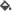 «Цвет
 по умолчанию».

	Для скрытия/отображения сетки на рабочей области используйте клавишу
	 G.

## Добавление объектов оформления алгоритма
	 расчёта

	Для оформления алгоритма расчёта используйте следующие объекты:

		- Линии. Предназначены
		 для создания визуальных связей между элементами;

		- Фигуры. Предназначены
		 для создания визуальных блоков;

		- Выноски. Предназначены
		 для создания примечаний и заметок к элементам;

		- Текст. Предназначен
		 для создания надписей, комментариев и подписей, разъясняющих назначение
		 блоков и объектов;

		- Изображения. Предназначены
		 для создания визуальных элементов.

	Для добавления объекта оформления алгоритма расчёта выполните:

	[Добавление
	 линии](javascript:TextPopup(this))

			- Выберите требуемый тип линии в раскрывающемся меню кнопки,
			 содержащей набор линий, на [панели
			 инструментов](../../../UiWsp/2_WorkSpace/UiWsp_WorkSpace_Starting.htm). Кнопка выбора линии имеет вид последней
			 выбранной линии.

			- Переместите курсор к предполагаемому месту начала линии
			 и, удерживая кнопку мыши, переместите курсор к месту предполагаемого
			 окончания линии. Отпустите кнопку мыши.

		Доступные линии для выбора:

			- .
			 Прямая линия;

			- .
			 Стрелка;

			- . Угловая линия;

			- 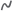. Изогнутая линия.

		После создания прямой линии/стрелки в её центре отображается
		 дополнительная точка, позволяющая создать ломаную линию. Для этого
		 перетащите дополнительную точку, расположенную в центре линии,
		 в другое место рабочей области при необходимости создания ломаной
		 линии. Дополнительные точки отображаются на каждом новом линейном
		 участке:

		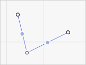

		Для удаления дополнительной точки дважды щёлкните по ней.

	[Добавление
	 фигуры](javascript:TextPopup(this))

			- Выберите требуемый тип фигуры в раскрывающемся меню
			 в раскрывающемся меню кнопки, содержащей набор фигур, на [панели инструментов](Beginning_of_work.htm#elements).
			 Кнопка выбора фигуры имеет вид последней выбранной фигуры.

			- Укажите курсором место расположения фигуры, щёлкнув
			 мышью на рабочей области.

		Доступные фигуры для выбора:

			- 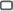. Скруглённый прямоугольник;

			- 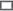. Прямоугольник;

			- . Эллипс;

			- . Треугольник;

			- . Четырёхугольник;

			- . Пятиугольник;

			- . Шестиугольник;

			- . Восьмиугольник.

	[Добавление
	 выноски](javascript:TextPopup(this))

			- Выберите требуемый тип выноски в раскрывающемся меню
			 кнопки, содержащей набор выносок, на [панели
			 инструментов](Beginning_of_work.htm#elements). Кнопка выбора выноски имеет вид последней
			 выбранной выноски.

			- Укажите курсором место расположения выноски, щёлкнув
			 мышью на рабочей области.

		Доступные для выбора выноски:

			- . Прямоугольная выноска;

			- . Скруглённая прямоугольная выноска;

			- . Овальная выноска.

		Потяните за красный маркер уголка для изменения его расположения
		 и размера при необходимости.

	[Добавление
	 текстового блока](javascript:TextPopup(this))

			- Нажмите кнопку  «Добавить
			 текст» на [панели
			 инструментов](Beginning_of_work.htm#elements).

			- Укажите курсором место расположения текстового блока,
			 щёлкнув мышью на рабочей области.

	[Добавление
	 изображения](javascript:TextPopup(this))

			- Нажмите кнопку  «Изображение»
			 на [панели инструментов](Beginning_of_work.htm#elements).

			- Укажите курсором место расположения текстового блока,
			 щёлкнув мышью на рабочей области.

	Для управления объектами оформления алгоритма расчёта обратитесь
	 к разделу «[Управление элементами
	 алгоритма расчёта](Management_of_Elements.htm)».

## Настройка объектов оформления алгоритма
	 расчёта

	По умолчанию все объекты, используемых для визуального структурирования
	 элементов алгоритма расчёта, рабочей области имеют одинаковое оформление.
	 Для настройки оформления выделенного объекта задайте параметры оформления
	 на всплывающей панели:

		- для линии:

	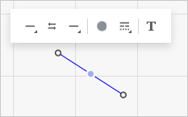

		- для фигуры/изображения:

	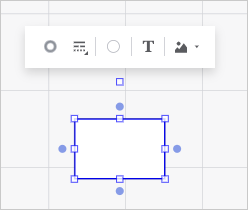

		- для выноски:

	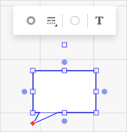

		- для текстового блока:

	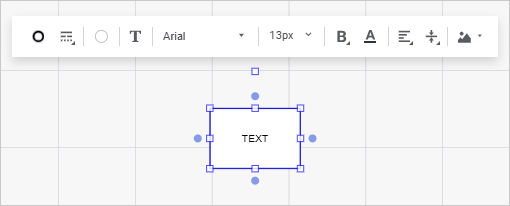

	Задайте:

	[Параметры
	 линии](javascript:TextPopup(this))

			- Тип начальной/конечной
			 стрелки. Выберите требуемый тип начальной/конечной
			 стрелки в раскрывающемся меню кнопки 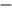
			 «Начало»/  «Конец»:

		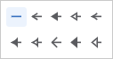

		Кнопка выбора типа начальной/конечной
		 стрелки имеет вид последнего выбранного типа начальной/конечной
		 стрелки.

		При необходимости изменения выбранных
		 типов начальной и конечной стрелки между собой нажмите кнопку
		 
		 «Поменять местами»;

			- Цвет линии.
			 Выберите цвет линии в раскрывающейся палитре цветов кнопки
			 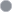
			 «Цвет линии».

Для выбора доступны стандартные и пользовательские цвета. По умолчанию
 палитра содержит только стандартные цвета.

Для создания пользовательского цвета:

	- Нажмите кнопку  «Добавить
	 цвет». Откроется расширенная палитра цветов.

	- Выберите цвет в расширенной палитре цветов, на странице браузера
	 с помощью пипетки или задайте код цвета в формате RGB/HEX.

После выполнения действий пользовательский цвет будет создан и добавлен
 в палитру.

Примечание.
 Максимально возможное количество пользовательских цветов в палитре равно
 23.

Для удаления пользовательского цвета из палитры выполните команду «Удалить» контекстного меню выбранного
 цвета.

Для изменения непрозрачности цвета используйте бегунок или введите значение
 в процентах при необходимости.

Для сброса настроек цвета нажмите кнопку  «Без
 цвета».

			- Тип линии. Выберите
			 тип линии в раскрывающемся меню кнопки  «Настройка линии»:

	- . Сплошная линия;

	- . Квадратные точки;

	- .
	 Штрих;

	- . Штрих-точка-точка-штрих;

	- . Штрих-точка-штрих.

Толщина границы задаётся в пунктах.

			- Текст линии.
			 Добавьте/настройте текст линии. Для получения подробной информации
			 по добавлению и настройке текста линии обратитесь к разделу
			 «[Ввод и редактирование текста](AlgorithmDecor.htm#text)».

	[Параметры
	 фигуры/изображения](javascript:TextPopup(this))

			- Цвет границы.
			 Выберите цвет линии в раскрывающейся палитре цветов кнопки
			 
			 «Цвет границы».

Для выбора доступны стандартные и пользовательские цвета. По умолчанию
 палитра содержит только стандартные цвета.

Для создания пользовательского цвета:

	- Нажмите кнопку  «Добавить
	 цвет». Откроется расширенная палитра цветов.

	- Выберите цвет в расширенной палитре цветов, на странице браузера
	 с помощью пипетки или задайте код цвета в формате RGB/HEX.

После выполнения действий пользовательский цвет будет создан и добавлен
 в палитру.

Примечание.
 Максимально возможное количество пользовательских цветов в палитре равно
 23.

Для удаления пользовательского цвета из палитры выполните команду «Удалить» контекстного меню выбранного
 цвета.

Для изменения непрозрачности цвета используйте бегунок или введите значение
 в процентах при необходимости.

Для сброса настроек цвета нажмите кнопку  «Без
 цвета».

			- Тип границы.
			 Выберите тип границы в раскрывающемся меню кнопки  «Настройка
			 границ»:

	- . Сплошная линия;

	- . Квадратные точки;

	- .
	 Штрих;

	- . Штрих-точка-точка-штрих;

	- . Штрих-точка-штрих.

Толщина границы задаётся в пунктах.

			- Цвет заливки.
			 Выберите цвет заливки в раскрывающейся палитре цветов кнопки
			  «Цвет
			 заливки».

Для выбора доступны стандартные и пользовательские цвета. По умолчанию
 палитра содержит только стандартные цвета.

Для создания пользовательского цвета:

	- Нажмите кнопку  «Добавить
	 цвет». Откроется расширенная палитра цветов.

	- Выберите цвет в расширенной палитре цветов, на странице браузера
	 с помощью пипетки или задайте код цвета в формате RGB/HEX.

После выполнения действий пользовательский цвет будет создан и добавлен
 в палитру.

Примечание.
 Максимально возможное количество пользовательских цветов в палитре равно
 23.

Для удаления пользовательского цвета из палитры выполните команду «Удалить» контекстного меню выбранного
 цвета.

Для изменения непрозрачности цвета используйте бегунок или введите значение
 в процентах при необходимости.

Для сброса настроек цвета нажмите кнопку  «Без
 цвета».

			- Текст линии.
			 Добавьте/настройте текст линии. Для получения подробной информации
			 по добавлению и настройке текста линии обратитесь к разделу
			 «[Ввод и редактирование текста](AlgorithmDecor.htm#text)».

			- Изображение в фигуре.
			 Выберите/настройте изображение. Для получения подробной информации
			 по выбору и настройке изображения обратитесь к разделу «[Добавление и настройка
			 изображения](AlgorithmDecor.htm#insert_image)».

	[Параметры
	 выноски](javascript:TextPopup(this))

			- Цвет границы.
			 Выберите цвет линии в раскрывающейся палитре цветов кнопки
			 
			 «Цвет границы».

Для выбора доступны стандартные и пользовательские цвета. По умолчанию
 палитра содержит только стандартные цвета.

Для создания пользовательского цвета:

	- Нажмите кнопку  «Добавить
	 цвет». Откроется расширенная палитра цветов.

	- Выберите цвет в расширенной палитре цветов, на странице браузера
	 с помощью пипетки или задайте код цвета в формате RGB/HEX.

После выполнения действий пользовательский цвет будет создан и добавлен
 в палитру.

Примечание.
 Максимально возможное количество пользовательских цветов в палитре равно
 23.

Для удаления пользовательского цвета из палитры выполните команду «Удалить» контекстного меню выбранного
 цвета.

Для изменения непрозрачности цвета используйте бегунок или введите значение
 в процентах при необходимости.

Для сброса настроек цвета нажмите кнопку  «Без
 цвета».

			- Тип границы.
			 Выберите тип границы в раскрывающемся меню кнопки  «Настройка
			 границ»:

	- . Сплошная линия;

	- . Квадратные точки;

	- .
	 Штрих;

	- . Штрих-точка-точка-штрих;

	- . Штрих-точка-штрих.

Толщина границы задаётся в пунктах.

			- Цвет заливки.
			 Выберите цвет заливки в раскрывающейся палитре цветов кнопки
			  «Цвет
			 заливки».

Для выбора доступны стандартные и пользовательские цвета. По умолчанию
 палитра содержит только стандартные цвета.

Для создания пользовательского цвета:

	- Нажмите кнопку  «Добавить
	 цвет». Откроется расширенная палитра цветов.

	- Выберите цвет в расширенной палитре цветов, на странице браузера
	 с помощью пипетки или задайте код цвета в формате RGB/HEX.

После выполнения действий пользовательский цвет будет создан и добавлен
 в палитру.

Примечание.
 Максимально возможное количество пользовательских цветов в палитре равно
 23.

Для удаления пользовательского цвета из палитры выполните команду «Удалить» контекстного меню выбранного
 цвета.

Для изменения непрозрачности цвета используйте бегунок или введите значение
 в процентах при необходимости.

Для сброса настроек цвета нажмите кнопку  «Без
 цвета».

			- Текст линии.
			 Добавьте/настройте текст линии. Для получения подробной информации
			 по добавлению и настройке текста линии обратитесь к разделу
			 «[Ввод и редактирование текста](AlgorithmDecor.htm#text)».

	[Параметры
	 текстового блока](javascript:TextPopup(this))

			- Цвет границы.
			 Выберите цвет линии в раскрывающейся палитре цветов кнопки
			 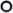 «Цвет
			 границы».

Для выбора доступны стандартные и пользовательские цвета. По умолчанию
 палитра содержит только стандартные цвета.

Для создания пользовательского цвета:

	- Нажмите кнопку  «Добавить
	 цвет». Откроется расширенная палитра цветов.

	- Выберите цвет в расширенной палитре цветов, на странице браузера
	 с помощью пипетки или задайте код цвета в формате RGB/HEX.

После выполнения действий пользовательский цвет будет создан и добавлен
 в палитру.

Примечание.
 Максимально возможное количество пользовательских цветов в палитре равно
 23.

Для удаления пользовательского цвета из палитры выполните команду «Удалить» контекстного меню выбранного
 цвета.

Для изменения непрозрачности цвета используйте бегунок или введите значение
 в процентах при необходимости.

Для сброса настроек цвета нажмите кнопку  «Без
 цвета».

			- Тип границы.
			 Выберите тип границы в раскрывающемся меню кнопки  «Настройка
			 границ»:

	- . Сплошная линия;

	- . Квадратные точки;

	- .
	 Штрих;

	- . Штрих-точка-точка-штрих;

	- . Штрих-точка-штрих.

Толщина границы задаётся в пунктах.

			- Цвет заливки.
			 Выберите цвет заливки в раскрывающейся палитре цветов кнопки
			  «Цвет
			 заливки».

Для выбора доступны стандартные и пользовательские цвета. По умолчанию
 палитра содержит только стандартные цвета.

Для создания пользовательского цвета:

	- Нажмите кнопку  «Добавить
	 цвет». Откроется расширенная палитра цветов.

	- Выберите цвет в расширенной палитре цветов, на странице браузера
	 с помощью пипетки или задайте код цвета в формате RGB/HEX.

После выполнения действий пользовательский цвет будет создан и добавлен
 в палитру.

Примечание.
 Максимально возможное количество пользовательских цветов в палитре равно
 23.

Для удаления пользовательского цвета из палитры выполните команду «Удалить» контекстного меню выбранного
 цвета.

Для изменения непрозрачности цвета используйте бегунок или введите значение
 в процентах при необходимости.

Для сброса настроек цвета нажмите кнопку  «Без
 цвета».

			- Текст линии.
			 Добавьте/настройте текст линии. Для получения подробной информации
			 по добавлению и настройке текста линии обратитесь к разделу
			 «[Ввод и редактирование текста](AlgorithmDecor.htm#text)».

			- Изображение в фигуре.
			 Выберите/настройте изображение. Для получения подробной информации
			 по выбору и настройке изображения обратитесь к разделу «[Добавление и настройка
			 изображения](AlgorithmDecor.htm#insert_image)».

### Ввод и редактирование текста

	Для ввода и редактирования текста линии/фигуры/выноски/текстового
	 блока:

		- дважды щёлкните по выбранному объекту;

		- выполните для него команду контекстного меню «Переименовать»;

		- нажмите кнопку  «Добавить/Редактировать
		 текст» на всплывающей панели выделенного объекта.

	Будет активирован редактор текста. Для завершения редактирования
	 текста щёлкните за пределами редактора.

	Для настройки оформления текста выделенного объекта используйте
	 всплывающую панель:

	

	Задайте параметры текста:

	[Шрифт](javascript:TextPopup(this))

		Доступные настройки оформления текста:

			- Шрифт.
			 Выберите шрифт, установленный в операционной системе. При
			 необходимости можно загрузить [пользовательские
			 шрифты](Setup.chm::/UiWebSetup/03_Setup_Web/General_for_linux/Loading_Custom_Fonts.htm);

			- Размер
			 шрифта. Выберите размер шрифта от 6 до 36 пунктов;

			- Начертание
			 шрифта. Выберите один или несколько типов начертания
			 шрифта в раскрывающемся меню кнопки 
			 «Начертание»:

				- . Полужирное начертание;

				- . Курсивное начертание;

				- 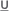. Подчёркивание текста;

				- 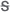. Зачёркивание текста линией;

			- Цвет шрифта.
			 Нажмите кнопку  «Цвет
			 шрифта» и выберите цвет шрифта в раскрывающемся палитре
			 цветов.

Для выбора доступны стандартные и пользовательские цвета. По умолчанию
 палитра содержит только стандартные цвета.

Для создания пользовательского цвета:

	- Нажмите кнопку  «Добавить
	 цвет». Откроется расширенная палитра цветов.

	- Выберите цвет в расширенной палитре цветов, на странице браузера
	 с помощью пипетки или задайте код цвета в формате RGB/HEX.

После выполнения действий пользовательский цвет будет создан и добавлен
 в палитру.

Примечание.
 Максимально возможное количество пользовательских цветов в палитре равно
 23.

Для удаления пользовательского цвета из палитры выполните команду «Удалить» контекстного меню выбранного
 цвета.

Для изменения непрозрачности цвета используйте бегунок или введите значение
 в процентах при необходимости.

	[Выравнивание](javascript:TextPopup(this))

		Для определения способа расположения текста фигуры/изображения/текстового
		 блока/выноски используйте группу настроек «Выравнивание».

		Задайте способы расположения текста:

			- Выравнивание
			 текста по горизонтали. Выберите способ выравнивания
			 текста в блоке по горизонтали в раскрывающемся меню кнопки
			 
			 «Выравнивание текста по горизонтали»:

				- . По левому краю;

				- 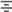. По центру. Используется по
				 умолчанию;

				- . По правому краю;

			- Выравнивание
			 текста по вертикали. Выберите способ выравнивания текста
			 в блоке по вертикали в раскрывающемся меню кнопки 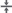 «Выравнивание
			 текста по вертикали»:

				- 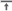. По верхнему краю;

				- . По середине. Используется
				 по умолчанию;

				- . По нижнему
				 краю.

	Для задания смешанного форматирования текста измените [параметры
	 шрифта](AlgorithmDecor.htm#font) выделенной части текста.

### Добавление и настройка изображения

	Для добавления изображения в фигуру/текстовый блок:

		- Выделите фигуру/текстовый блок.

		- Выполните команду «Выбрать
		 изображение» в раскрывающемся меню кнопки  «Изображение
		 в фигуре» на всплывающей панели.

	После выбора файла изображение будет добавлено в текстовый блок
	 или фигуру с ограничением границ объекта.

	Для настройки изображения, расположенного на рабочей области, выполните
	 команду «Настроить изображение»
	 в раскрывающемся меню кнопки  «Изображение
	 в фигуре» на всплывающей панели. После чего будет открыта боковая
	 панель «Настройки изображения»:

	

	Задайте параметры:

		- Выравнивание. Задайте
		 в группе ориентацию изображения внутри фигуры. По умолчанию изображение
		 располагается по центру относительно вертикальных и горизонтальных
		 границ фигуры;

		- Отступы от границ, мм.
		 Задайте в группе дополнительные отступы для изображения внутри
		 фигуры;

		- Параметры изображения.
		 Задайте в группе настройки:

			- Режим
			 масштабирования. Выберите режим изменения размеров
			 изображения относительно размеров фигуры:

				- Не изменять размер.
				 Изображение будет отображаться с теми размерами, которое
				 оно имеет. Если изображение больше фигуры, то оно выйдет
				 за его границы;

				- Сохранять пропорции.
				 Размер изображения подгоняется пропорционально соотношению
				 ширины и высоты фигуры;

				- Растягивать.
				 Изображение растягивается таким образом, чтобы заполнить
				 пространство фигуры с учётом установленных отступов;

			- Прозрачность.
			 Задайте степень прозрачности изображения. Допустимые значения
			 находятся в диапазоне [0, 80].

	Для удаления изображения:

		- Выделите изображение на рабочей области, табличный блок
		 или фигуру, содержащую изображение.

		- Выполните команду «Удалить
		 изображение» в раскрывающемся меню кнопки  «Изображение
		 в фигуре» на всплывающей панели.

	После выполнения действий изображение будет удалено с рабочей области
	 или из табличного блока/фигуры.

См. также:

[Построение
 алгоритма расчёта](Construction_of_the_calculation_algorithm.htm)

		Справочная
		 система на версию 10.9
		 от 18/08/2025,
		 © ООО «ФОРСАЙТ»,
