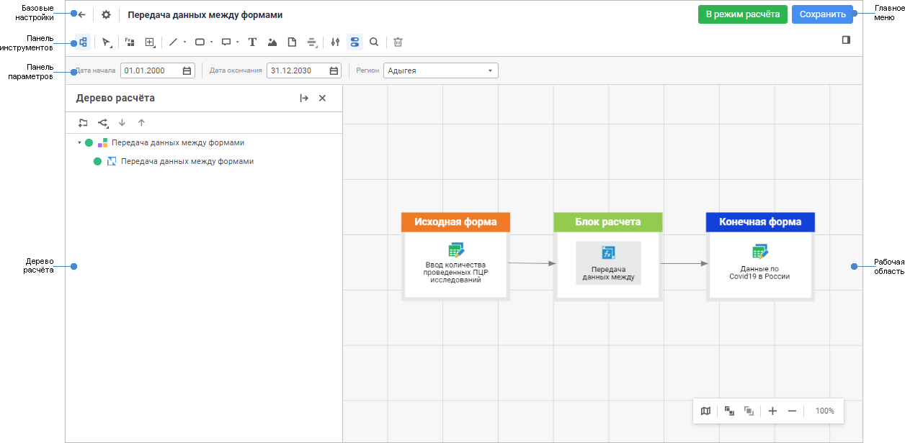
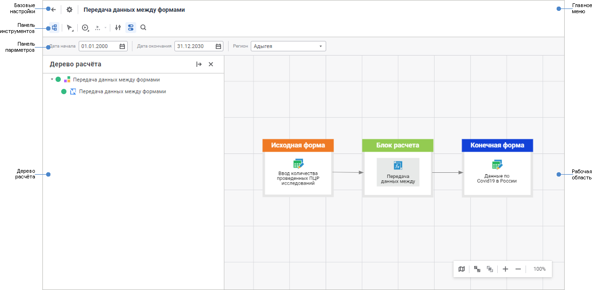

# Начало работы с расширением «Алгоритмы расчёта» в веб-приложении

Начало работы с расширением «Алгоритмы расчёта» в веб-приложении
-

# Начало работы с расширением «Алгоритмы
 расчёта» в веб-приложении

Для начала работы с расширением создайте новый или откройте готовый
 алгоритм расчёта.

[Создание
 нового алгоритма расчёта](javascript:TextPopup(this))

	Для создания нового алгоритма расчёта в [навигаторе
	 объектов](GetStarted.chm::/Interface/interface_navigator.htm) нажмите кнопку  «Создать» в главном меню и выберите
	 тип объекта на боковой панели «[Новый
	 объект](UiNav.chm::/02_Navigator/General_Principles_of_Work.htm#add_object)».

[Открытие
 готового алгоритма расчёта](javascript:TextPopup(this))

	Для открытия готового алгоритма расчёта на редактирование в [навигаторе
	 объектов](GetStarted.chm::/Interface/Interface_Navigator.htm) выделите алгоритм расчёта и выполните
	 одно из действий:

		- выполните команду «Редактировать»
		 в контекстном меню алгоритма расчёта;

		- выполните команду «Редактировать
		 в новой вкладке» в контекстном меню алгоритма расчёта;

		- выполните команду «Редактировать
		 в новом окне» в контекстном меню алгоритма расчёта;

		- нажмите клавишу F4.

	Для открытия готового алгоритма расчёта на просмотр в [навигаторе
	 объектов](GetStarted.chm::/Interface/Interface_Navigator.htm) выделите алгоритм расчёта и выполните
	 одно из действий:

		- выполните команду «Открыть»
		 в контекстном меню алгоритма расчёта;

		- выполните команду «Открыть
		 в новой вкладке» в контекстном меню алгоритма расчёта;

		- выполните команду «Открыть
		 в новом окне» в контекстном меню алгоритма расчёта;

		- дважды щёлкните по алгоритму расчёта;

		- нажмите клавишу ENTER.

	Для открытия готового алгоритма расчёта в режиме расчёта:

		- откройте алгоритм расчёта на просмотр;

		- откройте алгоритм расчёта на редактирование и нажмите кнопку
		 «В режим расчёта» в главном
		 меню.

Для построения алгоритмов расчёта
 смотрите статью «[Построение
 алгоритма расчёта](Construction_of_the_calculation_algorithm.htm)».

Для работы с готовыми алгоритмами
 расчёта смотрите статью «[Работа
 с готовым алгоритмом расчёта](Work.htm)».

Основное окно расширения «Алгоритмы расчёта»:

	 В режиме редактирования В режиме расчёта

		

		

[Элементы
 окна алгоритма расчёта](javascript:TextPopup(this))

		- Базовые настройки.
		 В режиме редактирования содержит поле для редактирования наименования
		 алгоритма расчёта, а также кнопки для возвращения в навигатор
		 объектов, настройки параметров алгоритма расчёта. В режиме расчёта
		 доступно только возвращение в режим редактирования или в навигатор
		 объектов, если алгоритм расчёта открыт на просмотр.

		- Главное меню. В
		 режиме редактирования содержит кнопки, предназначенные для перехода
		 в режим расчёта и сохранения изменений в алгоритме расчёта.

		- Панель инструментов.
		 Содержит кнопки для построения, настройки и запуска алгоритма
		 расчёта.

		- Панель параметров.
		 Предназначена для задания значений [параметров](Set_up_calculation_parameters.htm)
		 алгоритма расчёта. Для отображения/скрытия панели параметров используйте
		 кнопку 
		 «Параметры» на панели
		 инструментов.

		- Панель поиска. Предназначена
		 для [поиска](Management_of_Elements.htm#search) элементов
		 алгоритма расчёта на рабочей области. Для отображения/скрытия
		 панели поиска используйте кнопку  «Поиск»
		 на панели инструментов или сочетание клавиш CTRL+F.

		- Дерево расчёта.
		 Предназначено для настройки структуры алгоритма расчёта. Для отображения/скрытия
		 дерева расчёта используйте кнопку  «Дерево
		 расчёта» на панели инструментов.

		- Рабочая область.
		 Предназначена для [построения](Construction_of_the_calculation_algorithm.htm)
		 алгоритма расчёта.

См. также:

[Работа с готовым
 алгоритмом расчёта](Work.htm)

		Справочная
		 система на версию 10.9
		 от 18/08/2025,
		 © ООО «ФОРСАЙТ»,
