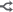
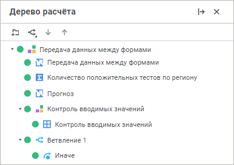
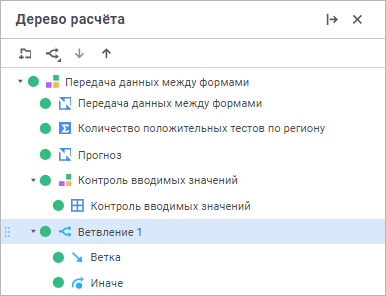
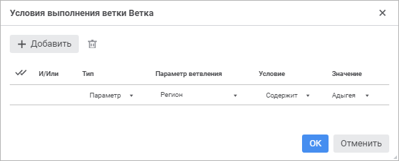
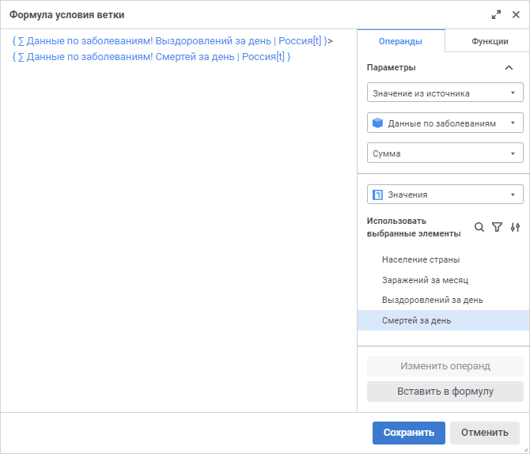

# Настройка условий выполнения расчёта алгоритма: Веб-приложение

Настройка условий выполнения расчёта алгоритма: Веб-приложение
-

# Настройка условий выполнения расчёта алгоритма

После [добавления и настройки
 параметров](Set_up_calculation_parameters.htm) алгоритма расчёта можно настроить условия выполнения алгоритма
 с помощью ветвлений. Ветвления используются для создания условий выполнения
 отдельных элементов алгоритма расчёта.

Для настройки условий выполнения алгоритма расчёта:

	- Выполните команду «Добавить
	 ветвление» в раскрывающемся меню кнопки 
	 «Добавить ветвление» в дереве
	 расчёта. В результате будет создано ветвление и условие  «Иначе»:

Для переименования ветвления выполните команду
 «Переименовать» в контекстном
 меню ветвления. Введите новое наименование и нажмите клавишу ENTER. После
 чего ветвление будет переименовано.

	- Выделите созданное ветвление и выполните команду «Добавить
	 ветку» в раскрывающемся меню кнопки  «Добавить ветвление». В результате
	 будет создана ветка в ветвлении:

Примечание.
 Количество веток и ветвлении не ограничено. При наличии нескольких веток
 по умолчанию выполняется расчёт только в первой ветке, условие которой
 выполняется.

Для переименования ветки выполните команду
 «Переименовать» в контекстном
 меню ветки. Введите новое наименование и нажмите клавишу ENTER. После
 чего ветка будет переименована.

	- Выделите элемент в дереве расчёта и перетащите его в условие
	  «Ветка» или  «Иначе» с помощью механизма Drag&Drop.
	 Для выделения и переноса нескольких элементов удерживайте нажатую
	 клавишу CTRL или SHIFT.

	- Откройте окно «Условия выполнения
	 ветки <наименование
	 ветки>» для задания
	 условий выполнения ветки с помощью команды контекстного меню ветки
	 «Параметры ветвления».

В результате будет открыто окно «Условия
 выполнения ветки <наименование
 ветки>»:

	- Нажмите кнопку  «Добавить» для добавления условия:

	- Задайте параметры:

		- Тип. Выберите тип
		 условия в раскрывающемся списке:

			- Параметр;

			- Формула;

		- Параметр ветвления.
		 В раскрывающемся списке выберите [параметр](Parameters_of_the_calculation_algorithm.htm)
		 алгоритма расчёта или его [атрибут](UiNavObj.chm::/reference_book/Master_RDS_reference_book/Attributes.htm),
		 который будет участвовать в условии;

Примечание.
 Доступно только для типа условия «Параметр».

		- Условие.
		 В раскрывающемся списке выберите один из типов условия:

			- Содержит. Используйте
			 данное условие для определения, содержит ли параметр или его
			 атрибут, выбранный в столбце «Параметр
			 ветвления», заданное значение, указанное в столбце
			 «Значение». Данный
			 тип условия доступен, если выбран [параметр](Parameters_of_the_calculation_algorithm.htm)
			 алгоритма расчёта или его атрибут следующего типа данных:
			 строковый, длинный текст;

			- Не содержит.
			 Используйте данное условие для определения, не содержит
			 ли параметр или его атрибут, выбранный в столбце «Параметр
			 ветвления», заданное значение, указанное в столбце
			 «Значение». Данный
			 тип условия доступен, если выбран [параметр](Parameters_of_the_calculation_algorithm.htm)
			 алгоритма расчёта или его атрибут следующего типа данных:
			 строковый, длинный текст;

			- Содержится в.
			 Используйте данное условие для определения, содержится
			 ли параметр или его атрибут, выбранный в столбце «Параметр
			 ветвления», в заданном значении, указанном в столбце
			 «Значение». Данный
			 тип условия доступен, если выбран атрибут следующего типа
			 данных: строковый, длинный текст;

			- Не содержится в.
			 Используйте данное условие для определения, не содержится
			 ли параметр или его атрибут, выбранный в столбце «Параметр
			 ветвления», в заданном значении, указанном в столбце
			 «Значение». Данный
			 тип условия доступен, если выбран атрибут следующего типа
			 данных: строковый, длинный текст;

			- Равно. Используйте данное
			 условие для определения, равен ли параметр или его атрибут,
			 выбранный в столбце «Параметр
			 ветвления», заданному значению, указанному в столбце
			 «Значение»;

			- Не равно. Используйте данное
			 условие для определения, не равен ли параметр или его атрибут,
			 выбранный в столбце «Параметр
			 ветвления», заданному значению, указанному в столбце
			 «Значение»;

			- Больше. Используйте данное
			 условие для определения, больше ли параметр или его атрибут,
			 выбранный в столбце «Параметр
			 ветвления», заданного значения, указанного в столбце
			 «Значение»;

			- Меньше. Используйте данное
			 условие для определения, меньше ли параметр или его атрибут,
			 выбранный в столбце «Параметр
			 ветвления», заданного значения, указанного в столбце
			 «Значение».

Примечание.
 Доступно только для типа условия «Параметр».
 Набор отображаемых типов условия зависит от параметра или [типа
 данных](UiNavObj.chm::/reference_book/Master_RDS_reference_book/Attributes/Attribute.htm) его атрибута, выбранного в столбце «Параметр
 ветвления».

		- Значение. Задайте
		 значение для выбранного типа условия:

			- Параметр. Задайте
			 значение, которое будет сравниваться со значением параметра
			 ветвления. Если в качестве параметра ветвления выбран параметр
			 алгоритма расчёта, то в раскрывающемся списке отметьте сравниваемые
			 элементы параметра. Если в качестве параметра ветвления выбран
			 атрибут параметра, то укажите сравниваемое значение, тип данных
			 которого задается в соответствии с типом данных атрибута;

			- Формула. Для
			 задания формулы условия ветки нажмите кнопку  «Добавить
			 формулу» и сформируйте [формулу
			 условия](../Calculation_block/Calculation_Formula_Generation.htm) для проверки значений в виде логического выражения
			 в открывшемся окне «Формула
			 условия ветки»:

Сформированная формула будет отображаться
 в виде строки, недоступной для редактирования, в столбце «Значение».

Примечание.
 Задание и редактирование формулы осуществляется только в окне «Формула
 условия ветки».

		- И/Или. Выберите
		 один из логических операторов в раскрывающемся списке, если добавлено
		 несколько условий:

			- И. Используется
			 по умолчанию. Если все условия выполняются, то выполняется
			 расчёт алгоритма;

			- Или. Если выполняется
			 хотя бы одно условие, то выполняется расчёт алгоритма.

Для удаления одного из условий выделите условие
 и нажмите кнопку  «Удалить»
 на панели инструментов.

	- Нажмите кнопку «ОК».

После выполнения действий будут настроены условия выполнения расчёта
 алгоритма.

См. также:

[Построение
 алгоритма расчёта](Construction_of_the_calculation_algorithm.htm)

		Справочная
		 система на версию 10.9
		 от 18/08/2025,
		 © ООО «ФОРСАЙТ»,
