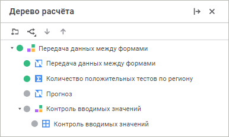
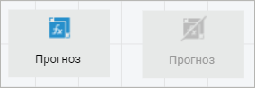

# Настройка порядка расчёта алгоритма: Веб-приложение

Настройка порядка расчёта алгоритма: Веб-приложение
-

# Настройка порядка расчёта алгоритма

Элементы алгоритма расчёта будут [рассчитаны](Perform_calculations.htm)
 в том порядке, в котором они следуют в [дереве
 расчёта](Beginning_of_work.htm).

Для изменения порядка следования элементов:

	- выделите элемент и используйте кнопки 
	 «Переместить вверх» и  «Переместить вниз»
	 в дереве расчёта;

	- используйте команды «Переместить
	 вверх» и «Переместить вниз»
	 в контекстном меню элемента;

	- выделите элемент и используйте механизм Drag&Drop. Для выделения
	 нескольких элементов удерживайте нажатую клавишу CTRL или SHIFT.

Важно.
 Учитывайте порядок [формул](../Calculation_block/Formula.htm),
 заданных для [блоков
 расчёта](../Calculation_block/Calculation_unit.htm) и [блоков контроля](../Control_Block/Control_Block.htm),
 в порядке расчёта алгоритма. Блок с формулами, результат которых используется
 в других формулах, должен стоять перед блоками, в которых формулы используют
 данный результат расчёта.

## Группировка элементов

Для группировки элементов:

	- Нажмите кнопку  «Добавить папку» в дереве расчёта.
	 После чего папка будет добавлена в конец списка элементов или в текущую
	 папку/ветку.

	- Переместите элементы в папку с помощью механизма Drag&Drop.

После выполнения действий элементы будут сгруппированы в папке.

Для переименования папки выполните команду «Переименовать»
 в контекстном меню папки.

Для удаления папки:

	- выделите папку и нажмите кнопку  «Удалить» на панели инструментов;

	- выполните команду «Удалить»
	 в контекстном меню папки.

После выполнения действий папка будет удалена со всеми элементами, содержащимися
 в ней.

## Исключение элемента из расчёта

Для исключения отдельных блоков, готовых алгоритмов, ветвлений из расчёта
 выполните команду «Исключить из расчёта»
 в контекстном меню элемента, расположенного в [дереве
 расчёта](Beginning_of_work.htm) или на [рабочей области](Beginning_of_work.htm).
 Исключённый элемент меняет цвет пиктограммы с зеленого на серый в дереве
 расчёта:

Также исключённый элемент меняет свой вид на [рабочей
 области](Beginning_of_work.htm), он становится серым с зачёркнутой пиктограммой. Например,
 слева блок, участвующий в расчёте, справа - исключённый из расчёта:

См. также:

[Построение
 алгоритма расчёта](Construction_of_the_calculation_algorithm.htm)

		Справочная
		 система на версию 10.9
		 от 18/08/2025,
		 © ООО «ФОРСАЙТ»,
