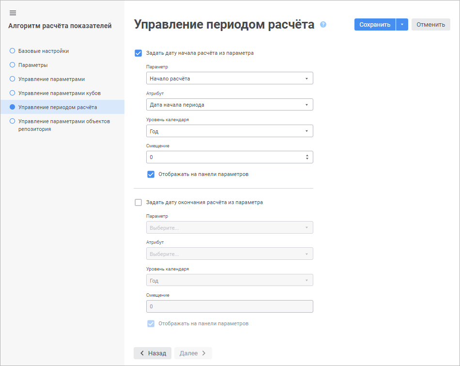
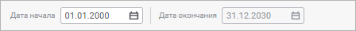

# Управление периодом расчёта: Алгоритм расчёта показателей, веб-приложение

Управление периодом расчёта: Алгоритм расчёта показателей, веб-приложение
-

# Управление периодом расчёта

Параметры алгоритма расчёта могут управлять периодом расчёта всего алгоритма.

Выбор и настройка параметров алгоритма, управляющих периодом расчёта,
 выполняются на странице «Управление периодом
 расчёта» в [мастере
 редактирования настроек алгоритма расчёта](Set_up_calculation_parameters.htm):

По умолчанию начало и окончание расчёта алгоритма задаётся пользователем.
 С помощью параметра можно задать:

	- начало и окончание расчёта;

	- только начало расчёта;

	- только окончание расчёта.

Для выбора и настройки параметра, управляющего началом или окончанием
 расчёта, установите флажок «Задать дату
 начала расчёта из параметра» или «Задать
 дату окончания расчёта из параметра» соответственно, после чего
 задайте настройки:

	- Параметр. Выберите в
	 раскрывающемся списке [параметр
	 алгоритма расчёта](Parameters_of_the_calculation_algorithm.htm), который будет управлять началом или окончанием
	 расчета. Для выбора доступны только параметры типа «Отметка»
	 и «Дата»;

	- Атрибут. Выберите в
	 раскрывающемся списке атрибут, значение которого будет использоваться
	 в качестве даты начала расчёта. Список доступен при выборе параметра
	 типа «Отметка» в раскрывающемся
	 списке «Параметр»;

	- Уровень календаря. Выберите
	 в раскрывающемся списке календарную динамику начала или окончания
	 расчёта. Доступные варианты:

		- Год;

		- Полугодие;

		- Квартал;

		- Месяц;

		- День;

	- Смещение. Задайте количество
	 точек во временном периоде, на которое дата начала или окончания расчёта
	 будет смещена вперёд или назад относительно значения параметра;

	- Отображать на панели параметров.
	 При необходимости снимите флажок для скрытия параметра «Дата
	 начала» или «Дата окончания»
	 на панели параметров.

В результате начало или окончание расчёта будет управляться параметром
 алгоритма и параметр «Дата начала»
 или «Дата окончания» на панели
 параметров станет недоступен:

Для возврата к заданию пользователем начала или окончания расчёта алгоритма
 снимите флажок «Задать дату начала расчёта
 из параметра» или «Задать дату
 окончания расчёта из параметра» соответственно.

## Особенности работы с периодом расчёта

При работе с периодом расчёта имеются особенности:

	- при использовании [календаря
	 как обычного измерения](../Calculation_block/Master_calculation_block_page_consumer.htm#calendar) в [блоке
	 расчёта](../Calculation_block/Calculation_unit.htm) или [блоке
	 контроля](../Control_Block/Control_Block.htm) расчёт блока выполняется по периоду, заданному в [настройках
	 фильтрации календарного измерения](../Calculation_block/Master_calculation_block_page_consumer.htm#filter). В этом случае заданный на панели
	 параметров период расчёта игнорируется;

	- при использовании календаря в [блоке
	 агрегации](../Aggregation_block/Aggregation_block.htm) расчёт блока выполняется по пересечению отметки календарного
	 измерения, заданной в [настройках
	 фильтрации](../Aggregation_block/Aggregation_block_Receiver.htm#filter), и периода расчёта алгоритма, заданного на панели параметров;

	- при использовании вложенного алгоритма расчёта его период расчёта
	 устанавливается по периоду расчёта того алгоритма, в который он входит.

См. также:

[Построение
 алгоритма расчёта](Construction_of_the_calculation_algorithm.htm)

		Справочная
		 система на версию 10.9
		 от 18/08/2025,
		 © ООО «ФОРСАЙТ»,
