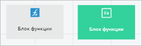

# Отладка расчёта алгоритма: Веб-приложение

Отладка расчёта алгоритма: Веб-приложение
-

# Отладка расчёта алгоритма

Отладка расчёта алгоритма предназначена для выявления и исправления
 ошибок, а также позволяет посмотреть промежуточные значения, полученные
 в ходе расчёта. Просмотр промежуточных значений особенно актуален, если
 внутри расчёта используются промежуточные кубы без таблиц с данными, то
 есть по таким кубам нельзя просмотреть полученные значения после окончания
 расчёта алгоритма.

Для отладки расчёта алгоритма:

	- Откройте алгоритм расчёта в [режиме
	 расчёта](Beginning_of_work.htm#open):

	- Нажмите кнопку  «Настройки
	 выполнения расчёта» на [панели
	 инструментов](Beginning_of_work.htm):

Задайте параметры выполнения расчёта:

	- Проверять арифметические операции.
	 Установите флажок для проверки арифметических операций, используемых
	 в [формулах](../Calculation_block/Formula.htm), при расчёте
	 алгоритма. Если при расчёте алгоритма в формуле производится деление
	 на ноль, то будет выдано соответствующее сообщение с указанием формулы
	 расчёта и блока.

Для коррекции указанной формулы нажмите кнопку
 «Остановить», после чего будет
 остановлен расчёт алгоритма. Отредактируйте формулу вручную и выполните
 повторный расчёт алгоритма.

Для пропуска ошибки выберите один из вариантов
 пропуска и нажмите кнопку «Ок».
 После чего рассчитываемые элементы пропускаются и результатом такого расчёта
 является пустое значение.

При снятом флажке проверка арифметических
 операций в формулах не выполняется. Если производится деление на ноль,
 то рассчитываемые элементы пропускаются и результатом такого расчёта является
 пустое значение.

Примечание.
 Проверку арифметических операций можно не выполнять, если формула расчёта
 задана верно и в результате расчёта допустимо содержание пустых значений.

		- Не сохранять результат
		 в БД. Установите флажок для расчёта алгоритма без сохранения
		 результатов;

Примечание.
 Если после окончания расчёта нужно будет сохранить данные, то выполните
 команду «Сохранение данных» в
 раскрывающемся меню кнопки  «Продолжить отладку» на [панели
 инструментов](Beginning_of_work.htm).

		- Многопоточный расчёт.
		 Установите флажок для ускорения расчёта [блоков
		 расчёта](../Calculation_block/Calculation_unit.htm) и [блоков
		 контроля](../Control_Block/Control_Block.htm), если установлен флажок «[Многопоточный
		 расчет](../Calculation_block/Master_calculation_block_page_consumer.htm)» в мастере редактирования блока расчёта или
		 блока контроля. Для блоков агрегации выполняется только однопоточный
		 расчёт. Для получения подробной информации о многопоточном расчёте
		 обратитесь к разделу «[Как
		 выполнять многопоточный расчёт?](../../FAQ/MultiThreadedCalculation.htm)». По умолчанию флажок снят и
		 выполняется однопоточный расчёт алгоритма;

Примечание.
 Значение флажка сохраняется только на период отладки расчёта алгоритма.

		- Поточечный расчет.
		 Установите флажок для изменения способа расчёта [формул](../Calculation_block/Formula.htm)
		 во всех [блоках
		 расчёта](../Calculation_block/Calculation_unit.htm) и [блоках
		 контроля](../Control_Block/Control_Block.htm), которые содержатся в алгоритме. При поточечном расчёте
		 алгоритма выполняется последовательный расчёт формул в каждой
		 точке данных: сначала формулы рассчитываются по первой точке данных,
		 затем по второй точке и так далее. Такой расчёт можно использовать,
		 если данные по текущей календарной точке зависят от данных, рассчитанных
		 по предыдущей календарной точке. При снятом флажке используется
		 векторный расчёт, то есть формулы рассчитываются по всем точкам
		 данных.

Примечание.
 Флажок доступен, если в алгоритме расчёта содержатся [блоки
 расчёта](../Calculation_block/Calculation_unit.htm) и [блоки контроля](../Control_Block/Control_Block.htm),
 для которых заданы [формулы
 расчёта](../Calculation_block/Formula.htm).

Если установлен флажок «[Поточечный
 расчет](../Calculation_block/Additional_Calculation_and_Data_Saving_Parameters.htm)» для конкретных формул расчёта, то расчёт может выполняться
 несколькими способами.

Важно.
 Использование параметра приводит к снижению производительности и продолжительному
 расчёту алгоритма.

Если в алгоритме расчёта содержатся [блоки
 агрегации](../Aggregation_block/Aggregation_block.htm), то при использовании поточечного расчёта алгоритма невозможен
 расчёт агрегации для одной календарной точки. Выберите способ расчёта
 блоков агрегации с помощью переключателей:

			- Не рассчитывать блоки
			 агрегации. Блоки агрегации не будут рассчитаны;

			- Рассчитать блоки агрегации
			 до поточечного расчёта. Блоки агрегации будут рассчитаны
			 до поточечного расчёта блоков расчёта и блоков контроля;

			- Рассчитать блоки агрегации
			 после поточечного расчёта. По умолчанию. Блоки агрегации
			 будут рассчитаны после поточечного расчёта блоков расчёта
			 и блоков контроля.

Примечание.
 Порядок расчёта блоков агрегации в [дереве
 расчёта](Beginning_of_work.htm) учитывается только при использовании поточечного расчёта конкретных
 формул расчёта. При использовании поточечного расчёта алгоритма порядок
 расчёта блоков агрегации зависит от выбранного способа расчёта.

	- Для отладки расчёта алгоритма выполните одну из команд в раскрывающемся
	 меню кнопки  «Рассчитать»
	 на [панели инструментов](Beginning_of_work.htm):

		- Запустить в режиме отладки. Выполняется отладка всего алгоритма
		 расчёта;

		- Запустить выделенное в режиме
		 отладки. Выполняется отладка
		 отдельных блоков алгоритма расчёта. Перед выполнением команды
		 выделите блоки на [рабочей
		 области](Beginning_of_work.htm) или в [дереве
		 расчёта](Beginning_of_work.htm) с помощью клавиши SHIFT
		 или CTRL.

После
 запуска расчёта начнётся загрузка данных в алгоритм.

	- При необходимости настройте циклический расчёт объекта алгоритма
	 с помощью окна «<наименование объекта> - настройки цикла».

Примечание.
 Настройка циклического расчёта доступна только для тех объектов, которые
 не содержатся в [ветвлении](CalculationConditions.htm).

[Для
 открытия окна](javascript:TextPopup(this))

	Для открытия окна «<наименование блока> - настройки цикла» выберите
	 объект в раскрывающемся меню кнопки  «Продолжить
	 расчёт в цикле» на [панели инструментов](Beginning_of_work.htm).

Задайте параметры:

		- Ограничивать количество
		 итераций. При необходимости переведите переключатель в
		 неактивное состояние для остановки циклического расчёта [блока
		 функции](../Function_Block/Function_Block.htm) с помощью [пользовательской
		 функции](../Function_Block/Function_Block_Wizard.htm) или вручную. По умолчанию переключатель переведен
		 в активное состояние, циклический расчёт будет выполняться по
		 заданному количеству итераций.

Примечание.
 Параметр доступен только для настройки циклического расчёта [блока
 функции](../Function_Block/Function_Block.htm).

Для остановки циклического расчёта блока
 функции с помощью пользовательской функции используйте свойство ITsUserData.Data
 со значением True. В качестве
 параметра свойства задайте ключ BREAK_CYCLE. Для получения текущей итерации
 расчёта используйте свойство ITsUserData.Data с параметром CURRENT_ITERATION.
 Для получения временного интервала, заданного в параметре «Временной
 интервал между итерациями (сек.)», используйте свойство ITsUserData.Data
 с параметром ITERATION_INTERVAL.

Если переключатель переведен в активное состояние
 и задано количество итераций в параметре «Количество
 итераций», то при использовании ключа BREAK_CYCLE остановка циклического
 расчёта будет происходить в зависимости от значения, которое принимает
 свойство ITsUserData.Data. Остановка циклического расчёта с помощью пользовательской
 функции является приоритетной.

Пример функции, в которой происходит остановка
 циклического расчёта на пятой итерации:

	Public Function CalcFunction(Paramarray arr : array Of Variant) : Variant;

	Var

	    Context: ITsCalculationContext;

	    UserData: ITsUserData;

	    CurrentIteration: Integer;

	Begin

	    // Получим пользовательские данные

	    Context := TsCalculation.Current;

	    UserData := Context.UserData;

	    // Получим текущую итерацию циклического расчёта

	    CurrentIteration := UserData.Data("CURRENT_ITERATION")

	    If CurrentIteration = 5 Then

	        // Если текущая итерация равна 5, то останавливаем циклический расчет на этой итерации

	        UserData.Data("BREAK_CYCLE") := True;

	    End If;

	Return Null;

	End Function CalcFunction;

		- Количество итераций.
		 Укажите количество итераций циклического расчёта объекта;

Примечание.
 Параметр доступен, если переключатель «Ограничивать
 количество итераций» переведен в активное состояние.

		- Временной интервал между
		 итерациями (сек.). Укажите временной интервал между выполнениями
		 циклического расчёта объекта в секундах.

Примечание.
 Параметр доступен, если задано более одного количества итераций в параметре
 «Количество итераций» или переключатель
 «Ограничивать количество итераций»
 переведен в неактивное состояние.

После выполнения действий нажмите кнопку
 «ОК». В [дереве
 расчёта](Beginning_of_work.htm) справа от объекта будет отображаться процесс выполнения циклического
 расчёта объекта в соответствии с заданными параметрами цикла, например:

Для приостановки циклического расчёта объекта
 нажмите кнопку  «Пауза»
 на [панели инструментов](Beginning_of_work.htm). При приостановке
 циклического расчёта объекта доступно выполнение следующих действий:

		- просмотр [формул
		 расчёта](../Calculation_block/Formula.htm), заданных для [блоков
		 расчёта](../Calculation_block/Calculation_unit.htm) и [блоков
		 контроля](../Control_Block/Control_Block.htm);

		- открытие [объектов репозитория](AddRepoObject.htm),
		 расположенных на [рабочей области](Beginning_of_work.htm);

		- просмотр [рассчитанных данных](DataView.htm).

Для остановки циклического расчёта объекта
 нажмите кнопку  «Остановить
 цикл» на [панели инструментов](Beginning_of_work.htm).

	- Перейдите к расчёту следующего блока с помощью кнопки  «Продолжить отладку» или выберите
	 определенный блок в раскрывающееся меню кнопки  «Продолжить отладку». В меню содержатся
	 все блоки, которые ещё не были выполнены.

Рассчитанный блок меняет свой вид в [рабочей
 области](Beginning_of_work.htm), становится зелёным. Например, слева блок до расчёта, справа
 - после расчёта:

	- При необходимости остановите расчёт с помощью кнопки  «Остановить».

Во время отладки расчёта все объекты алгоритма расчёта доступны для
 чтения. Например, можно посмотреть настройки блока расчёта или [результаты
 расчёта](DataView.htm) в приёмниках данных.

После завершения расчёта будет выведено [сообщение
 с результатом расчёта алгоритма](Perform_calculations.htm#message). Если при расчёте возникла ошибка,
 то будет выведено соответствующее сообщение об ошибке.

Совет. Для ускорения
 расчёта алгоритма обратитесь к разделу «[Как
 ускорить расчёт алгоритма?](../../FAQ/Acceleration_of_Algorithm_Calculation.htm)».

## Сообщение с результатом расчёта алгоритма

После завершения расчёта алгоритма целиком или расчёта отдельных блоков
 выводится сообщение с результатом расчёта алгоритма:

[Копирование
 результата расчёта в буфер обмена](javascript:TextPopup(this))

	Для копирования результата расчёта алгоритма нажмите кнопку «Скопировать в буфер обмена», после
   чего результат расчёта алгоритма будет скопирован в буфер обмена.

[Просмотр подробного
 результата расчёта](javascript:TextPopup(this))

	Для просмотра подробного результата расчёта алгоритма нажмите кнопку
	 «Подробнее», после чего будет
	 отображен результат расчёта алгоритма в виде таблицы:

	

	Таблица содержит следующие столбцы:

		- Наименование. Отображает
		 наименования каждого этапа расчёта алгоритма и наименования рассчитанных
		 объектов алгоритма расчёта;

		- Кол-во изм. точек.
		 Отображает количество рассчитанных точек в приёмниках данных после
		 расчёта [блоков
		 расчёта](../Calculation_block/Calculation_unit.htm). Рассчитанные точки соответствуют изменённым значениям
		 в ячейках таблицы при [открытии
		 приёмника](DataView.htm) на просмотр. Если в настройках выполнения расчёта
		 установлен флажок «Поточечный
		 расчёт», то в результате расчёта алгоритма в строке «Расчёт»
		 будет отображаться только общая сумма количества изменённых точек
		 без указания рассчитанных блоков;

	- Выполнение (сек.). Отображает
		 время, затраченное на каждый этап расчёта алгоритма и на расчёт
		 каждого объекта алгоритма расчёта.

	Примечание.
	 Если в структуре алгоритма расчёта содержатся [ветвления](CalculationConditions.htm),
	 то при расчёте алгоритма проверяются условия выполнения веток. В результате
	 проверки загружаются только те источники данных, которые заданы для
	 объектов, содержащихся в удовлетворяющих условиям ветках. Данная оптимизация
	 позволяет сократить время загрузки данных.

	Для скрытия подробного результата расчёта алгоритма нажмите кнопку
	 «Скрыть».

См. также:

[Построение
 алгоритма расчёта](Construction_of_the_calculation_algorithm.htm)

		Справочная
		 система на версию 10.9
		 от 18/08/2025,
		 © ООО «ФОРСАЙТ»,
