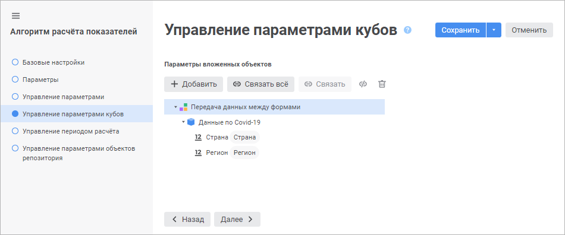
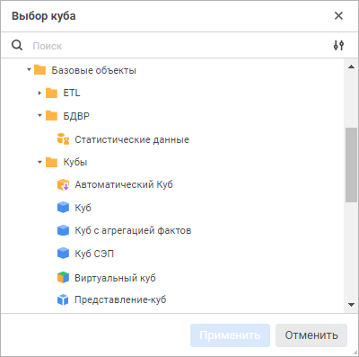

# Задание связей с параметрами кубов: Алгоритм расчёта показателей, веб-приложение

Задание связей с параметрами кубов: Алгоритм расчёта показателей, веб-приложение
-

# Задание связей с параметрами кубов

Связи предназначены для управления параметрами [кубов](UiNavObj.chm::/cube/uimd_cube_type.htm)
 с помощью [параметров](Parameters_of_the_calculation_algorithm.htm)
 алгоритма расчёта. При [использовании](DataView.htm) кубов
 в блоках алгоритма значения параметров алгоритма будут автоматически передаваться
 в связанные параметры этих кубов.

Задание связей параметров алгоритма расчёта с параметрами кубов выполняется
 на странице «Управление параметрами кубов»
 в [мастере редактирования настроек
 алгоритма расчёта](Set_up_calculation_parameters.htm):

Для задания связи параметра алгоритма расчёта с параметром куба:

	- Нажмите кнопку  «Добавить».

	После выполнения действия будет открыто окно «Выбор
	 куба»:

	

	Выберите куб с параметрами, который будет использоваться для связи
	 с параметрами алгоритма расчёта, и нажмите кнопку «Применить».

Для быстрого выбора объекта в поле для поиска введите его название/идентификатор/ключ,
 в зависимости от настроек отображения. Поиск будет выполняться автоматически
 по мере ввода текста. Список будет содержать объекты, наименования/идентификаторы/ключи
 которых содержат вводимый текст.

Для настройки отображения объектов репозитория
 в списке нажмите кнопку  «Отображение объекта» и выберите
 в раскрывающемся меню вариант отображения:

	- Наименование. Объекты
	 отображаются под своими наименованиями. Вариант по умолчанию;

	- Идентификатор. Объекты
	 отображаются под своими идентификаторами;

	- Ключ. Объекты отображаются
	 под своими ключами.

Выбрать можно несколько вариантов. Идентификатор
 и ключ будут указаны в скобках.

	- Выделите параметр куба.

	- Нажмите кнопку 
	 «Связать». Будет отображён
	 диалог «Связь параметров расчёта»:

Выберите параметр алгоритма расчёта, связываемый
 с параметром куба, и нажмите кнопку «Применить».

Для связывания доступны параметры одного
 [типа данных](Parameters_of_the_calculation_algorithm.htm),
 а также все параметры типа «Отметка».

В результате параметр алгоритма расчёта будет связан с параметром куба.
 Задайте связи для всех требуемых параметров кубов.

Совет. Для автоматического
 создания связей между параметрами нажмите кнопку 
 «Связать всё».

После задания связей появится возможность оперировать параметрами куба
 через параметры алгоритма расчёта.

Если куб используется в блоке и его параметры связаны с параметрами
 алгоритма расчёта, то при изменении значения параметра алгоритма расчёта
 будет выдано сообщение о необходимости проверки настроек расчёта алгоритма.

Для разрыва связи выделите связанный параметр куба и нажмите кнопку
  «Отменить связь».

Для удаления куба из алгоритма расчёта выделите его в списке и нажмите
 кнопку  «Удалить».

См. также:

[Настройки
 алгоритма расчёта](Set_up_calculation_parameters.htm)

		Справочная
		 система на версию 10.9
		 от 18/08/2025,
		 © ООО «ФОРСАЙТ»,
