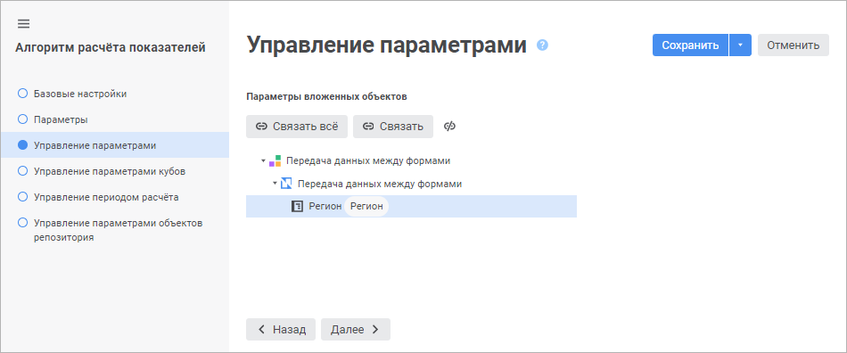

# Задание связей параметров: Алгоритм расчёта показателей, веб-приложение

Задание связей параметров: Алгоритм расчёта показателей, веб-приложение
-

# Задание связей параметров

Связи предназначены для управления параметрами блоков с помощью [параметров](Parameters_of_the_calculation_algorithm.htm)
 алгоритма расчёта. При расчёте значения параметров алгоритма будут передаваться
 в связанные параметры блоков.

Задание связей параметров алгоритма расчёта с параметрами блоков выполняется
 на странице «Управление параметрами»
 в [мастере редактирования настроек
 алгоритма расчёта](Set_up_calculation_parameters.htm):

На странице отображаются параметры объектов (блоков и вложенных алгоритмов
 расчёта).

Для задания связи параметра объекта с параметром алгоритма расчёта:

	- Выделите параметр объекта.

	- Нажмите кнопку 
	 «Связать». Будет отображён
	 диалог «Связь параметров расчёта»,
	 в котором выберите параметр алгоритма расчёта, связываемый с параметром
	 объекта:

В результате параметр алгоритма расчёта будет связан с параметром объекта
 и отображен справа от него. Задайте связи для всех параметров объектов.

Совет. Для автоматического
 создания связей нажмите кнопку 
 «Связать всё».

Для разрыва связи выделите связанный параметр и нажмите кнопку  «Отменить связь».

См. также:

[Настройки алгоритма расчёта](Set_up_calculation_parameters.htm)

		Справочная
		 система на версию 10.9
		 от 18/08/2025,
		 © ООО «ФОРСАЙТ»,
