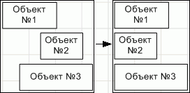
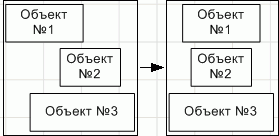
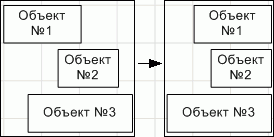
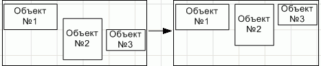
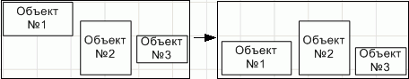
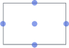
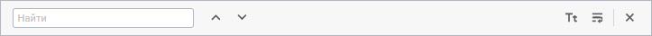
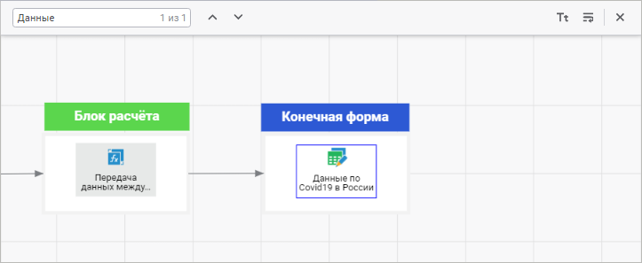
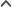

# Управление элементами алгоритма расчёта: Веб-приложение

Управление элементами алгоритма расчёта: Веб-приложение
-

# Управление элементами алгоритма расчёта

Для управления элементами алгоритма расчёта доступны следующие операции:

[Переименование
 блока в алгоритме](javascript:TextPopup(this))

	Для переименования блока в алгоритме:

		- выполните команду «Переименовать»
		 в контекстном меню блока, расположенного в [дереве
		 расчёта](Beginning_of_work.htm);

		- откройте блок на редактирование с помощью команды контекстного
		 меню блока «Редактировать»
		 и измените его наименование.

	После выполнения одного из действий блок будет переименован.

[Изменение размера
 элемента](javascript:TextPopup(this))

	Для изменения размера элемента на [рабочей
	 области](Beginning_of_work.htm):

		- с помощью мыши:

			- Наведите курсор мыши
			 на точку, расположенную на границе элемента. Указатель мыши
			 примет вид двунаправленной стрелки.

			- Зажмите кнопку мыши
			 и растяните/сожмите элемент до необходимого размера.

		- с помощью клавиатуры:

			- Зажмите сочетание клавиш
			 CTRL+SHIFT.

			- Измените размер элемента
			 с помощью клавиш UP, DOWN, LEFT, RIGHT на 1 пиксель.

	После выполнения действий будет изменён размер элемента.

[Изменение
 порядка расположения элемента](javascript:TextPopup(this))

	Для изменения порядка расположения элемента на [рабочей
	 области](Beginning_of_work.htm) используйте команды  «На
	 передний план» и  «На
	 задний план» в контекстном меню элемента.

[Выделение
 элементов](javascript:TextPopup(this))

	Для выделения одного элемента в [дереве
	 расчёта](Beginning_of_work.htm) или на [рабочей области:](Beginning_of_work.htm)

		- щелкните по элементу мышью;

		- используйте клавишу TAB для выделения элемента в порядке
		 слева направо, сверху вниз;

		- используйте сочетание клавиш SHIFT+TAB для выделения элемента
		 в порядке снизу вверх, справа налево.

	Примечание.
	 Выделение будет осуществляться в пределах видимой рабочей области.

	Для выделения всех элементов на рабочей области используйте сочетание
	 клавиш CTRL+А.

	Для выделения нескольких элементов на рабочей области:

		- зажмите клавишу CTRL и последовательно
		 щёлкните по каждому выделяемому элементу;

		- выберите режим 
		 «Курсор» на [панели
		 инструментов](Beginning_of_work.htm) и используйте рамку для выделения элементов:

			- Определите группу элементов, которые требуется выделить.

			- Щёлкните и зажмите кнопку мыши за пределами группы выделяемых
			 элементов.

			- Начните перемещать указатель мыши. Будет отображена
			 прямоугольная рамка:

	

			- Перемещайте указатель до тех пор, пока все требуемые
			 элементы не будут помещены в рамку.

			- Отпустите указатель мыши. Все элементы, полностью или
			 частично помещенные в рамку, будут выделены.

[Выравнивание
 элементов](javascript:TextPopup(this))

	Для выравнивания элементов относительно
	 друг друга:

		- [Выделите](Management_of_Elements.htm#select)
		 несколько элементов.

		- Выполните одно из действий:

			- выполните команду «Выровнять»
			 контекстного меню объекта;

			- нажмите кнопку  «Выровнять»
			 на панели инструментов;

		- Выберите один из вариантов выравнивания элементов в раскрывающемся
		 меню команды/кнопки:

			- Выровнять
			 по левому краю. Выделенные элементы будут выровнены
			 по левому краю относительно крайнего левого элемента:

	

			- Выровнять
			 по центру. Выделенные элементы будут выровнены по центру.
			 Центр рассчитывается исходя из положения крайнего левого элемента
			 и крайнего правого среди выделенных и размеров самих элементов:

	

			- Выровнять
			 по правому краю. Выделенные элементы будут выровнены
			 по правому краю относительно крайнего правого элемента:

	

			- Выровнять
			 по верхнему краю. Выделенные элементы будут выровнены
			 по верхнему краю относительно крайнего верхнего элемента:

	

			- Выровнять
			 по середине. Выделенные элементы будут выровнены по
			 середине. Середина рассчитывается исходя из положения крайнего
			 верхнего элемента и крайнего нижнего среди выделенных и размеров
			 самих элементов:

	

			- Выровнять
			 по нижнему краю. Выделенные элемента будут выровнены
			 по нижнему краю относительно крайнего нижнего элемента:

	

[Соединение
 элемента с другими элементами](javascript:TextPopup(this))

	Для элемента существуют 5 базовых точек, предназначенных для соединения
	 с другими элементами на [рабочей области](Beginning_of_work.htm):

	

	Линия - фигура, определяющая соответствие между элементами по точкам
	 соединения. Линия, привязанная к одной из таких точек, будет привязана
	 к данной точке вне зависимости от места расположения элемента. Центральная
	 точка соединения является плавающей, то есть связь будет привязана
	 к одной из точек по периметру в зависимости от места расположения
	 элемента.

	Для соединения элемента с другими элементами:

		- Наведите курсор мыши на одну из точек соединения на элементе
		 и зажмите кнопку мыши.

		- Переместите курсор к точке соединения другого элемента,
		 не отпуская кнопку мыши.

		- Отпустите кнопку мыши.

	После выполнения действий будет добавлена линия, соединяющая элементы
	 по точкам.

[Поиск
 элемента на рабочей области](javascript:TextPopup(this))

	Для поиска элемента на [рабочей области](Beginning_of_work.htm)
	 выполните одно из действий:

		- нажмите кнопку  «Поиск»
		 на панели инструментов;

		- используйте сочетание клавиш CTRL+F.

	После выполнения действия будет отображена панель поиска:

	

	Введите частичное или целое наименование элемента строке поиска
	 и нажмите клавишу ENTER. При необходимости используйте дополнительные
	 условия поиска:

		- нажмите кнопку  «Учитывать
		 регистр». В процессе поиска будет учитываться регистр заданных
		 букв;

		- нажмите кнопку  «Слово
		 целиком». В процессе поиска будет учитываться только целое
		 заданное наименование элемента.

	После нажатия клавиши ENTER фокус будет перемещен к первому найденному
	 элементу, удовлетворяющему параметрам поиска:

	

	Для перемещения по найденным элементам используйте кнопки  «Найти
	 предыдущее»,  «Найти
	 далее».

	Для скрытия панели поиска выполните одно из действий:

		- нажмите кнопку  «Закрыть»;

		- отожмите кнопку  «Поиск»
		 на панели инструментов.

	После выполнения действия панель поиска будет скрыта.

[Перемещение
 элементов на рабочей области](javascript:TextPopup(this))

	Для перемещения одного или нескольких выделенных элементов на рабочей
	 области:

		- используйте клавиши UP, LEFT, DOWN, RIGHT для перемещения
		 элементов на 1 пиксель;

		- используйте сочетание клавиш SHIFT+UP, SHIFT+LEFT, SHIFT+DOWN,
		 SHIFT+RIGHT для перемещения элементов на 10 пикселей;

		- используйте сочетание клавиш CTRL+UP, CTRL+LEFT, CTRL+DOWN,
		 CTRL+RIGHT для перемещения элементов на 100 пикселей.

[Поворот элементов
 на рабочей области](javascript:TextPopup(this))

	Для поворота одного или нескольких выделенных элементов на рабочей
	 области выполните команду «Поворот»
	 в контекстном меню элемента и выберите один из способов:

		- Повернуть на 90o по часовой стрелке;

		- Повернуть на 90o против часовой стрелки.

## Работа с буфером обмена

При работе с буфером обмена на [рабочей
 области](Beginning_of_work.htm) доступны следующие операции:

[Копирование
 элемента в буфер обмена](javascript:TextPopup(this))

	Для копирования элемента в буфер обмена:

		- выполните команду  «Копировать»
		 в контекстном меню элемента;

		- выделите элемент и используйте сочетание клавиш CTRL+C.

	После выполнения одного из действий элемент будет скопирован в буфер
	 обмена.

	Примечание.
	 Копирование элемента доступно пользователям, обладающим привилегией
	 «[Доступ
	 к менеджеру обновлений](Admin.chm::/04_SecurityPolicy/Admin_Priv.htm#upd_manager)».

[Перемещение
 элемента в буфер обмена](javascript:TextPopup(this))

	Для перемещения элемента в буфер обмена:

		- выполните команду  «Вырезать»
		 в контекстном меню элемента;

		- выделите элемент и используйте сочетание клавиш CTRL+X.

	После выполнения одного из действий элемент будет перемещен в буфер
	 обмена.

[Вставка элемента
 из буфера обмена](javascript:TextPopup(this))

	Для вставки элемента из буфера обмена:

		- выполните команду  «Вставить»
		 в контекстном меню рабочей области;

		- используйте сочетание клавиш CTRL+V.

	После выполнения одного из действий в [дерево
	 расчёта](Beginning_of_work.htm) и на [рабочую область](Beginning_of_work.htm)
	 будет вставлен элемент из буфера обмена.

## Удаление элементов

Для удаления элементов:

	- [Выделите](#select) один или несколько элементов.

	- Выполните одно из действий:

		- выполните команду «Удалить»
		 в контекстном меню элемента;

		- нажмите кнопку 
		 «Удалить» на [панели
		 инструментов](Beginning_of_work.htm);

		- нажмите клавишу DELETE;

		- нажмите клавишу BACKSPACE.

После выполнения действий выделенные элементы будут удалены.

См. также:

[Построение
 алгоритма расчёта](Construction_of_the_calculation_algorithm.htm)

		Справочная
		 система на версию 10.9
		 от 18/08/2025,
		 © ООО «ФОРСАЙТ»,
