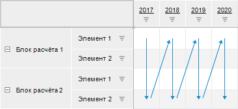
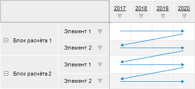
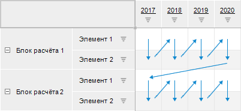
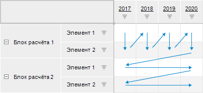
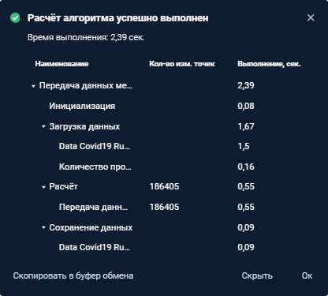

# Расчёт алгоритма: Веб-приложение

Расчёт алгоритма: Веб-приложение
-

# Расчёт алгоритма

Для расчёта алгоритма:

	- Откройте алгоритм расчёта в [режиме
	 расчёта](Beginning_of_work.htm#open):

	- Нажмите кнопку  «Настройки
	 выполнения расчёта» на [панели
	 инструментов](Beginning_of_work.htm):

Задайте параметры выполнения расчёта:

	- Проверять арифметические операции.
	 Установите флажок для проверки арифметических операций, используемых
	 в [формулах](../Calculation_block/Formula.htm), при расчёте
	 алгоритма. Если при расчёте алгоритма в формуле производится деление
	 на ноль, то будет выдано соответствующее сообщение с указанием формулы
	 расчёта и блока.

Для коррекции указанной формулы нажмите кнопку
 «Остановить», после чего будет
 остановлен расчёт алгоритма. Отредактируйте формулу вручную и выполните
 повторный расчёт алгоритма.

Для пропуска ошибки выберите один из вариантов
 пропуска и нажмите кнопку «Ок».
 После чего рассчитываемые элементы пропускаются и результатом такого расчёта
 является пустое значение.

При снятом флажке проверка арифметических
 операций в формулах не выполняется. Если производится деление на ноль,
 то рассчитываемые элементы пропускаются и результатом такого расчёта является
 пустое значение.

Примечание.
 Проверку арифметических операций можно не выполнять, если формула расчёта
 задана верно и в результате расчёта допустимо содержание пустых значений.

		- Не сохранять результат
		 в БД. Установите флажок для расчёта алгоритма без сохранения
		 результатов. По умолчанию результаты расчёта автоматически сохраняются;

		- Многопоточный расчёт.
		 Установите флажок для ускорения расчёта [блоков
		 расчёта](../Calculation_block/Calculation_unit.htm) и [блоков
		 контроля](../Control_Block/Control_Block.htm), если установлен флажок «[Многопоточный
		 расчет](../Calculation_block/Master_calculation_block_page_consumer.htm)» в мастере редактирования блока расчёта или
		 блока контроля. Для блоков агрегации выполняется только однопоточный
		 расчёт. Для получения подробной информации о многопоточном расчёте
		 обратитесь к разделу «[Как
		 выполнять многопоточный расчёт?](../../FAQ/MultiThreadedCalculation.htm)». По умолчанию флажок снят и
		 выполняется однопоточный расчёт алгоритма;

Примечание.
 Значение флажка сохраняется только на период расчёта алгоритма.

		- Поточечный расчет.
		 Установите флажок для изменения способа расчёта [формул](../Calculation_block/Formula.htm)
		 во всех [блоках
		 расчёта](../Calculation_block/Calculation_unit.htm) и [блоках
		 контроля](../Control_Block/Control_Block.htm), которые содержатся в алгоритме. При поточечном расчёте
		 алгоритма выполняется последовательный расчёт формул в каждой
		 точке данных: сначала формулы рассчитываются по первой точке данных,
		 затем по второй точке и так далее. Такой расчёт можно использовать,
		 если данные по текущей календарной точке зависят от данных, рассчитанных
		 по предыдущей календарной точке. При снятом флажке используется
		 векторный расчёт, то есть формулы рассчитываются по всем точкам
		 данных.

[Схемы
 расчёта формул](javascript:TextPopup(this))

	Расчёт элементов измерения, значения
	 которых рассчитывают формулы, при использовании поточечного расчёта
	 алгоритма:

	

	Расчёт элементов измерения, значения
	 которых рассчитывают формулы, без использования поточечного расчёта
	 алгоритма:

	

Примечание.
 Флажок доступен, если в алгоритме расчёта содержатся [блоки
 расчёта](../Calculation_block/Calculation_unit.htm) и [блоки контроля](../Control_Block/Control_Block.htm),
 для которых заданы [формулы
 расчёта](../Calculation_block/Formula.htm).

Если установлен флажок «[Поточечный
 расчет](../Calculation_block/Additional_Calculation_and_Data_Saving_Parameters.htm)» для конкретных формул расчёта, то расчёт может выполняться
 несколькими способами. Способы расчёта формул приведены на схемах ниже.

[Схемы
 расчёта формул](javascript:TextPopup(this))

	Расчёт элементов измерения, значения
	 которых рассчитывают формулы, при использовании поточечного расчёта
	 алгоритма и поточечного расчёта каждой формулы в блоке:

	

	Расчёт элементов измерения, значения
	 которых рассчитывают формулы, без использования поточечного расчёта
	 алгоритма, но с использованием поточечного расчёта каждой формулы
	 в блоке:

	

	Расчёт элементов измерения, значения
	 которых рассчитывают формулы, без использования поточечного расчёта
	 алгоритма, но с использованием поточечного расчёта формул, например,
	 только в блоке 1:

	

Важно.
 Использование параметра приводит к снижению производительности и продолжительному
 расчёту алгоритма.

Если в алгоритме расчёта содержатся [блоки
 агрегации](../Aggregation_block/Aggregation_block.htm), то при использовании поточечного расчёта алгоритма невозможен
 расчёт агрегации для одной календарной точки. Выберите способ расчёта
 блоков агрегации с помощью переключателей:

			- Не рассчитывать блоки
			 агрегации. Блоки агрегации не будут рассчитаны;

			- Рассчитать блоки агрегации
			 до поточечного расчёта. Блоки агрегации будут рассчитаны
			 до поточечного расчёта блоков расчёта и блоков контроля;

			- Рассчитать блоки агрегации
			 после поточечного расчёта. По умолчанию. Блоки агрегации
			 будут рассчитаны после поточечного расчёта блоков расчёта
			 и блоков контроля.

Примечание.
 Порядок расчёта блоков агрегации в [дереве
 расчёта](Beginning_of_work.htm) учитывается только при использовании поточечного расчёта конкретных
 формул расчёта. При использовании поточечного расчёта алгоритма порядок
 расчёта блоков агрегации зависит от выбранного способа расчёта.

	- Задайте значения параметров алгоритма расчёта на
	 [панели параметров](Beginning_of_work.htm).

	- Выполните расчёт алгоритма целиком или расчёт отдельных блоков.

После завершения расчёта будет отображено сообщение об успешном выполнении
 расчёта алгоритма с временем выполнения. Если при расчёте возникла ошибка,
 то будет отображено соответствующее сообщение.

Для просмотра рассчитанных данных в результате выполнения расчёта обратитесь
 к разделу «[Просмотр рассчитанных данных](DataView.htm)».

Совет. Для ускорения
 расчёта алгоритма обратитесь к разделу «[Как
 ускорить расчёт алгоритма?](../../FAQ/Acceleration_of_Algorithm_Calculation.htm)».

## Расчёт алгоритма целиком

Для расчёта алгоритма целиком выполните команду «Запустить
 расчёт» в раскрывающемся меню кнопки  «Рассчитать» на [панели
 инструментов](Beginning_of_work.htm). Будет запущен расчёт алгоритма.

Для остановки расчёта нажмите кнопку  «Остановить» на [панели
 инструментов](Beginning_of_work.htm).

После завершения расчёта будет выведено [сообщение
 с результатом расчёта алгоритма](Perform_calculations.htm#message). Если при расчёте возникла ошибка,
 то будет выведено соответствующее сообщение об ошибке.

Совет. Для запрета
 остановки расчёта алгоритма обратитесь к разделу «[Как
 запретить остановку расчёта алгоритма?](../../FAQ/AlgorithmMultuThread.htm)».

## Расчёт отдельных блоков

Для расчёта только выделенных блоков:

	- Выделите в [рабочей области](Beginning_of_work.htm)
	 или [дереве расчёта](Beginning_of_work.htm) блоки, которые
	 надо рассчитать. Для выделения блоков используйте клавишу SHIFT или
	 CTRL.

	- Выполните команду «Запустить
	 выделенное» в раскрывающемся меню кнопки  «Рассчитать» на [панели
	 инструментов](Beginning_of_work.htm).

После завершения расчёта будет выведено [сообщение
 с результатом расчёта алгоритма](Perform_calculations.htm#message). Если при расчёте возникла ошибка,
 то будет выведено соответствующее сообщение об ошибке.

## Сообщение с результатом расчёта алгоритма

После завершения расчёта алгоритма целиком или расчёта отдельных блоков
 выводится сообщение с результатом расчёта алгоритма:

[Копирование
 результата расчёта в буфер обмена](javascript:TextPopup(this))

	Для копирования результата расчёта алгоритма нажмите кнопку «Скопировать в буфер обмена», после
   чего результат расчёта алгоритма будет скопирован в буфер обмена.

[Просмотр подробного
 результата расчёта](javascript:TextPopup(this))

	Для просмотра подробного результата расчёта алгоритма нажмите кнопку
	 «Подробнее», после чего будет
	 отображен результат расчёта алгоритма в виде таблицы:

	

	Таблица содержит следующие столбцы:

		- Наименование. Отображает
		 наименования каждого этапа расчёта алгоритма и наименования рассчитанных
		 объектов алгоритма расчёта;

		- Кол-во изм. точек.
		 Отображает количество рассчитанных точек в приёмниках данных после
		 расчёта [блоков
		 расчёта](../Calculation_block/Calculation_unit.htm). Рассчитанные точки соответствуют изменённым значениям
		 в ячейках таблицы при [открытии
		 приёмника](DataView.htm) на просмотр. Если в настройках выполнения расчёта
		 установлен флажок «Поточечный
		 расчёт», то в результате расчёта алгоритма в строке «Расчёт»
		 будет отображаться только общая сумма количества изменённых точек
		 без указания рассчитанных блоков;

	- Выполнение (сек.). Отображает
		 время, затраченное на каждый этап расчёта алгоритма и на расчёт
		 каждого объекта алгоритма расчёта.

	Примечание.
	 Если в структуре алгоритма расчёта содержатся [ветвления](CalculationConditions.htm),
	 то при расчёте алгоритма проверяются условия выполнения веток. В результате
	 проверки загружаются только те источники данных, которые заданы для
	 объектов, содержащихся в удовлетворяющих условиям ветках. Данная оптимизация
	 позволяет сократить время загрузки данных.

	Для скрытия подробного результата расчёта алгоритма нажмите кнопку
	 «Скрыть».

См. также:

[Работа с готовым
 алгоритмом расчёта](Work.htm)

		Справочная
		 система на версию 10.9
		 от 18/08/2025,
		 © ООО «ФОРСАЙТ»,
