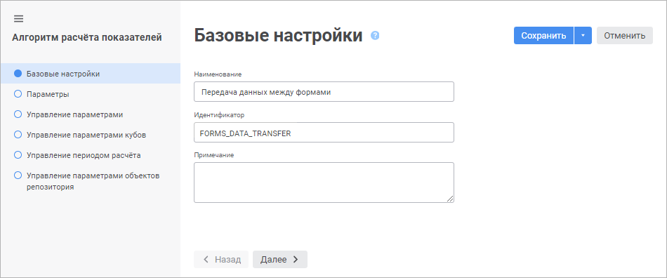

# Базовые настройки: Алгоритм расчёта показателей, веб-приложение

Базовые настройки: Алгоритм расчёта показателей, веб-приложение
-

# Базовые настройки

На странице «Базовые настройки»
 в [мастере редактирования настроек
 алгоритма расчёта](Set_up_calculation_parameters.htm) задаются наименование алгоритма, его идентификатор
 и примечание:

Задайте параметры:

	- Наименование. Введите
	 наименование алгоритма расчёта, которое будет отображаться в навигаторе
	 объектов;

	- Идентификатор. Введите
	 идентификатор алгоритма расчёта. Идентификатор представляет собой
	 последовательность букв латинского алфавита, цифр и знаков подчёркивания,
	 начинающаяся с буквы. Идентификатор должен быть уникальным в пределах
	 репозитория;

	- Примечание. Введите
	 заметки или аннотации к алгоритму расчёта. Поле необязательно для
	 заполнения.

См. также:

[Настройки алгоритма расчёта](Set_up_calculation_parameters.htm)

		Справочная
		 система на версию 10.9
		 от 18/08/2025,
		 © ООО «ФОРСАЙТ»,
