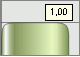
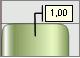
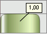

# ChartLabelType

ChartLabelType
-

# ChartLabelType

## Описание

Перечисление ChartLabelType содержит тип подписи данных .

Используется следующими свойствами и методами:

-
[IChartLabel.Type](../Interface/IChartLabel/IChartLabel.Type.htm)

## Допустимые значения

 Значение
 Краткое описание

 0
 Simple. Простая:

 1
 Noteline. Выноска:

 2
 Pointer. Указатель:

См. также:

[Перечисления сборки Chart](Enums_built_Chart.htm)

		Справочная
		 система на версию 10.9
		 от 18/08/2025,
		 © ООО «ФОРСАЙТ»,
