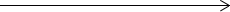
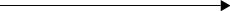
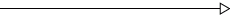
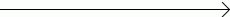
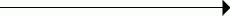
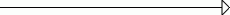
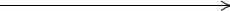
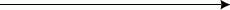
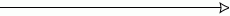

# ChartLineCapType

ChartLineCapType
-

# ChartLineCapType

## Описание

Перечисление ChartLineCapType содержит варианты окончания линии подписи данных .

Используется следующими свойствами и методами:

-
[IChartLabel.Cap](../Interface/IChartLabel/IChartLabel.Cap.htm)

## Допустимые значения

 Значение
 Краткое описание

 0
 Flat. Нет наконечника:

 1
 Arrow30Degree. Стрелка c углом наклона 30 градусов:

 2
 Arrow30DegreeFilled. Заполненная стрелка c углом наклона 30 градусов:

 3
 Arrow30DegreeEmpty. Пустая стрелка c углом наклона 30 градусов:

 4
 Arrow45Degree. Стрелка c углом наклона 45 градусов:

 5
 Arrow45DegreeFilled. Заполненная стрелка c углом наклона 45 градусов:

 6
 Arrow45DegreeEmpty. Пустая стрелка c углом наклона 45 градусов:

 7
 ArrowRounded. Скругленная стрелка:

 8
 ArrowRoundedFilled. Заполненная скругленная стрелка:

 9
 ArrowRoundedEmpty. Пустая скругленная стрелка:

См. также:

[Перечисления сборки Chart](Enums_built_Chart.htm)

		Справочная
		 система на версию 10.9
		 от 18/08/2025,
		 © ООО «ФОРСАЙТ»,
