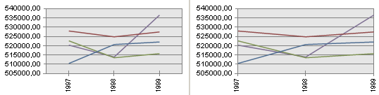

# IChart.AxisXPlacement

IChart.AxisXPlacement
-

# IChart.AxisXPlacement

## Синтаксис

AxisXPlacement: [ChartAxisXPlacement](../../Enums/ChartAxisXPlacement.htm);

## Описание

Свойство AxisXPlacement определяет возможность построения диаграммы без отступа от оси категорий.

## Комментарии

При установке свойству значения [ChartAxisXPlacement.OnTick](../../Enums/ChartAxisXPlacement.htm) наименования оси категорий выводятся, начиная с точки пересечения с осью значений. Для диаграмм линейного типа и типа «области» рисование производится от начала и до конца области построения. Для диаграмм столбикового типа отображаются все серии столбикового типа симметрично относительно делений соответствующей категории.

## Пример

Для выполнения примера предполагается наличие формы, расположенной на ней кнопки с наименованием «Button1», компонентов ChartBox, UiChart и компонента UiErAnalyzer с наименованием «UiErAnalyzer1», являющегося источником данных.

			Class OBJ24517Form: Form

    Button1: Button;

    UiChart1: UiChart;

    UiErAnalyzer1: UiErAnalyzer;

    ChartBox1: ChartBox;

    Sub Button1OnClick(Sender: Object; Args: IMouseEventArgs);

        Begin

        ChartBox1.Chart.AxisXPlacement:= ChartAxisXPlacement.OnTick;

    End Sub Button1OnClick;

End Class OBJ24517Form;

После нажатия кнопки «Button1» диаграмма будет построена сразу с линий осей значений:

См. также:

[IChart](IChart.htm)

		Справочная
		 система на версию 10.9
		 от 18/08/2025,
		 © ООО «ФОРСАЙТ»,
