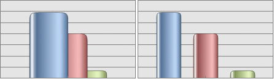

# IChart.OverlapCoef

IChart.OverlapCoef
-

# IChart.OverlapCoef

## Синтаксис

OverlapCoef: Double;

## Описание

Свойство OverlapCoef определяет
 ширину перекрытия между рядами, перекрытие рядов будет происходить во
 всех точках диаграммы.

## Комментарии

Устанавливаемая ширина перекрытия должна находится в диапазоне [-1.0;
 1.0]. Если ширина перекрытия отрицательная, то между рядами будет зазор.

Данное свойство применимо только для гистограммы.

## Пример

В рассматриваемом примере предполагается, что существует объект Chart типа IChart.

Диаграмма должна быть столбикового типа. Для преобразования диаграммы
 к столбиковому типу следует выполнить команду:

«Chart.Type := 1 As ChartType».

	Sub Overlap;

	Var

	    Chart: IChart;

	Begin

	    Chart.OverlapCoef := 0.5;

	End Sub Overlap;

После выполнения примера для диаграммы будет установлено перекрытие
 столбиков.

Ниже приведен пример диаграмм с положительным (слева) и отрицательным
 (справа) значением ширины перекрытия:

См. также:

[IChart](IChart.htm)

		Справочная
		 система на версию 10.9
		 от 18/08/2025,
		 © ООО «ФОРСАЙТ»,
