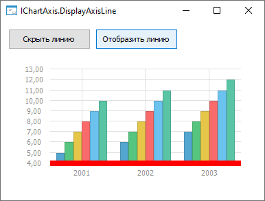
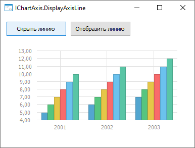

# IChartAxis.DisplayAxisLine

IChartAxis.DisplayAxisLine
-

# IChartAxis.DisplayAxisLine

## Синтаксис

DisplayAxisLine: Boolean;

## Описание

Свойство DisplayAxisLine определяет,
 отображаются ли линии осей диаграммы.

## Комментарии

Допустимые значения:

	- True. Линии осей отображаются
	 на диаграмме;

	- False. Линии осей не
	 отображаются на диаграмме.

## Пример

Для выполнения примера разместите на форме два компонента Button,
 ChartBox и UiErAnalyzer
 с наименованиями BUTTON1, BUTTON2, CHARTBOX1 и UIERANALYZER1 соответственно.
 Для компонента ChartBoxустановите
 свойству Source значение UiErAnalyzer1.
 Для компонента Button1 установите
 свойству Text значение «Скрыть
 линию», для компонента Button2
 - «Отобразить линию». Для компонента UiErAnalyzer
 установите свойству Active значение
 True. Предполагается наличие экспресс-отчета,
 который указан в качестве свойства Object
 для компонента UiErAnalyzer.

Добавьте ссылки на системные сборки: Chart, Drawing, Express, Forms.

	Sub Button1OnClick(Sender: Object; Args: IMouseEventArgs);

	Var

	    Chart: IChart;

	    ChartAxisX: IChartAxis;

	Begin

	    Chart := ChartBox1.Chart;

	    ChartAxisX := Chart.AxisX;

	    ChartAxisX.DisplayAxisLine := False;

	End Sub Button1OnClick;

	Sub Button2OnClick(Sender: Object; Args: IMouseEventArgs);

	Var

	    Chart: IChart;

	    ChartAxisX: IChartAxis;

	Begin

	    Chart := ChartBox1.Chart;

	    ChartAxisX := Chart.AxisX;

	    ChartAxisX.DisplayAxisLine := True;

	    ChartAxisX.AxisPen := New GxPen.CreateSolid(GxColor.FromName("Red"), 2.0);

	End Sub Button2OnClick;

При нажатии на кнопку «Отобразить линию» будет отображена линия на оси Х:

При нажатии на кнопку «Скрыть линию» линия на оси Х будет скрыта:

См. также:

[IChartAxis](IChartAxis.htm)

		Справочная
		 система на версию 10.9
		 от 18/08/2025,
		 © ООО «ФОРСАЙТ»,
